# Запуск экземпляра EC2 в частном виртуальном облаке (Virtual Private Cloud - VPC)

**Содержание**
* [Введение](#введение)
* [Решение](#решение)
    * [Задание 1: Создание VPC](#задание-1-создание-vpc)
    * [Задание 2: Создание частной и общедоступной подсетей](#задание-2-создание-частной-и-общедоступной-подсетей)
    * [Задание 3: Создание маршрутов и настройка интернет-шлюза](#задание-3-создание-маршрутов-и-настройка-интернет-шлюза)
    * [Задание 4: Запуск EC2 в общедоступной подсети](#задание-4-запуск-EC2-в-общедоступной-подсети)
    * [Задание 5: Запуск EC2 в частной подсети](#задание-5-запуск-EC2-в-частной-подсети)
    * [Задание 6: Подключение к общедоступному EC2 по SSH](#заданиеk-6-подключение-к-общедоступному-EC2-по-SSH)


## Введение
В этом практическом занятии у вас будет возможность изучить и понять фундаментальные и вычислительные сервисы, предоставляемые AWS. Мы создадим частное виртуальное облако (Virtual Private Cloud - VPC), подсети в нескольких зонах доступности (Availability Zones - AZs), маршруты (routes) и интернет-шлюз (internet gateway), а также добавим группу безопасности. Эти сервисы являются основой сетевой архитектуры внутри AWS и охватывают такие концепции, как инфраструктура, дизайн, маршрутизация и безопасность.

## Решение

> Убедитесь, что вы одном и том же регионе на протяжении всего практического задания. Существующие регионы [AWS Регионы.](https://aws.amazon.com/about-aws/global-infrastructure/)

### Диаграмма решения
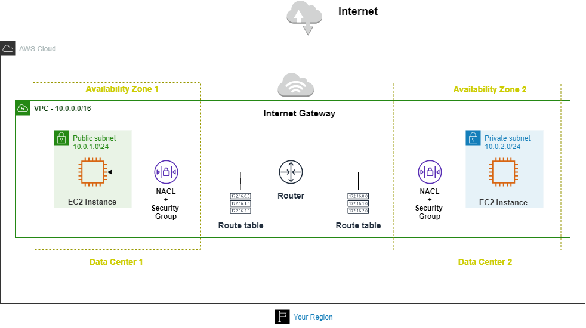

### Задание 1: Создание VPC
1. Авторизируйтесь в [AWS Management Console](https://aws.amazon.com/console/).

2. Выберите регион.

    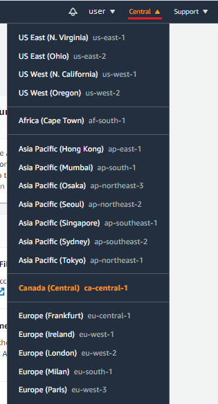

3. Найдите через поисковую строку `vpc`. 

    


4. В меню слева нажмите **Your VPCs**.

    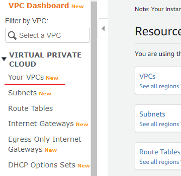

5. Нажмите **Create VPC** в правом верхнем углу.

    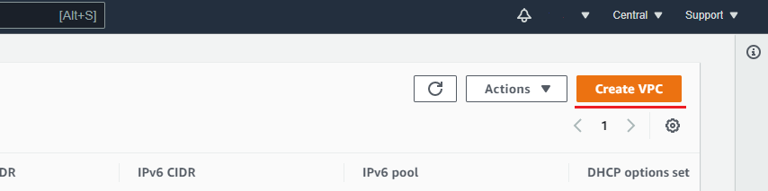

6. Чтобы создать VPC введите следующие данные:

    - *Name tag:* **HoLVPC**
    - *IPv4 CIDR block:* **10.0.0.0/16**
    - *IPv6 CIDR block:* **No IPv6 CIDR block**
    - *Tenancy:* **Default**
    - *Key:* **Name**
    - *Value -* **optional: HoLVPC**

    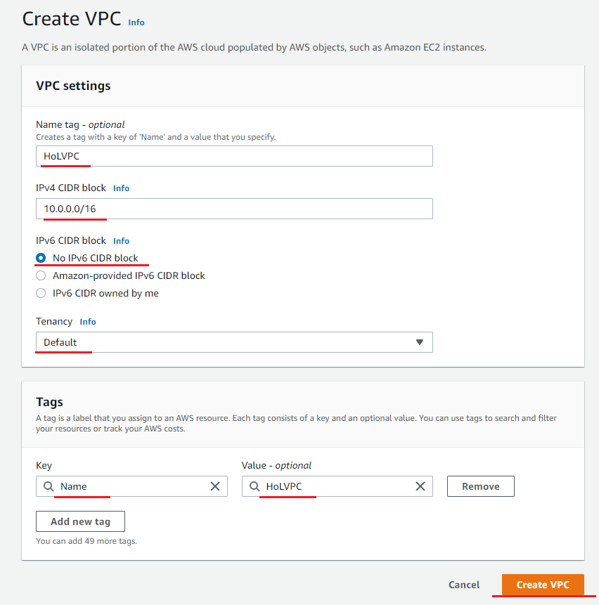

7. Нажмите **Create VPC**.

### Задание 2: Создание частной и общедоступной подсетей
1. В меню слева нажмите **Subnets**.

    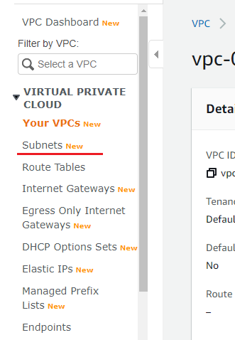

2. Затем нажмите кнопку **Create subnet** справа вверху.

    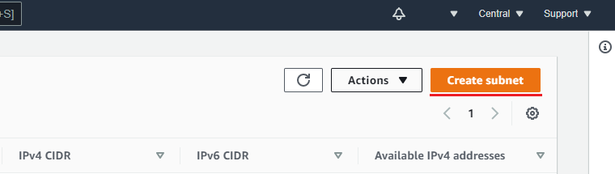

3. Из выпадающего меню выберите VPC созданную в задании 1 и введите следующие параметры:

    - *Subnet name:* **sn-public-a**
    - *Availability Zone:* **choose any option**
    - *IPv4 CIDR block:* **10.0.1.0/24**

    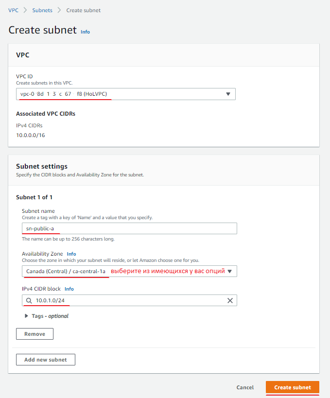    

4. Нажмите **Create Subnet** внизу справа.
5. Чтобы создать частную подсеть, снова нажмите **Create subnet**. 

       

6. Из выпадающего меню выберите ту же VPC что и для общедоступной сети и введите следующие значения:

    - *Subnet name:* **sn-private-b**
    - *Availability Zone:* **should be different from the one selected for your public subnet**
    - *IPv4 CIDR block:* **10.0.2.0/24**

       

7. Чтобы завершить создание подсети, нажмите **Create Subnet** > внизу.

### Задание 3: Создание маршрутов и настройка интернет-шлюза
1. В меню слева нажмите **Route Tables**.

       

2. Далее нажмите вкладку **Routes**, чтобы увидеть существующие маршруты. Скорее всего их там не будет.

    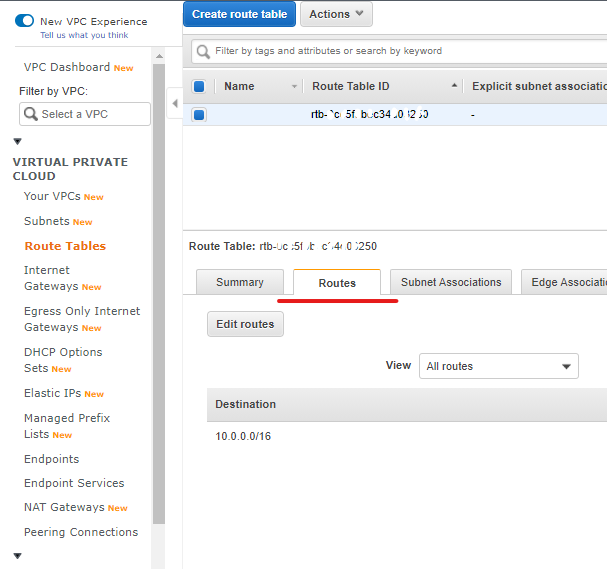   

3. Нажмите **Subnet Associations**, чтобы проверить подсети, ассоциирующиеся с данной таблицей маршрутов(Route Table). 

    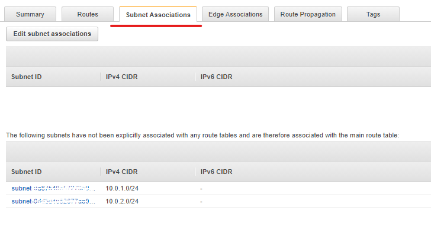   

4. Далее нажмите **Subnets**.

    

5. Выберите общедоступную подсеть `sn-public-a`.

    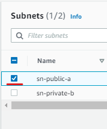

6. Справа сверху нажмите **Actions** и выберите из выпадающего меню **Modify auto-assign IP settings**.

    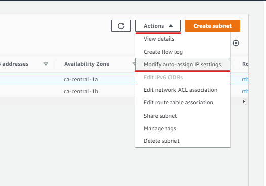

7. Нажмите **Auto-assign IPv4**, чтобы сделать возможным автоматическое назначение IPv4 адреса.

    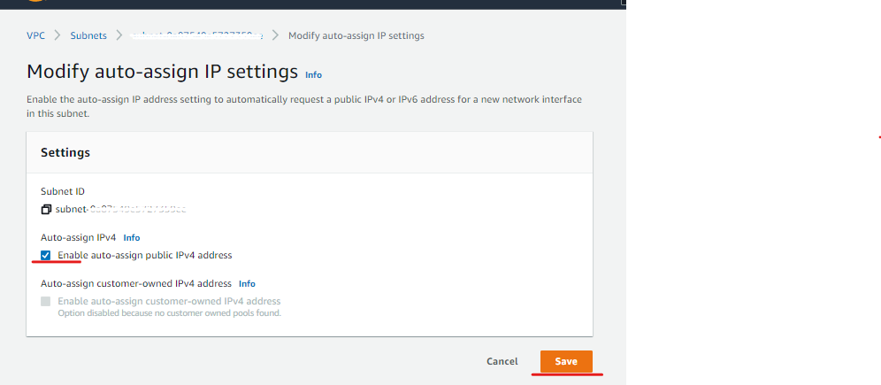

8. Нажмите **Save**.
9. Для создания интернет шлюза, нажмите **Internet Gateways**.

       

10. Справа сверху нажмите **Create Internet gateway** и введите **hol-VPCIGW**  в поле *Name tag:* 

    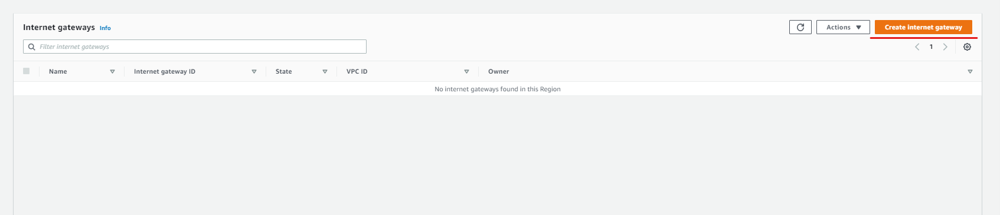 
    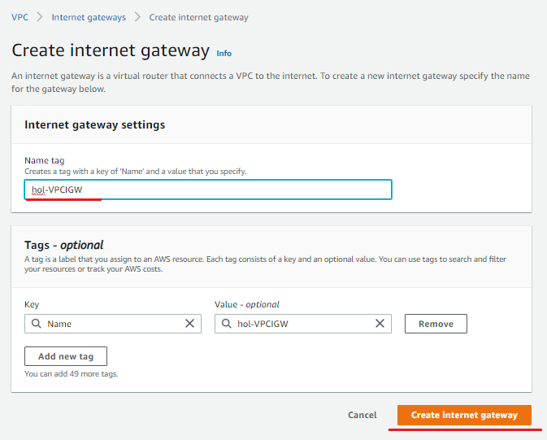   

11. Чтобы завершить создание шлюза, нажмите **Create Internet gateway** > внизу.
12. Выделите созданный интернет шлюз, нажмите **Actions** справа сверху, и выберите **Attach to VPC**

    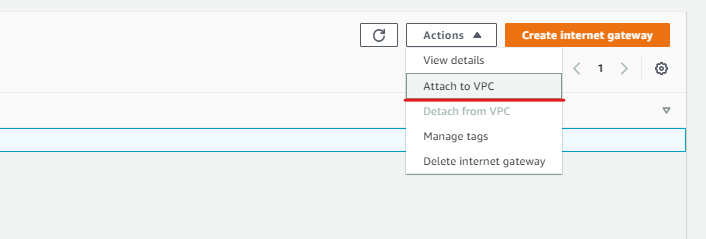  

13. Выберите **HoLVPC**, и нажмите **Attach Internet gateway**. Мы подключили интернет шлюз к нашему VPC.

    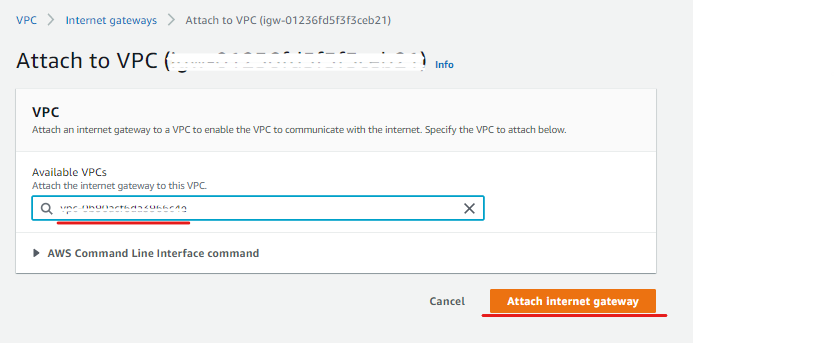  

14. Теперь мы создадим таблицу маршрутов. В меню слева нажмите **Route Tables**.

       

15. Нажмите **Create route table** и введите следующие значения:

    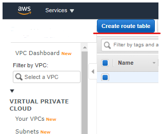   
    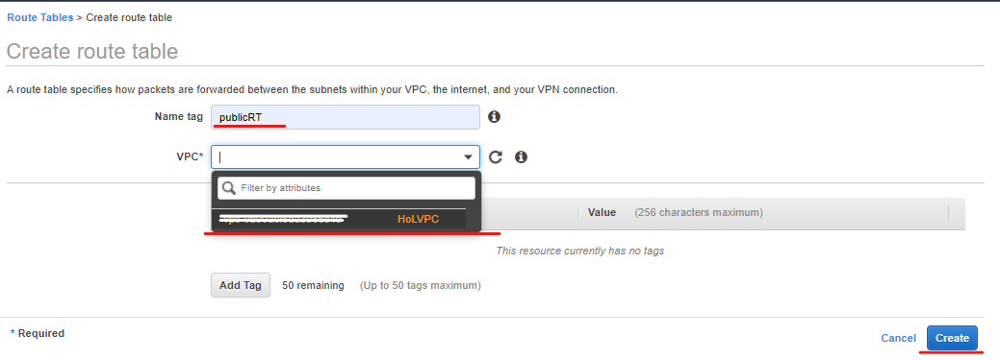   

    - *Name Tag:* **publicRT**
    - *VPC:* **HoLVPC**

16. Нажмите **Create**.
17. Выберите только `publicRT`.
18. Перейдите на вкладку **Routes** и нажмите **Edit routes**.

    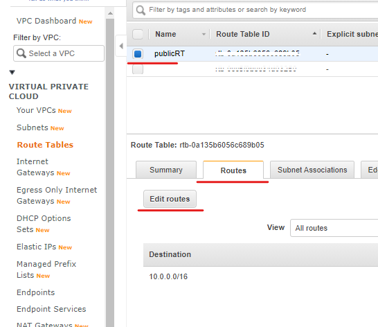   

19. Нажмите **Add route** и введите следующие значения:

    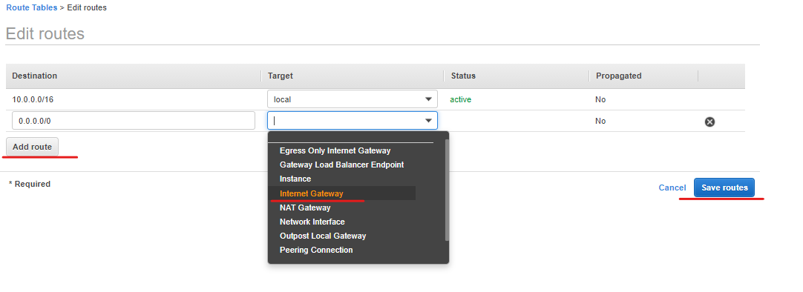   

    - *Destination:* **0.0.0.0/0**
    - *Target:* Select **Internet Gateway**, then select **hol-VPCIGW**

21. Нажмите **Save routes** и в следующем окне **Close**.
22. Убедитесь, что выбрана только `publicRT`.

    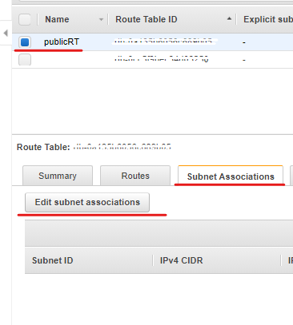 

23. Перейдите во вкладку **Subnet Associations tab** внизу страницы.
24. Нажмите **Edit subnet associations**.
25. Выберите общедоступную подсеть `sn-public-a` и сохраните свой выбор > **Save**.

    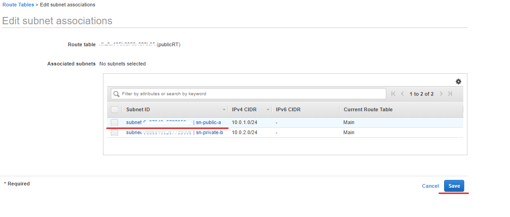 

26. Перейдите на страницу подсетей, кликнув **Subnets** на в меню слева.

    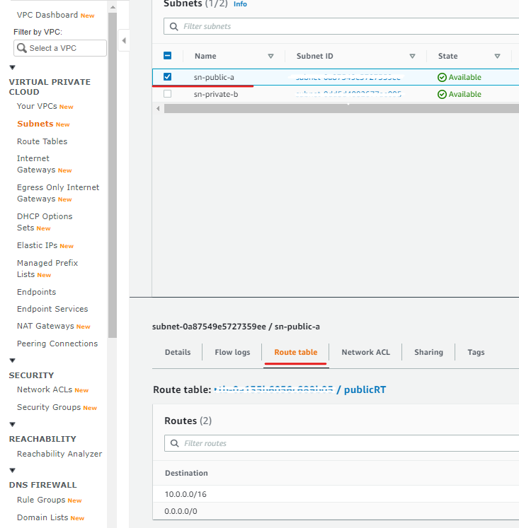 

27. Выберите любую подсеть и перейдите во вкладку **Route Table** (внизу), чтобы увидеть обновленную таблицу маршрутов.

### Задание 4: Запуск EC2 в общедоступной подсети
1. Чтобы перейдите на дашборд  EC2, нажмите **Services**.

    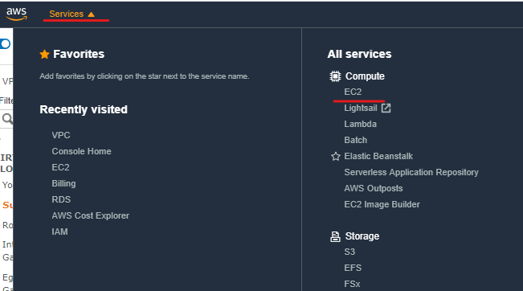 

2. Далее перейдите в **EC2**, находящийся в секции **Compute**.
3. В меню следа нажмите **Instances**.

    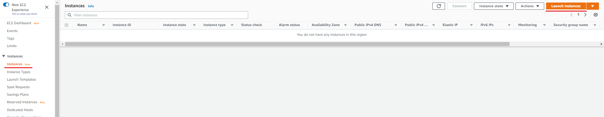 

4. Далее **Launch instances** > справа вверху.
5. Нужно выбрать *Amazon Linux 2 AMI (HVM), SSD Volume Type*. Убедитесь, что именно *64-bit (x86)*, и нажмите **Select**.

    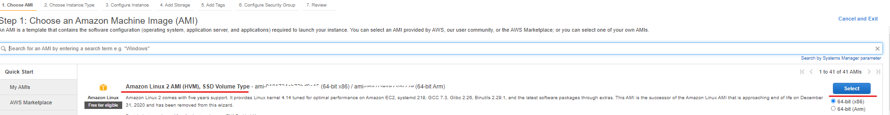 

6. Выберите **t2.micro**, и кликните на **Next: Configure Instance Details**.

    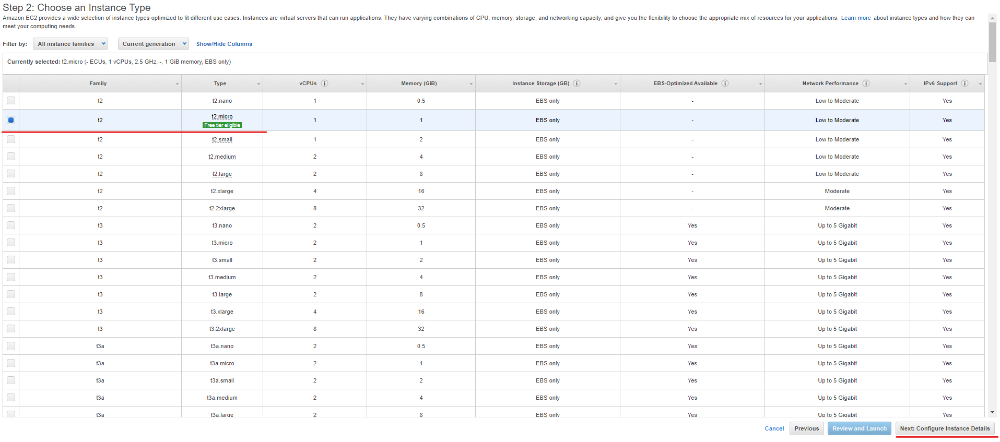 

7. Введите следующие значения:

    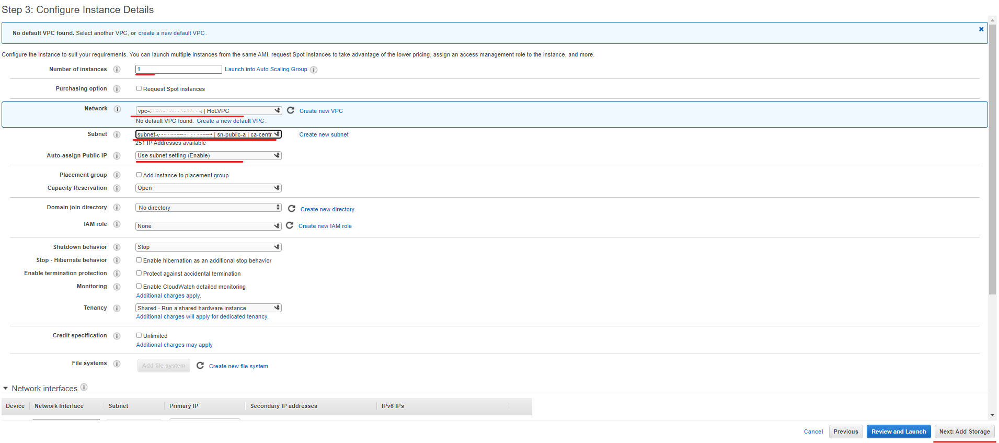 

    - *Number of Instances:* **1**
    - *Network:* **HoLVPC**
    - *Subnet:* **sn-public-a**
    - *Auto-assign Public IP:* **Use subnet setting (Enable)**

8. Далее **Next: Add Storage**.
9. Оставьте тут настройки без изменения и переходите далее **Next: Add Tags**.
10. Тэги тоже можно не создавать. Нажмите  **Next: Configure Security Group**.
11. Выберите опцию **Create a new security group**.

    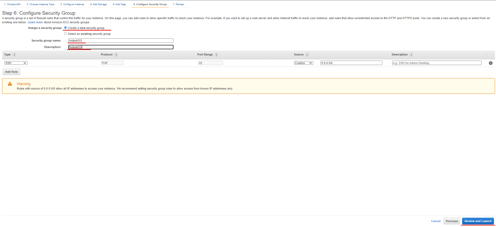 

12. В поле *Security group name* введите **holpubSG**.
13. В поле *Description* введите тоже самое - **holpubSG**.
14. Нажмите **Review** и далее **Launch**. 
15. Кликните на **Launch** .

    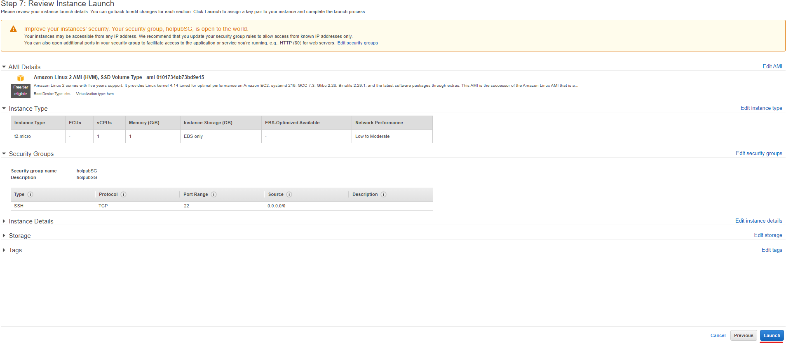 

16. Вам нужно создать секретный ключ. Во всплывающем диалоговом окне выберите **Create a new key pair**.
17. В поле *Key pair name* скопируйте **holpubkeypair**.
18. Скачайте ключ, нажав **Download Key Pair**. 

     

    > (Убедитесь, что секретный ключ находится в безопасном и доступном месте.)

19. Чтобы наконец запустить EC2, нажмите **Launch Instances** и далее **View Instances**.

### Задание 5: Запуск EC2 в частной подсети
1. Снова нажмите **Launch instances** > справа вверху.

     

2. Нужно выбрать *Amazon Linux 2 AMI (HVM), SSD Volume Type*. Убедитесь, что именно *64-bit (x86)*, и нажмите **Select**.

     

3. Выберите **t2.micro**, и кликните на **Next: Configure Instance Details**

     

4. Введите следующие значения:

    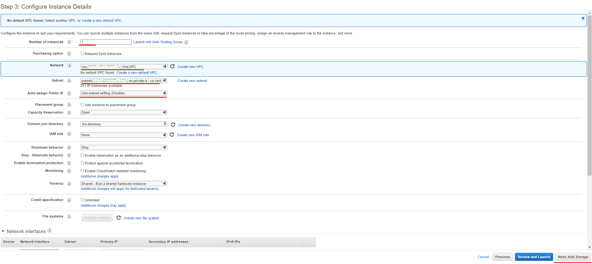 

    - *Number of Instances:* **1**
    - *Network:* **HoLVPC**
    - *Subnet:* **sn-private-b**
    - *Auto-assign Public IP:* **Use subnet setting (Disable)**

6. Оставьте тут настройки без изменения и переходите далее **Next: Add Tags**.
7. Тэги тут тоже можно не создавать. Нажмите  **Next: Configure Security Group**.
8. Выберите **Create a new security group**.
9. В поле *Security group name* введите **holprivSG**.
10. В поле *Description* - **holprivSG**.
11. Введите следующие значения:

    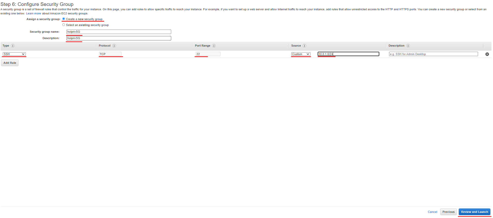 

    - *Type:* **SSH**
    - *Protocol:* **TCP**
    - *Port Range:* **22**
    - *Source:* **Custom 10.0.1.0/24**

12. Далее **Review and Launch** и **Launch**.

     

13. Во всплывающем окне выберите **Choose an existing key pair**.

14. Выберите **holpubkeypair**, который мы создали в предыдущей задаче.

    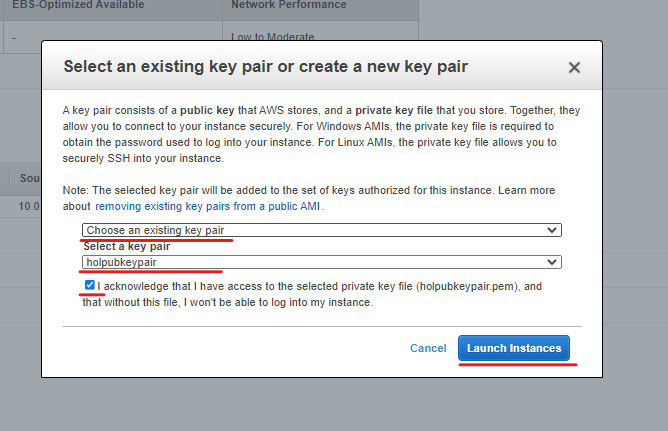 

15. Чтобы запустить ваш экземпляр EC2, нажмите **Launch Instances** и **View Instances**.

### Задание 6: Подключение к общедоступному EC2 по SSH
1. Чтобы найти адрес для подключения выберите экземпляр EC2 и нажмите **Connect** > справа сверху.

    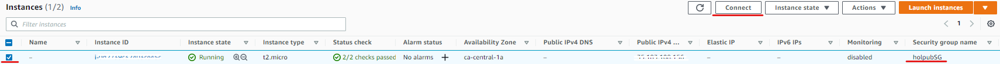 

2. Перейдите на вкладку **SSH client**.
3. Скопируйте команду для подключения.

    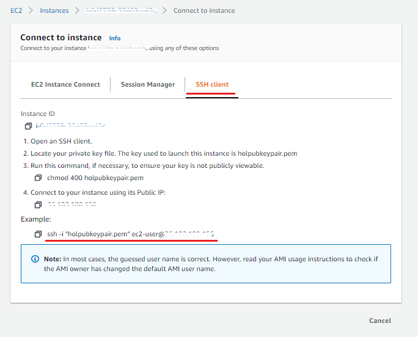 

4. Запустите терминал на вашем компьютере. Если вы на Windows, можно скачать [Git Bash](https://git-scm.com/downloads).

5. Перейдите в директорию, где вы сохранили секретный ключ **holpubkeypair**.
6. Для безопасности, поменяйте настройки доступа к секретному ключу. Введите следующую команду в терминале:

    ```
    chmod 400 <название вашего ключа>
    ```

7. Далее введите адрес подключения, который вы скопировали в шаге 3. Нажмите **Enter**.

### Поздравляем — вы закончили это практическое задание!
