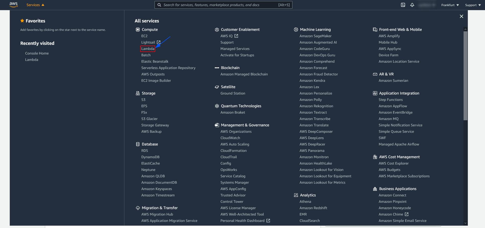
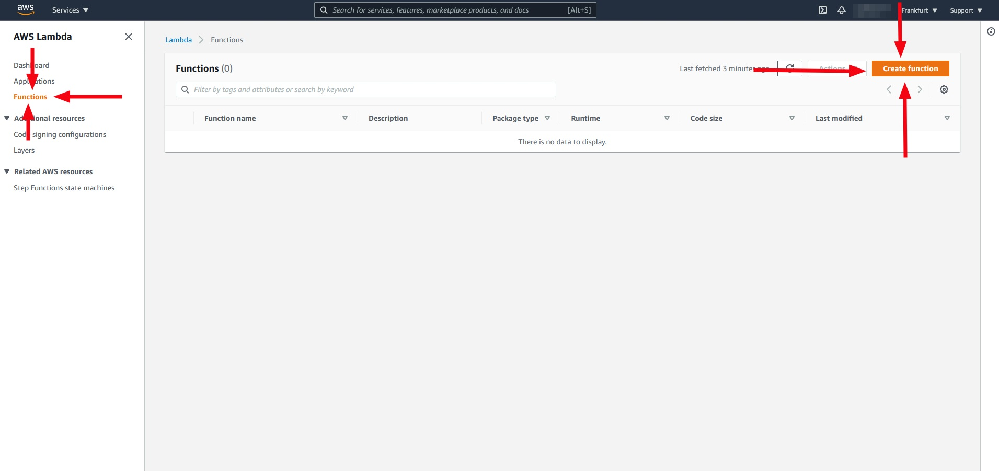
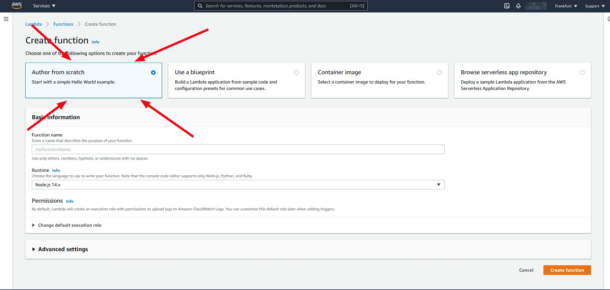
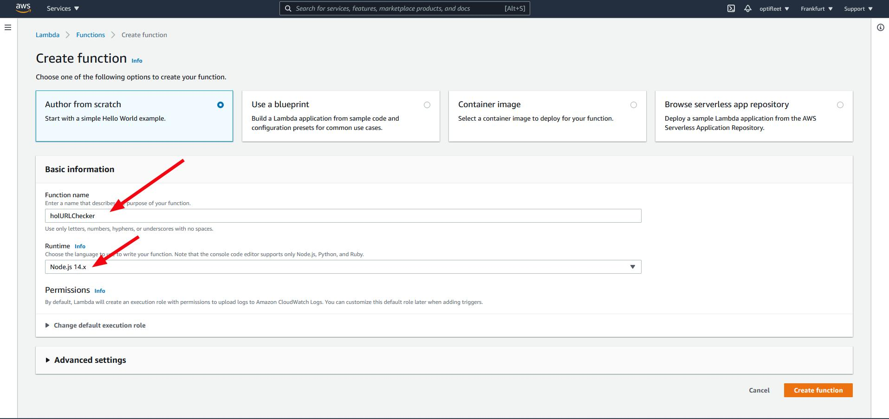
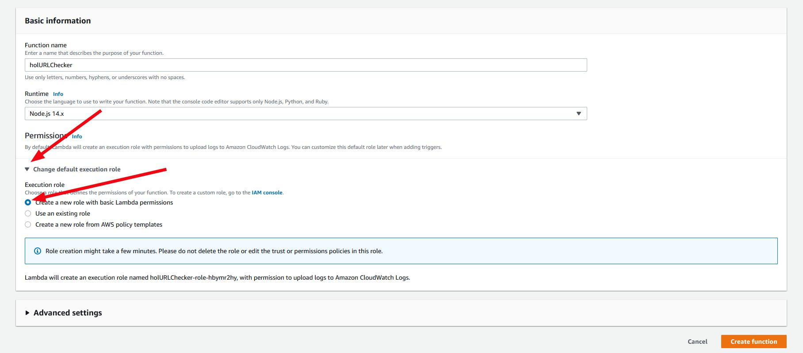
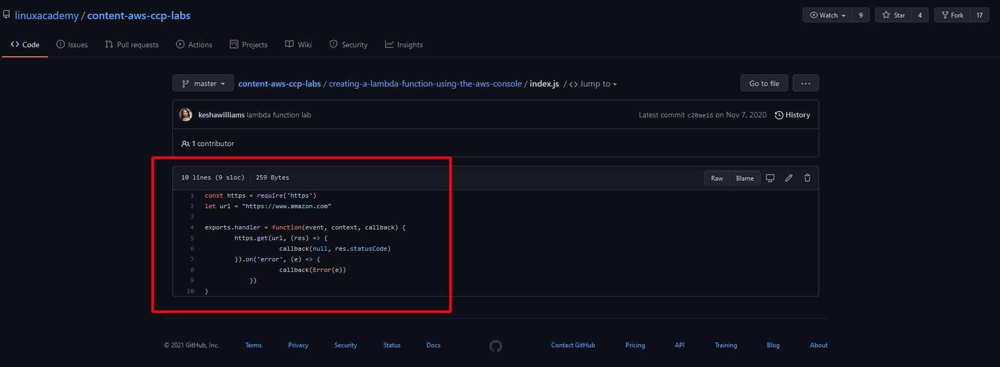
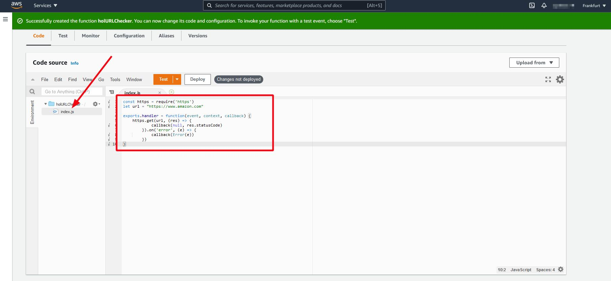

# Создаем лямбда функцию в AWS Console

## Введение
В этом практическом лабораторном сценарии вы напишете лямбда-функцию Node.js, которая проверяет URL-адрес (например, www.amazon.com) и возвращает код состояния, который показывает, работает ли веб-сайт или нет. Во время этой лабораторной работы у вас будет возможность изучить консоль Lambda, код функции, роли выполнения, тестовые события и результаты выполнения. AWS Lambda позволяет писать краткие функции и беспокоиться только о своем коде. Поскольку Lambda является бессерверной, AWS управляет базовой инфраструктурой за вас. 

## Решение
Авторизуйтесь на сайте https://aws.amazon.com/free/. 
Откройте код в соседней вкладке. Он нам понадобиться для выполнения задания. https://github.com/linuxacademy/content-aws-ccp-labs/blob/master/creating-a-lambda-function-using-the-aws-console/index.js

### Создаем Node.js ламбда функцию в AWS Console
1. В AWS console выбирите Lambda > Functions

2. Нажмите кнопку `Create function`

3. Выбирите `Author from scratch`

4. Устоновите следующие значения:
    - _Function name_: **holURLChecker**
    - _Runtime_: **Node.js**

5. Расширьте **Change default execution role**. Затем для _Execution role_ выбирите **Create a new role with basic Lambda permissions**

6. На вкладке в которой открыт GitHub, скопируйте код из index.js.

7. Вернитесь на вкоадку AWS console и нажмите на кнопку **Create function**.

8. На открывшейся странице Lambda функции удалите существующий код в функции и вставьте только что скопированный код из index.js.

9. 