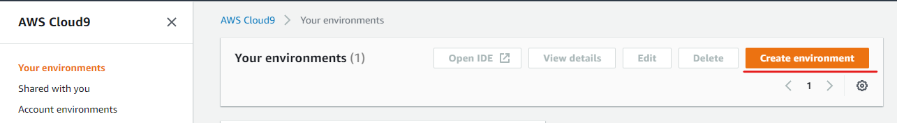
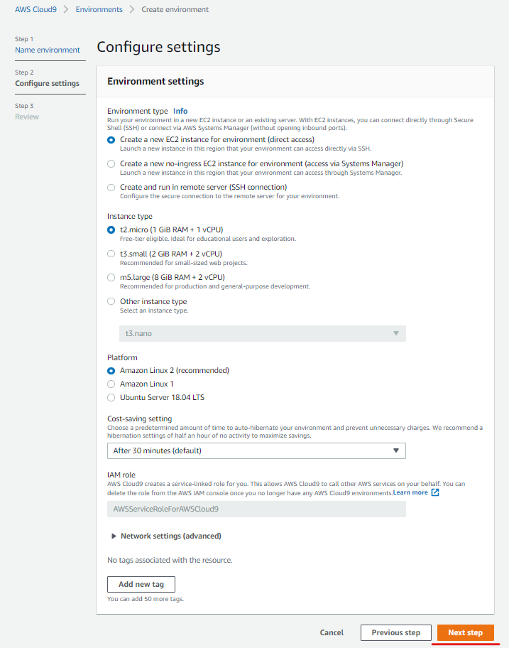
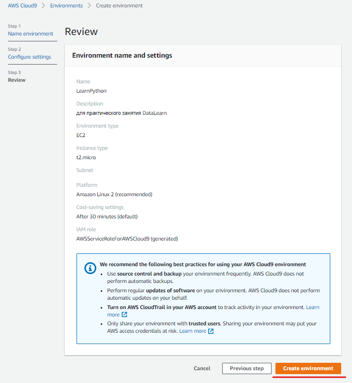

# Python Workshop

**Содержание**
* [Введение](#введение)
* [Начало работы](#начало-работы)
    * [1. Cloud9](#1-cloud9)
    * [2. Версия Python](#2-версия-python)
    * [3. Виртуальная среда](#3-виртуальная-среда)
* [Переменные](#переменные)
* [Типы данных](#типы-данных)
    * [Строки](#строки) 
    * [Числа](#числа) 
    * [Словари](#словари)  
    * [Списки](#списки)  
    * [Определение типа данных](#определение-типа-данных)
* [Пакеты](#пакеты) 
* [Функции](#функции) 
    * [Лаба #1. Простая функция](#лаба-1-простая-функция)
    * [Лаба #2. Введение в boto3](#лаба-2-введение-в-boto3)
    * [Лаба #3. Функция main()](#лаба-3-функция-main())
* [Аргументы и параметры](#аргументы-и-параметры)
    * [Лаба #4. Аргументы](#лаба-4-аргументы)
        * [1. Позиционные аргументы](#1-позиционные-аргументы)
        * [2. Именованные аргументы в виде словаря](#2-именованные-аргументы-в-виде-словаря)
* [Ввод данных](#ввод-данных)
    * [Лаба #5. Ввод данных](#лаба-5-ввод-данных)
        * [1. Консоль](#1-консоль)
        * [2. Ввод данных через интерфейс командной строки](#2-ввод-данных-через-интерфейс-командной-строки)
        * [3. Ввод данных из файла](#3-ввод-данных-из-файла)
        * [4. Ввод данных из JSON](#4-ввод-данных-из-json)
* [Циклы](#циклы)
    * [Лаба #6. Циклы по спискам и JSON](#лаба-6-циклы-по-спискам-и-json)
        * [1. Простые циклы](#1-простые-циклы)
        * [2. Цикл по словарям и JSON](#2-цикл-по-словарям-и-json)
        * [3. Генераторы списков](#3-генераторы-списков)
* [Условия](#условия)
    * [Лаба #7. Условия](#лаба-7-условия)
        * [1. If-Else](#1-if-else)
        * [2. Проверяем значение в списке](#2-проверяем-значение-в-списке)
        * [3. Elif](###-3-elif)
        * [4. Проверка вводных данных](#4-проверка-вводных-данных)
* [Логирование (logging)](#логирование-(logging))
    * [Лаба #8. Логирование](#лаба-8-логирование)
        * [1. Простое логирование](#1-Простое-логирование)
        * [2. Уровни логирования и файлы логов (log file)](#2-уровни-логирования-и-файлы-логов-(log-file))
        * [3. Добавление логирования в наш рабочий код](#3-добавление-логирования-в-наш-рабочий-код)
* [Ошибки и исключения](#ошибки-и-исключения)
    * [Лаба #9. Try-Except](#лаба-9-try-except)
        * [1. Простой пример](#1-простой-пример)
        * [2. Добавление обработки ошибок в код](#2-добавление-обработки-ошибок-в-код)
* [Хранение данных](#хранение-данных)
    * [Лаба #10. Amazon DynamoDB](#лаба-10-amazon-dynamodb)
        * [1. Создание таблицы](#1-создание-таблицы)
        * [2. Загрузка данных](#2-загрузка-данных)
        * [3. Создание, чтение, обновление, и удаление данных](#3-создание-чтение-обновление-и-удаление-данных)
        * [4. Запросы и сканирование данных](#4-запросы-и-сканирование-данных)
        * [5. Удаление таблицы(опционально)](#5-удаление-таблицы(опционально))
* [Разработка в AWS](#разработка-в-aws)
    * [Построение Lambda-функций с помощью Python](#построение-lambda-функций-с-помощью-python)
    * [Создание современного веб-приложение на Python](#создание-современного-веб-приложение-на-python)
    * [Комплект для облачной разработки (CDK)](#комплект-для-облачной-разработки-(cdk))
* [Сворачивание ресурсов](#сворачивание-ресурсов)

# Введение
В этом практическом задании предполагается, что вы используете свою учетную запись AWS. Также предполагается, что вы используете IDE Cloud9 (создается в учетной записи AWS).

Если вы решите использовать собственную IDE, вам нужно следует настроить IAM доступ к вашей учетной записи AWS и установить Boto3 SDK. 

# Начало работы

## 1. Cloud9
После того, как вы войдете в консоль AWS, вам необходимо перейти к AWS Cloud9, которое представляет собой облачную интегрированную среду разработки (IDE), которая позволяет писать, запускать и отлаживать код в браузере. 

- В консоли AWS введите Cloud9 в строку поиска.
- Нажмите **Create environment**

    

- Укажите имя, например *LearnPython* и нажмите **Next step**

    

- Примите настройки по умолчанию и нажмите **Next step**.

    


    > Используя настройки по умолчанию, услуги этого сервиса должны быть бесплатными.

- Выберите **Create Environment**.

    


Как только вы создали экземпляр *Cloud9*, на экране появится интегрированная среда разработки. В верхнем разделе находится редактор кода, в котором вы будете писать свой код на Python. Нижняя часть - это сеанс терминала, позволяющий напрямую взаимодействовать с AWS и python. Левая боковая панель - это ваша среда, в которой вы можете создавать и просматривать файлы Python. 

## 2. Версия Python

**Проверяем версию Python**

В терминале (нижний раздел) проверьте версию python.

* В командной строке введите `python`
* Должна отображаться следующая информация

```python
Python 3.7.9 (default, Apr 30 2021, 20:11:56) 
[GCC 7.3.1 20180712 (Red Hat 7.3.1-12)] on linux
Type "help", "copyright", "credits" or "license" for more information.
```

**Interactive Mode**

Это интерактивная среда Python. Вы можете вводить команды python прямо в него, и они будут работать как python. Это отличный инструмент для быстрого тестирования команд Python.

Попробуйте это сейчас на примере. Введите или скопируйте следующее в интерактивную среду Python после `>>>`

```python
some_string = "Hello Python"
print(some_string)
```

После введения кода и нажатия кнопки **Enter**:

```python
>>> some_string = "Hello Python"
>>> print(some_string)
Hello Python
```

Поздравляем! Вы только что создали свою первую переменную Python с именем `some_string` и присвоили ей значение `"Hello Python"`.
Затем вы вывели на экране значение переменной, используя встроенную функцию `print`.


**Выйти из интерактивного режима**

Чтобы выйти из среды Python, используйте `crtl + d` или набрав `exit()`. 


## 3. Виртуальная среда

Создать виртуальную среду

Виртуальная среда в python - это контейнер, в котором находится весь ваш код и другие пакеты python. Это позволяет вам хранить конфигурацию Python отдельно от других версий в вашей системе. При разработке кода Python рекомендуется всегда использовать виртуальную среду.

Вы можете выбрать любое имя для своей виртуальной среды.

Для создания виртуальной среды воспользуемся консольной командой: 

```console
python -m venv my_venv
```

После того, как виртуальная среда создана, вам необходимо активировать ее. После активации ваш код запускается внутри среды, включая любые установленные вами пакеты. Чтобы активировать среду, используйте одну из следующих команд :

**Linux/macOS**

```console
source my_venv/bin/activate
```

**Windows (Git-Bash)**

```console
source my_venv/Scripts/activate
```

**Windows (PowerShell)**

```console
.\my_venv\Scripts\Activate.ps1
```

Чтобы знать, что вы находитесь внутри виртуальной среды, ваша командная строка будет иметь префикс (my_venv). Теперь любые используемые вами пакеты будут храниться в структуре папок в вашей виртуальной среды. 

Чтобы выйти из виртуальной среды, вы вводите deactivate, и в командной строке больше не будет префикса (my_venv). 

# Переменные
Переменная - это значение, которое может изменяться. Они могут использоваться для хранения информации, на которую могут ссылаться программы. Вместо того, чтобы напрямую использовать сохраненное значение, мы можем использовать вместо этого переменную. Переменные могут хранить в себе различные типы данных. Например, строка текста, список или объект. Использование переменных делает наш код гибким и многоразовым. 

Имена переменных определяются, когда вы их объявляете. Соглашение об именах переменных изложено в [pep8](https://www.python.org/dev/peps/pep-0008/#function-and-variable-names), руководстве по стилю для Python. Названия должны быть набраны строчными буквами, а слова должны быть разделены подчеркиванием по мере необходимости для улучшения читаемости.

Переменные в Python объявляются в формате `имя = значение`. В python мы можем хранить разные типы данных без необходимости явно указывать тип при объявлении переменной.

Вот несколько примеров: 

```python
a_str = "This is an example of a string in quotes" #строчное значение
my_float = 5.5 #число с плавающей точкой
test_function = my_function() #функция
example_tuple = ("apple", "orange", "pear") #кортеж
boolean_values = True #булево значение
```

# Типы данных 

## Строки 

В python строка(`string`, сокращенно `str`) относится к любому значению заключенному в кавычки. Кавычки могут быть одинарными и двойными. The examples below are identical to python.

```python
"The quick brown fox jumped over the lazy dog"
'The quick brown fox jumped over the lazy dog'
```
Если вам нужно вставить цитату в предложение, тогда используйте одинарные кавычки для текста и двойные кавычки для цитаты. Например:

```python
'The error message was "Incorrect DataType"'
```

Строки, как и все типы данных, могут быть присвоены переменной.

```python
>>>first_name = "Monty"
>>>last_name = "Python"
```

Также вы можете добавить одну строку к другой используя переменные. 

```python
>>>print(first_name+last_name)
MontyPython
```

Вы заметили что в предыдущем примере на выходе мы получили `MontyPython` без пробела. Пробел можно добавить либо его к началу или концу слова. Либо добавить как отдельное строчное значение(как в примере ниже).

```python
>>>print(first_name + " " + last_name)
Monty Python
```

### Использование переменных внутри строки

Представьте, что вы хотите использовать значение переменной в середине строки. Это можно сделать несколькими способами.

### .format()

В этом методе вы можете использовать фигурные скобки внутри строки, чтобы указать, куда должна идти переменная. Затем используйте `.format(variable_name)` после кавычек. Если у вас есть несколько переменных, то для каждой переменной вы используете фигурные скобки. В `.format()` отделите каждую переменную запятой. Например `.format (variable_1, variable_2).`

Попробуйте ввести следующий пример в интерактивном режиме питона.

```python
>>>first_name = "John"
>>>surname = "Doe"
>>>print("My first name is {}. My family name is {}".format(first_name, surname))
```

### f-strings

Начиная с версии 3.6 появилась возможность использовать форматирование под названием *f-strings* для использования переменной внутри строчного значения. Для некоторых этот форматирование более читабельное.

```python
firstname = "Jane"
surname = "Doe"

print(f"My first name is {firstname}. My family name is {surname}")
```


## Числа 


Целые числа в питоне называются integers, сокращенно int.

Числа я плавающей точкой называются floating point numbers, сокращенно float.
 

### Использование чисел в строках
В предыдущем разделе, посвященных строкам, вы узнали, что вы можете использовать  `+ `, чтобы добавить строки вместе, для образования предложения. Вы также узнали, что вы можете вставить переменные в предложение с помощью фигурных скобок  `{} `.

Что произойдет, если мы попытаемся использовать число с этими двумя различными методами?

Попробуйте следующий код:

```python
my_int = 50
sentence = "The total comes to: "
```

```python
print(sentence + my_int)
```

В результате вы должны получить следующую ошибку:
`TypeError: can only concatenate str (not "int") to str`

`TypeError` очень распространены, когда вы изучаете python. Python говорит вам, что вы пытаетесь использовать тип данных, который не будет работать. В этом случае вы не можете добавить строку и число вместе.

Исправьте ошибку, преобразовав тип данных 'int' в тип данных 'str'

```python
my_int = 50
sentence = "The total comes to: "

print(sentence + str(my_int))
```
Мы использовали метод `str()` для преобразования переменной из целого числа в строку. В большинстве случаев Питон будет определять тип данных без вашей декларации. Тем не менее, может быть полезно сказать питону, как именно вы хотите обращаться с типом данных. Другими примеры преобразования:

`str()` возвращает объект строки

`int()` возвращает объект целого числа

`float()` возвращает объект числа с плавающей точкой

`bool()` булево значение True или False


## Словари  

Словарь(`dictionary`) - это способ хранения связанной информации в парах ключ-значение (`key-value` pairs). Он использует ключ(`key`) в качестве идентификатора и значение (`value`) для хранения информации. Например, ключом может быть first_name, а значением - Ada.

Словарь, написанный на Python, будет выглядеть как `{"first_name": "Ada"}`. 

Словари очень распространены в AWS, поэтому вы будете часто их видеть.

- Они используются для обмена информацией между различными сервисами и функциями.
- Они возвращаются как ответ от Application Programming Interfaces (API).
- Они используются как значения тегов (Tag)

 
### Создание, чтение, обновление и удаление значений в словаре 

### Создание

Словари можно создавать, назначая пары `ключ-значение` (`key-value`), которые вы хотите сохранить в словаре.

Используя интерактивный режим Python, попробуйте следующее: 

```python
>>> user = {"first_name":"Ada"}
>>> print(user)
{'first_name': 'Ada'}
```

или если вы собираетесь добавлять содержимое словаря позже, вы можете объявить пустой словарь. Вы можете создать пустой словарь двумя способами: 

Присвоение `{}` переменной, например: 

`account_details = {}`
или конструктор `dict()`:

`account_details = dict()`

### Чтение

Чтобы прочитать значение, связанное с ключом, вам необходимо указать имя словаря и значение ключа в квадратных скобках. 

Попробуйте следующее:
```python
>>> user = {"first_name":"Ada"}
>>> print(user["first_name"])
Ada
```

### Обновление

- Добавление новой пары `ключ-значение` (`key-value`)

Словари изменяемы(mutable), то есть их можно изменять после того, как вы их создадите. Вы можете добавлять, обновлять или удалять пары ключ-значение в словаре.

Чтобы добавить в словарь дополнительную пару `ключ-значение`, укажите имя словаря, новый ключ в `[]` и `значение` после знака `=`.

Попробуйте следующее: 

```python
>>>user["family_name"] = "Byron"
>>>print(user)
{'first_name': 'Ada', 'family_name': 'Byron'}
```

- Изменение значения

Изменение значения аналогично его добавлению, вы указываете новое значение после знака `=`. 

Попробуйте следующее:

```python
user["family_name"] = "Lovelace"
print(user)
{'first_name': 'Ada', 'family_name': 'Lovelace'}
```

### Удаление пары `ключ-значение`

Чтобы удалить пару `ключ-значение`, вы используете оператор `del` с именем словаря и ключом, который вы хотите удалить.

```python
>>> del user["family_name"]
>>> print(user)
{'first_name': 'Ada'}
```

## Списки  
Список - это упорядоченная последовательность значений, разделенных пробелами. Например: 

`[0,1,2,3,4]`

или

`["apples","oranges","bananas"]`

Список может содержать другие объекты, например словари, о которых мы узнали на прошлом уроке. Например: 

`[{"fruit_type":"apples"},{"number":50}]`

 

### Создание, чтение, обновление и удаление элементов в списке 

### Создание

Списки могут быть созданы путем присвоения значений, которые вы хотите сохранить в списке, переменной, например: 

`fruit = ["apples","oranges","bananas"]`

или если вы собираетесь добавлять содержимое списка позже, вы можете объявить пустой список. Вы можете создать пустой список двумя способами, подобно словарю: 

Присвоение `[]` переменной, например: 

`fruit = []`
или конструктор `list()`:

`fruit = list()`

### Чтение  

Объектам, хранящимся в списке, присваивается порядковый номер, начинающийся с 0. Чтобы прочитать элемент из списка, вы используете порядковый номер сохраненного значения. 

Используя интерактивный режим Python, попробуйте следующее:
```python
>>>fruit = ["apples","oranges","bananas"]
>>>print(fruit[1])
oranges
```
В приведенном выше примере python напечатал значение, хранящееся в позиции индекса 1, которая вернула `oranges`, потому что список начинается с позиции 0 (в которой хранятся  `apples`). 

Вы можете найти длину списка, используя  len(). Попробуйте следующее:

```
>>>len(fruit)
3
```

Вы можете вернуть последнее значение в списке или работать в обратном направлении от последнего элемента, используя отрицательное значение индекса. Например, чтобы вернуть последнее значение в списке.

Try the following:
```python
>>>print(fruit[-1])
bananas
>>>print(fruit[-2])
oranges
```

### Обновление  

Списки изменяемы, что означает, что они могут быть изменены после того, как вы их создадите. Вы можете добавлять, обновлять, удалять и изменять порядок элементов в списке. 

Вы можете использовать `append()`, чтобы добавить элемент в конец списка. 

Попробуйте следующее:

```
>>> fruit.append("kiwi")
>>> print(fruit)
['apples', 'oranges', 'bananas', 'kiwi']
```

Если вы хотите добавить элемент в определенную точку списка, вы можете использовать значение индекса с помощью метода `insert()`. 

Попробуйте следующее:

```
>>> fruit.insert(2, "passion fruit")
>>> print(fruit)
['apples', 'oranges', 'passion fruit', 'bananas', 'kiwi']
```

### Организация списков 

Элементы в списке не сортируются автоматически.

Если вы хотите вернуть отсортированную информацию, но сохранить исходный порядок списка, вы можете использовать функцию `sorted()`. 

Попробуйте следующее:

```python
>>>print(sorted(fruit))
['apples', 'bananas', 'kiwi', 'oranges', 'passion fruit']
>>>print(fruit)
['apples', 'oranges', 'passion fruit', 'bananas', 'kiwi']
```

В приведенном выше примере вы можете видеть, что функция `sorted()` возвращает отсортированный список, но не изменяет исходный порядок списка.

Если вы хотите постоянно отсортировать список, вам следует использовать метод `sort()`. 

Попробуйте следующее:

```python
>>> fruit.sort()
>>> print(fruit)
['apples', 'bananas', 'kiwi', 'oranges', 'passion fruit']
```
Чтобы изменить порядок списка, вы можете использовать метод `reverse()`. Это навсегда изменит порядок в списке.

Попробуйте следующее:

```
>>>fruit.reverse()
>>> print(fruit)
['passion fruit', 'oranges', 'kiwi', 'bananas', 'apples']
```

Чтобы отменить это действие. вы должны просто снова использовать `reverse()`, чтобы восстановить исходный порядок. 

### Удаление

Вы можете удалить элементы из списка, используя оператор `del`, если вы знаете позицию индекса. 

Попробуйте следующее:

```python
>>> del fruit[1]
>>> print(fruit)
['passion fruit', 'kiwi', 'bananas', 'apples']
```

Если вы используете `del`, элемент удаляется, поэтому вы больше не можете его использовать. Например, если у вас есть список пользователей, вы можете удалить пользователя.

Если вы хотите использовать значение после удаления его из списка, используйте метод `pop()`. Чтобы использовать `pop()`, вам нужно сохранить значение, которое вы удалили из списка, внутри другой переменной. 

Попробуйте следующее:

```python
>>>favorite_fruit = fruit.pop()
>>>print(favorite_fruit)
apples
```

В этом примере `pop()` вернул последний элемент в списке, который является значением по умолчанию для `pop()`. Вы можете вернуть любой элемент с помощью `pop()`, используя значение индекса. 

Попробуйте следующее:

```python
>>> fresh_fruit = fruit.pop(1)
>>> print(fresh_fruit)
kiwi
```

Если вы не знаете позицию индекса или не хотите удалять последний элемент в списке, вы можете использовать метод `remove()`, чтобы указать значение элемента, который вы хотите удалить. 

Попробуйте следующее:

```python
>>> fruit.remove('bananas')
>>> print(fruit)
['passion fruit']
```

Помните, что когда вы используете `del`, `pop()` или `remove()`, элемент безвозвратно удаляется из исходного списка. Если список распечатан, вы увидите, что эти элементы больше не хранятся в списке. 

## Определение типа данных

Иногда ваш код вызывает ошибку `TypeError`. Это может быть неприятно исправлять. Первым шагом часто бывает выяснение типа данных.

Чтобы узнать, какой тип данных Python хранит в переменной, можно использовать метод `type()`.

В IDE (интегрированная среда разработки ) попробуйте следующее: 

```python
>>>my_variable = "A string"
>>>print(type(my_variable))
```

На экране дложно быть выведено следующее:

```python
<class 'str'>
```

Как только вы узнаете тип данных, вы можете решить проблему, явно указав, как вы хотите, чтобы Python обрабатывал данные.

Вот пример `TypeError` ниже. 

```python
>>> my_number = 50
>>> some_string = "The number is "
>>> print(some_string + my_number)
Traceback (most recent call last):
  File "<stdin>", line 1, in <module>
TypeError: can only concatenate str (not "int") to str
```

Вот как мы можем исправить ошибку `TypeError`, указав Питону преобразовать `my_number` в строку. 


```python
>>> my_number = 50
>>> some_string = "The number is "
>>> print(some_string + str(my_number))
The number is 50
```

# Пакеты 

Мы почти готовы начать взаимодействие с AWS. Прежде чем мы это сделаем, нам нужно установить дополнительное программное обеспечение, называемое пакетом.

Пакет в python - это код, состоящий из отдельных компонентов, называемых модулями, которые мы можем использовать в нашем коде. Пакеты избавляют нас от необходимости писать каждый аспект нашей программы с нуля, позволяя использовать код других людей. Импортируя пакеты в нашу программу, мы можем использовать функции этого пакета. У Python есть общие пакеты, которые включены, другие должны быть установлены в нашу виртуальную среду с помощью [pip](https://pypi.org/project/pip/) диспетчера пакетов python.

Для работы с AWS вам потребуется установить пакет [Boto3](https://boto3.amazonaws.com/v1/documentation/api/latest/index.html). Установите его сейчас. 

В командной строке в терминале введите: 

```console
pip install boto3
```

Команда должна запустить и установить несколько пакетов. Вы также можете получить сообщение, подобное приведенному ниже. 
```python
You are using pip version 18.1, however version 20.0.2 is available.
You should consider upgrading via the 'pip install --upgrade pip' command.
```
Вы можете продолжить и установить последнюю версию pip, введя команду:

```console
pip freeze
```
которая вернет что-то похожее на: 

```console
boto3==1.12.6
botocore==1.15.6
docutils==0.15.2
jmespath==0.9.5
python-dateutil==2.8.1
s3transfer==0.3.3
six==1.14.0
urllib3==1.25.8
```

### Создание файла requirements.txt 

Когда вы введете `pip freeze`, вы увидите все пакеты, установленные в вашей виртуальной среде. Нам нужно иметь возможность воссоздать набор пакетов, когда код будет повторно использован где-то еще. Например, на другом компьютере или в другой среде. Для этого используется файл `requirements.txt`. Этот файл содержит список всех пакетов и версий, необходимых для установки новой среды.

Вы можете создать файл `requirements.txt` с помощью команды 

```console
pip freeze> requirements.txt.
```

В текущем каталоге будет создан файл `requirements.txt`.

Чтобы установить файл `requirements.txt` в новой виртуальной среде, введите следующий код чтобы установить все те же пакеты и зависимости из этого файла. 

```console
pip install -r requirements.txt
```

# Функции 

Функция - это именованный раздел программы, который выполняет определенную задачу. Функции, как и переменные, добавляют гибкости коду, поскольку их можно использовать повторно, что сокращает объем кода, который нам приходится писать.

В этом разделе мы начнем с простой функции, а затем напишем функцию, которая использует Amazon Translate Service. 

## Лаба #1. Простая функция

В python мы можем объявить функцию, используя синтаксис  `def function_name()`;
Несколько базовых правил при создании функции:
- начинается с `def`;
- имя написано строчными буквами, а слова разделены подчеркиванием для улучшения читаемости;
- после имени функции - круглые скобки `()`, которые могут содержать параметры (подробнее об этом позже) 
- декларирование функции заканчивается двоеточием `:`. 

Ниже написана очень простая функция, которая при вызове вернет `hello world`.

В верхнем разделе `IDE Cloud9` вы можете написать свою программу. Для этого нажмите `+`, чтобы открыть новый файл(`New FIle`), или используйте `^ N`.

В редакторе вверху добавьте следующее: 

```python
# функция, которая выводит hello world

def hello_world():
    print('hello world')

# код ниже вызывает функцию
hello_world()
```

Сохраните файл `file > save` или `command + s` с именем
`lab_1_hello_world.py`. Расширение `py` в конце названия обозначает, 
что это питоновский файл .

Чтобы запустить программу, введите следующее в командной строке терминала:

```console
python lab_1_hello_world.py.
```

В терминале должно быть выведено `hello world`.

Поздравляем! Вы только что написали свой первый код в питоне.

Стоит отметить следующее:
- Символ решетки `#` используется для комментариев. 
Все, что находится после # в этой строке, python игнорирует.
- Функция определяется с помощью `def`.
- У функции есть имя `hello_world`.
- Следующая строка имеет отступ, чтобы показать, что она находится внутри функции.
- Функция вызывается последней строкой `hello_world ()`. 

Вопрос для самопроверки. Не переходите стразу к ответу.
Что произойдет, если вы опустите последнюю строку `hello_world()`?

Ответ:
Если вы опустите последнюю строку `hello_world()`, 
интерпретатор python не вызовет функцию, поэтому 
ничего не произойдет. Попробуйте, отредактировав файл и удалив его.

### Возврат информации из функции

Когда функция выполняет какое-либо действие, 
по умолчанию информация о ней остается в пределах функции. 
Чтобы передать информацию в другие части вашего кода, 
вам нужно использовать `return`. 
Значение, возвращаемое функцией, называется возвращаемым значением 
и передается обратно в строку, которая вызвала функцию. 

Модифицируйте `lab_1_hello_world.py` следующим образом: 

```python
# функция, которая возвращает hello world
def hello_world():
    return 'hello world'

# Присвоение функции hello_world() к переменной.
greeting = hello_world()
print(greeting)
```
### Выводы:

### Что вы сделали?

- Вы создали функцию hello_world ().
- В первом примере вы использовали print () для вывода вывода непосредственно на консоль.
- Во втором примере вы использовали return, чтобы вернуть строку hello_world в то место в коде, где была вызвана функция.
- Вы назначили функцию hello_world () переменной с именем welcome.
- Вы вывели значение переменной приветствия.

### Что сделал питон?

- В первом примере python вызывает функцию `hello_world()` и выводит строку с помощью `print (hello_world)`.
- Во втором примере python назначает функцию `hello_world()`  переменной и сохраняет возвращаемое значение. 


## Лаба #2. Введение в boto3

В этой лабораторной работе мы будем использовать Amazon Translate 
для перевода текста с английского на французский.

Сначала посмотрите документацию [Boto3 для Amazon Translate](https://boto3.amazonaws.com/v1/documentation/api/latest/reference/services/translate.html).

В разделе, помеченном как клиент([client](https://boto3.amazonaws.com/v1/documentation/api/latest/reference/services/translate.html#id11)), рассказывается, как использовать службу перевода в нашей программе.

В документации Boto3 для AWS Translate мы видим, 
что он поддерживает разные методы. Вы можете изучить каждый из них, 
если хотите. Мы собираемся использовать в нашей программе метод [translate_text()](https://boto3.amazonaws.com/v1/documentation/api/latest/reference/services/translate.html#Translate.Client.translate_text).

В методе translate text документация начинается 
с `translate_text(** kwargs)`, а затем идет раздел с заголовком Request Syntax(синтаксис запроса). 
Синтаксис запроса следующий: 

```python
response = client.translate_text(
    Text='string',
    TerminologyNames=[
        'string',
    ],
    SourceLanguageCode='string',
    TargetLanguageCode='string'
)
```
С помощью этой информации мы можем построить нашу функцию в python. 
Когда декларируем функцию в python, скобки `()` перед двоеточием `:`
используется для параметров, которые являются входными данными для вашей функции.

В Boto3 используются методы `(**kwargs)`. 
В python это означает, что функция будет принимать 
произвольное количество именных аргументов. 
Мы вернемся к использованию `kwargs` позже.

Прочитав документацию, вы увидите, что `translate_text()` имеет три [ОБЯЗАТЕЛЬНЫХ] вводных параметров 
и один опциональный:

- `Text` [ОБЯЗАТЕЛЬНО]
- `TerminologyNames` - опционально.
- `SourceLanguageCode` [ОБЯЗАТЕЛЬНО]
- `TargetLanguageCode` [ОБЯЗАТЕЛЬНО]

Все вышеперечисленные данные относятся к типу `String`, 
за исключением TerminologyNames, который представляет собой список (`list`), 
содержащий значения типа `String`, разделенные запятыми. 
На данный момент, чтобы упростить нашу функцию, 
мы удалим `TerminologyNames`.

Про`SourceLanguageCode` и `TargetLanguageCode` можно почитать в [документации](https://docs.aws.amazon.com/translate/latest/dg/what-is.html).

Мы будем использовать английский и французский языки с кодами `en` и `fr`. 
Выполните следующие шаги:

- Создайте новый файл `lab_2_intro_to_boto3.py` и добавьте следующий код: 

    ```python
    import boto3

    client = boto3.client('translate')

       def translate_text(): # Объявляем функцию  
        response = client.translate_text(
            Text='I am learning to code in AWS', # Присваиваем строчное значение к переменной Text
            SourceLanguageCode='en', # Согласно документации, мы используем обозначение языка из двух букв (en = English)
            TargetLanguageCode='fr' # Аналогично (fr = French)
        )
    ```
- Сначала нам нужно указать python использовать пакет boto3, 
который мы установили с помощью pip в разделе пакетов python 
семинара. Это делается с помощью оператора `import boto3`.

- Далее нам нужно указать python, какую конкретную службу 
мы хотим использовать в пакете boto3. Это делается с
 помощью `client = boto3.client ('translate')`.

    Теперь, когда мы создали нашу функцию и присвоили значения нашим переменным, 
    нам нужно указать python запустить функцию и вывести ответ, 
    чтобы мы могли его увидеть. 
    Сделайте это сейчас, и наша функция готова к запуску.

    Измените python `lab_2_intro_to_boto3.py` следующим образом: 

    ```python
    import boto3

    client = boto3.client('translate')

    def translate_text(): 
        response = client.translate_text(
            Text='I am learning to code in AWS', 
            SourceLanguageCode='en', 
            TargetLanguageCode='fr' 
        )

        print(response) # этот код внутри функции и выведет на экран значение функции 'response' 

    translate_text() # Эта линия вызовет нашу функцию. Без нее Питон не запустит нашу функцию
    ```
    Для запуска программы введите в терминале следующую команду:
    ```console
    python lab_2_intro_to_boto3.py
    ```
    Вы должны получить примерно такой результат: 
    ```console
    {'TranslatedText': "J'apprends à coder dans AWS", 'SourceLanguageCode': 'en', 'TargetLanguageCode': 'fr', 'ResponseMetadata': {'RequestId': 'db2e2966-000a-4474-97cd-337b6249b783', 'HTTPStatusCode': 200, 'HTTPHeaders': {'x-amzn-requestid': 'db2e2966-000a-4474-97cd-337b6249b783', 'cache-control': 'no-cache', 'content-type': 'application/x-amz-json-1.1', 'content-length': '101', 'date': 'Fri, 28 Feb 2020 10:14:32 GMT'}, 'RetryAttempts': 0}}
    ```
    
    Если вы проверите документацию, она покажет следующее: 
    ```
    Return type
    dict

    Returns
    Response Syntax

    {
        'TranslatedText': 'string',
        'SourceLanguageCode': 'string',
        'TargetLanguageCode': 'string',
        'AppliedTerminologies': [
            {
                'Name': 'string',
                'Terms': [
                    {
                        'SourceText': 'string',
                        'TargetText': 'string'
                    },
                ]
            },
        ]
    }
    ```
    Это говорит нам о том, что AWS возвращает данные в виде словаря с определенным синтаксисом.

Сравните то, что было возвращено из вашей программы, со структурой 
в документации. Вы увидите, что он соответствует структуре, 
описанной в документации, плюс некоторые метаданные из сервиса AWS. 
Этот формат нелегко прочитать человеку, но это формат, 
используемый для обмена информацией между программами и модулями. 
В следующей лабораторной работе мы узнаем, как извлечь данные из 
этой структуры, чтобы представить их в формате, более удобном 
для чтения человеком.

Если вы посмотрите на значение `TranslatedText`, вы уведите 
`«J'apprends à coder dans AWS»`. Это французский текст, возвращаемый 
`Amazon Translate`. Вы только что написали свою первую программу 
на Python, использующую AWS. 
Вы уже узнали некоторые ключевые понятия о переменных и функциях. 

## Лаба #3. Функция main()

В этом разделе представлена функция `main()`. Как новичок вы будете тратить больше 
времени на изучение чужого кода, чем на написание собственного. 
Вы увидите используемую функцию `main()` и задаетесь вопросом, 
что она делает. Функция `main()` устанавливает точку входа для 
программы на Python. Программа на Python будет запускаться 
построчно, но не будет запускать функции до тех пор, 
пока не дойдет до строки, вызывающей функцию.

В нашем предыдущем примере это было вызвано строкой `translate_text()`, 
которая вызывает функцию `translate_text()`. 
Давайте снова посмотрим на нашу функцию:

```python
    import boto3

    client = boto3.client('translate')

    def translate_text(): 
        response = client.translate_text(
            Text='I am learning to code in AWS', 
            SourceLanguageCode='en', 
            TargetLanguageCode='fr' 
        )

        print(response) # этот код внутри функции и выведет на экран значение функции 'response' 

    translate_text() # Эта линия вызовет нашу функцию. Без нее Питон не запустит нашу функцию
```

Когда этот код запускается, интерпретатор определит специальную 
переменную с именем `__name__` и присвоит значение `"__main__"` 
коду в этом файле python. 
Таким образом, код в нашем файле python становится `__name__ == "__main__"`.

Когда мы используем операторы импорта, 
мы можем импортировать код из других файлов 
в нашу программу Python. Когда это происходит, 
импортированный код устанавливает значение `__name__` имени модуля.

Установив `__name__ == "__main__"`, мы можем контролировать порядок, 
в котором выполняется код в этом файле, сообщая python запускать 
код в этом файле, который имеет имя `__main__`, а не код, 
импортированный из другого файла. 

Это позволяет избежать ситуаций, когда ваш код может запустить 
импортированный скрипт, что приведет к нежелательному поведению.

Мы делаем это с помощью оператора `if`. 
Если заявления будут рассмотрены более подробно позже. 
На этом этапе все, что вам нужно понять, это то, 
что он сообщает интерпретатору python, что 
если `__name__` равно `__main__`, который относится к коду 
в этом файле python, то запустите функцию `main()`.

Таким образом, функция `main()` устанавливает начальную точку 
для нашего кода, чтобы контролировать порядок, 
в котором выполняется наш код. Принято включать 
все вызовы ваших функций в функцию main (). Это поможет 
другим прочитать ваш код и понять логику и последовательность действий. 

Чтобы внедрить новую концепцию, создайте новый файл с именем 
`lab_3_main_function.py` и добавьте следующий код:

```python
import boto3

client = boto3.client('translate')

def translate_text():
    response = client.translate_text(
        Text='I am learning to code in AWS',
        SourceLanguageCode='en',
        TargetLanguageCode='fr'
    )
    print(response) # этот код внутри функции и выведет на экран значение функции 'response' 

def main():
    translate_text()

if __name__=="__main__":
    main()
```

Для запуска программы введите в терминале следующую команду:
```console
python lab_3_main_function.py 
```

### Что мы сделали в этой лабораторной работе? 

- создали функцию с именем `main()`, используя `def main():`
- добавили строку `translate_text()`, которая вызывает функцию 
`translate_text()`, в функцию `main()`.
- добавили оператор `if`, 
который сообщает интерпретатору python, что если переменная `__name__`
равна `"__main__"`, тогда вызовите основную функцию.

### Что сделал питон? 

- Интерпретатор python создал специальную переменную с именем `__name__`
 и присвоил коду в этом файле имя `"__main__"`.
- Затем он проверил оператор `if` и, если `__name __ == "__ main__"`, 
он вызвал функцию с именем `main()`
- Когда он запустил функцию `main()`, он обнаружил, 
что она содержит один вызов другой функции, называемой `translate_text()`.


# Аргументы и параметры
В разделе *Функции* мы написали простую функцию для использования 
сервиса Amazon Translate с жестко закодированными значениями внутри 
самой функции.

Чтобы сделать нашу функцию гибкой и пригодной для многоразового использования,
 нам нужно иметь возможность передавать значения функции 
 во время ее вызова программой.

В предыдущем разделе `SourceLanguageCode` является примером параметра. 
Это то, что необходимо функции для выполнения требуемого действия.

Значение, которое мы присвоили `en`, является примером аргумента, 
который является частью информации для функции, чтобы 
она могла выполнить запланированное действие.

Если посмотреть в документации Boto3 для `translate_text()`, 
некоторые параметры были `[Обязательными]`, а другие - необязательными.

В следующей лабораторной работе мы удалим жестко 
закодированные значения и вместо этого использовать аргументы. 

## Лаба #4. Аргументы
### 1. Позиционные аргументы
Создайте новый файл в Cloud9 с именем `lab_4_step_1_positional_arguments.py`
и добавьте следующий код: 

```python
import boto3

client = boto3.client('translate')

def translate_text():
    response = client.translate_text(
        Text='I am learning to code in AWS',
        SourceLanguageCode='en',
        TargetLanguageCode='fr'
    )
    print(response) 

def main():
    translate_text()

if __name__=="__main__":
    main()
```

Первый метод, который мы собираемся использовать, 
называется позиционными аргументами. 
Как следует из названия, порядок, в котором аргумент передается функции, 
зависит от порядка в скобках `()`.

Измените функцию так, чтобы у нас были некоторые позиционные аргументы: 

```python
import boto3

def translate_text(text, source_language_code, target_language_code): # добавляем позиционные аргументы в скобки `()`
    client = boto3.client('translate')
    response = client.translate_text(
        Text=text, # убираем жестко закодированные значения
        SourceLanguageCode=source_language_code, # используем позиционные аргументы
        TargetLanguageCode=target_language_code
    )
    print(response) 

def main():
    translate_text('I am learning to code in AWS','en','fr') # предоставляем значение аргументов в правильном порядке, когда вызываем функцию
if __name__=="__main__":
    main()
```
Для запуска программы введите в терминале следующую команду:

```console
python lab_4_step_1_positional_arguments.py 
```

### Что мы сделали в этой лабораторной работе? 

- Мы удалили жестко закодированные значения параметров и 
заменили их именами аргументов:

    - text
    - source_language_code
    - target_language_code.

- Мы определили имена аргументов как входные в порядке значений параметров в скобках `()`.

- Когда мы вызывали функцию, мы использовали фактические значения в правильной позиции.

### Что сделал Python? 
Python заменил фактические значения, 
которые мы предоставили, когда мы вызывали функцию на позиционные аргумент, 
и передали их параметрам.

### Как это улучшило наш код? 
Удалив жестко закодированные значения, мы теперь можем вызывать функцию несколько раз, используя разные значения. Это делает наш код гибким и многоразовым.
Попробуйте запустить программу еще раз, но на этот раз исправьте следующую строку:

`translate_text ('Я учусь программировать на AWS', 'en', 'fr')`


### 2. Именованные аргументы в виде словаря
Создайте новый файл с именем `lab_4_step_2_keyword_arguments.py` и 
добавьте в него финальный код из предыдущего упражнения: 

```python
import boto3

def translate_text(text, source_language_code, target_language_code): # добавляем позиционные аргументы в скобки `()`
    client = boto3.client('translate')
    response = client.translate_text(
        Text=text, # убираем жестко закодированные значения
        SourceLanguageCode=source_language_code, # используем позиционные аргументы
        TargetLanguageCode=target_language_code
    )
    print(response) 

def main():
    translate_text('I am learning to code in AWS','en','fr') # предоставляем значение аргументов в правильном порядке, когда вызываем функцию
if __name__=="__main__":
    main()
```

В этом упражнении мы заменим позиционные аргументы именованными аргументами.

Именованный аргумент - это аргумент в виде пары `имя-значение`, который 
передается функции. Некоторые из преимуществ:

- Если значения, переданные с позиционными аргументами, 
неверны, вы получите сообщение об ошибке или неожиданное поведение программы.
- Аргументы ключевых слов можно передавать в любом порядке.
- При использовании с ** мы можем передавать произвольное количество аргументов ключевого слова.
- Мы можем уменьшить количество строк в нашем коде.

### Изменение функции для использования именованных аргументов 

Измените свою функцию следующим образом: 

```python
import boto3

def translate_text(**kwargs): 
    client = boto3.client('translate')
    response = client.translate_text(**kwargs)
    print(response) 

def main():
    translate_text(Text='I am learning to code in AWS',SourceLanguageCode='en',TargetLanguageCode='fr')

if __name__=="__main__":
    main()
```

Для запуска программы введите в терминале следующую команду:

`python lab_4_step_2_keyword_arguments.py`. 

### Что мы сделали в этой лабораторной работе?

- Мы заменили позиционные аргументы на именованные аргументы. Это делается с помощью ** kwargs.
- Мы удалили все параметры, такие как `Text = text`, и заменили их на `response = client.translate_text (** kwargs)`.
- Мы указали именованные аргументы в момент вызова функции используя 
синтаксис `Text = 'Я учусь кодировать в AWS'`.

### Что сделал питон? 

Python использовал именные аргументы, определенные при вызове функции, и передал их функции как переменные.

### Использование словарей в качестве аргументов ключевого слова 

В последнем примере мы указали именные аргументы, используя синтаксис `'ключ = значение'`. 
В части семинара, посвященной словарям, мы узнали, что словари используют очень похожий формат `'ключ': 'значение'`.
AWS часто возвращает информацию в формате словаря `'ключ': 'значение'`. 
Мы можем легко использовать их в именованных аргументов в нашей функции.

Измените способ вызова функции. Измените синтаксис с `'ключ = значение'` на `'ключ': 'значение'`.

```python
import boto3

def translate_text(**kwargs): 
    client = boto3.client('translate')
    response = client.translate_text(**kwargs)
    print(response) 


kwargs={
    "Text":"I am learning to code in AWS",
    "SourceLanguageCode":"en",
    "TargetLanguageCode":"fr"
    }

def main():
    translate_text(**kwargs)

if __name__=="__main__":
    main()
```

### Что мы только что сделали? 

- Мы определили переменную `kwargs`, содержащую словарь пар `'ключ': 'значение'`.
- Мы заменили именные аргументы при вызове функции на `** kwargs`. `**` сообщает python, 
что это произвольное количество аргументов, `kwargs` - это имя функции, которое мы определили.
- Мы помещаем каждую пару `'ключ': 'значение'` в отдельную строку, чтобы облегчить чтение.

> Имя kwargs использовать не обязательно. Вы можете придумать любое имя.


# Ввод данных

## Лаба #5. Ввод данных

В этой лабораторной работе мы рассмотрим различные способы передачи информации 
в нашу программу в виде входных данных из внешних источников.  

### 1. Консоль

В нашем примере с Amazon Translate мы вводили значения аргументов функции непосредственно в коде. 
Что, если мы хотим получить значения аргументов функции от пользователей нашего приложения?

На этом этапе мы узнаем, как обеспечить ввод данных пользователем и передать его функции.

Создайте новый файл с именем `lab_5_step_1_console_input.py` и введите следующий код:

```python
import boto3

def translate_text(**kwargs): 
    client = boto3.client('translate')
    response = client.translate_text(**kwargs)
    print(response) 

kwargs={
    "Text":"I am learning to code in AWS",
    "SourceLanguageCode":"en",
    "TargetLanguageCode":"fr"
    }

def main():
    translate_text(**kwargs)

if __name__=="__main__":
    main()
```

### Пользовательский ввод данных. Функция input ()
Чтобы передать данные от пользователя в нашу функцию при запуске файла `lab_5_step_1_console_input.py`, 
нам нужно использовать встроенную функцию `input()`. 
При этом пользователю будет сделан запрос ввода информации, 
а затем программа будет ждать ввода данных.

Измените свою программу следующим образом:

```python
import boto3

def translate_text(**kwargs): 
    client = boto3.client('translate')
    response = client.translate_text(**kwargs)
    print(response) 

### Change below this line only ###

text = input("Provide the text you want translating: ")
source_language_code = input("Provide the two letter source language code: ")
target_language_code = input("Provide the two letter target language code: ") 

def main():
    translate_text(
        Text=text,
        SourceLanguageCode=source_language_code,
        TargetLanguageCode=target_language_code
        )

if __name__=="__main__":
    main()
```

Для запуска программы введите в терминале следующую команду:

```console
python lab_5_step_1_console_input.py
```

Когда вы запустите свою программу, вы должны получить следующие сообщения: 

```console
Provide the text you want translating: 
Provide the two letter source language code:
Provide the two letter target language code: 
```
Программа будет ждать, пока вы укажете значение, прежде чем делать следующий запрос.

### Что мы сделали в этой лабораторной работе?
- Мы определяем переменную для каждого из требуемых вводных значений.
- Мы использовали функцию `input()`, чтобы предоставить подсказку о том, что требуется от пользователем.
- Мы использовали переменные как ключевые слова для нашей функции.

### Что сделал питон?
- Python использовал функцию `input()`, чтобы предложить пользователю ввести данные.
- Python присвоил переменной входное значение.
- Python использовал переменную с именным аргументом.

Использование пользовательского ввода таким образом добавило дополнительной гибкости и простоты программе, 
поскольку нашему пользователю не нужно редактировать фактическую программу для получения результата. 
Таким образом, пользователь не должен знать, как работает программа.

Этот метод полезен, когда предполагается, что пользователь собирается вводить данные в командной строке. 

### 2. Ввод данных через интерфейс командной строки

Часто в AWS для автоматизации нашего рабочего процесса, 
нам нужен метод передачи параметров через интерфейс командной строки (CLI), например.

Создайте новый файл с именем `lab_5_step_2_cli_arguments.py` и добавьте следующий код: 

```python
import boto3

def translate_text(**kwargs): 
    client = boto3.client('translate')
    response = client.translate_text(**kwargs)
    print(response) 


text = input("Provide the text you want translating: ")
source_language_code = input("Provide the two letter source language code: ")
target_language_code = input("Provide the two letter target language code: ") 

def main():
    translate_text(
        Text=text, 
        SourceLanguageCode=source_language_code,
        TargetLanguageCode=target_language_code
        )

if __name__=="__main__":
    main()
```

### Использование argparse для ввода аргументов из интерфейса командной строки
Python имеет встроенный парсер аргументов командной строки [argparse](https://docs.python.org/3/library/argparse.html), который упрощает написание интерфейсов командной строки. 
Далее вы увидите много нового, но не волнуйтесь, это должно быть легко понять.

Измените свою программу, включив в нее приведенный ниже код: 

```python
import argparse # argparse является встроенным пакетом, и его нужно импортировать
import boto3

# присваиваем переменной парсера значение argparse.ArgumentParser()
# те. этой командой мы создали парсер
parser = argparse.ArgumentParser(description="Provides translation between one source language and another of the same set of languages.")

# добавьте каждый аргумент используя метод parser.add_argument()
# первый аргумент, который мы добавляем отвечает за значение текста, который мы хотим перевести
parser.add_argument(
    '--text',
    dest="Text",
    type=str,
    help="The text to translate. The text string can be a maximum of 5,000 bytes long. Depending on your character set, this may be fewer than 5,000 characters",
    required=True
    )

parser.add_argument(
    '--source-language-code', 
    dest="SourceLanguageCode", 
    type=str, 
    help="The language code for the language of the source text. The language must be a language supported by Amazon Translate.",
    required=True
    )

parser.add_argument(
    '--target-language-code',
    dest="TargetLanguageCode",
    type=str,
    help="The language code requested for the language of the target text. The language must be a language support by Amazon Translate.",
    required=True
    )

# код ниже: 
# - проанализирует командную строку 
# - разделит ввод на аргументы
# - конвертирует каждый аргумент в тот тип данных, который мы указали выше 

args = parser.parse_args()

def translate_text(**kwargs): 
    client = boto3.client('translate')
    response = client.translate_text(**kwargs)
    print(response) 

def main():
    # vars() - это встроенная функция, которая возвращает данные в виде словаря
    translate_text(**vars(args))

if __name__=="__main__":
    main()
```

Для запуска программы введите в терминале следующую команду:

```console
python lab_5_step_2_cli_arguments.py --text "we are learning python on AWS" --source-language-code en --target-language-code fr`
```

В коде выше мы добавили параметры в командную строку; каждый параметр соответствует каждому блоку `parser.add_argument`.

В этом примере было много нового кода, поэтому мы разберем его ниже.

### Что мы сделали в этой лабораторной работе?
- Мы импортировали пакет python с именем argparse, используя `import argparse`
- Мы создали объект `ArgumentParser`, который содержит информацию, необходимую для парсинга командной строки на типы данных python.
- Мы использовали `parser.add_argument()` для добавления каждого из аргументов. Разберем код добавления аргумента на примере аргумента `--text`
    - Dest требуется, чтобы сделать его именным аргументом
    - type - это тип данных, который в данном случае является строкой (str)
    - help - это отображаемый текст справки
- args = `parser.parse_args()` проверит командную строку, преобразует каждый аргумент в соответствующий тип и затем вызовет соответствующее действие

Теперь, когда мы вызываем функцию `translate_text()`, 
нам нужно использовать `**vars(args)`. `**vars` превращает наш объект, 
созданный c помощью `args = parser.parse_args()`, в объект словаря, который 
мы можем передать как пару `"ключ": "значение"` в нашу функцию.

### Упражнения

- Функция `translate_text()` в boto3 имеет 4-й параметр, называемый `TerminologyNames`. 
Добавьте его как необязательный аргумент.
- Выведите значение `args` с помощью `print(args)`. Что там написано?
- Удалите dest из `parser.add_argument()` и посмотрите значения, возвращаемые `print(args)`. 
Почему теперь возникает ошибка и что делает `dest`?
- Argparse имеет намного больше возможностей, ознакомьтесь с [документацией](https://docs.python.org/3/library/argparse.html)
- В терминале используйте команду [aws cli](https://docs.aws.amazon.com/cli/index.html) `aws translate translate-text help`. 
Сравните свой код с тем, что предоставлено в справочной документации cli для сервиса Amazon Translate. 

### 3. Ввод данных из файла
В предыдущих упражнениях наши вводные данные были предоставлены либо 
путем взаимодействия человека с командной строкой, 
либо с помощью конфигурации в командной строке опять же человеком.

Это нормально для небольшого объема вводных данных, 
но что произойдет, если мы захотим ввести большой объем данных 
или ввести данные, созданные другим компьютером. 
В этом случае нам нужно знать, как вводить данные из файла 
в качестве внешнего источника. 
В этом сценарии, возможно, мы передаем в программу фрагмент текста, который хотим перевести, 
и который набирать вручную было бы непрактично.

Для загрузки файла будем использовать встроенную функцию `open`. 
В [документации](https://docs.python.org/3/library/functions.html#open) показано, 
что `open` имеет необязательный параметр. В приведенном ниже примере мы передаем в него значение 'r', 
который означает, что файл открыт только для чтения. 
Для записи в файл вам нужно использовать `w`.

Чтобы получить ввод из внешнего файла, мы используем следующий паттерн:

```python
with open(filename, 'r' ) as variable_name:
    <Do something with the variable here>
```

Создайте два новых файла:
- `lab_5_step_3_input_text_file.py`
- `text.txt`

В `lab_5_step_3_input_text_file.py` введите или скопируйте код ниже: 

```python
def open_input(file):
    with open(file, 'r') as f:
        text = f.read() #используем read() для чтения содержимого файла 
        print(text)

def main():
    open_input("text.txt")

if __name__=="__main__":
    main()
```
В `text.txt` введите или скопируйте следующее (или предоставьте свое предложение): 

```python
"The Quick Brown Fox"
```

Для запуска программы введите в терминале следующую команду:

`python lab_5_step_3_input_text_file.py`

Он должен вернуть текст из `text.txt`

### 4. Ввод данных из JSON

### Что такое файла формата json?

JSON расшифровывается как Javascript Object Notation и произносится как «jason». 
Это очень похожая структура на словари и списки Python,
за некоторыми исключениями. Это очень распространенный формат 
обмена информацией между компьютерными программами 
при использовании интерфейсов прикладного программирования (API).

Когда мы конвертируем Python в JSON, 
происходит некоторое преобразование. Сопоставление показано ниже: 

Python      | JSON      
:---------- | :---------
dict        |	object  
list,tuple  |	array   
str	        |   string  
int, float  |	number  
True        |   true      
False       |	false   
None        |	null      

По этой причине нам нужно использовать пакет json для выполнения преобразования. 
Пакет json - это стандартный пакет Python, 
поэтому его не нужно устанавливать с помощью pip. 

### json.loads() и json.dumps()
Прежде чем подгружать внешний файл, стоит изучить  
`json.loads()` и `json.dumps()`. 
Эти два метода используют строки JSON. Когда вы учитесь управлять `JSON`, легко запутаться между `json.loads()` 
и `json.load()` или `json.dumps()` и `json.dump()`.

Вот простой способ узнать, что использовать.

- `json.load` () и `json.dump()` - используются для ввода и вывода JSON из файлов и в файлы.
- `json.loads` () и `json.dumps()` - используются для ввода и вывода JSON из строк и в строки.

Создайте новый файл `lab_5_step_4_json_input.py` и добавьте текст ниже: 

```python
import json

# вводные данные - JSON строка 

json_string = """
{
    "Input":[
        {
        "Text":"I am learning to code in AWS",
        "SourceLanguageCode":"en",
        "TargetLanguageCode":"fr",
        "Required": true
        }
    ]
}
"""

def main():
    json_input = json.loads(json_string)
    print(json_input)

if __name__=="__main__":
    main()

```

Для запуска программы введите в терминале следующую команду:

```
python lab_5_step_4_json_input.py
```

Что выведется:

`{'Input': [{'Text': 'I am learning to code in AWS', 'SourceLanguageCode': 'en', 'TargetLanguageCode': 'fr', 'Required': True}]}`

Обратите внимание на пару `ключ:значение` для "Required". python заменил исходное значение `true` с значением `True`. 
Это иллюстрирует, как работает замена JSON на python.

Этот формат читать нелегко, но мы можем заставить python обеспечивать то же форматирование отступов, 
что и наша исходная строка, которую мы передали как переменную json_string. 
ля этого мы используем второй параметр в `json.dumps()`, который отвечает за форматирование.

Измените свой код и замените `json.dumps(json_input)` на `json.dumps(json_input, indent = 2)`

```python
import json

json_string = """
{
    "Input":[
        {
        "Text":"I am learning to code in AWS",
        "SourceLanguageCode":"en",
        "TargetLanguageCode":"fr",
        "Required": true
        }
    ]
}
"""

def main():
    json_input = json.loads(json_string)
    indented_format = json.dumps(json_input, indent=2)
    print(indented_format)

if __name__=="__main__":
    main()
```

Когда вы запустите ваш новый код на экране выведется более читабельный текст.

### Навигация по структуре JSON 
Изучение навигации по структуре JSON для использования необходимой информации, вероятно, 
является одним из самых фундаментальных уроков, которые вы получите при использовании python с AWS. 
Это может сбивать с толку, но мы разберемся с этим.

Если вы посмотрите на структуру выше, вы увидите, 
что она состоит из словаря с ключом "Input" и значением в виде списка (содержащего другой словарь). 
Это называется вложением. 
Очень частая структура JSON - это словари, которые содержат списки, содержащие словари. 
Эта структура может иметь еще несколько уровней вложения, поэтому вам нужно научиться ориентироваться в ней.

Измените свой код, как показано ниже:

```python
import json

json_string = """
{
    "Input":[
        {
        "Text":"I am learning to code in AWS",
        "SourceLanguageCode":"en",
        "TargetLanguageCode":"fr",
        "Required": true
        }
    ]
}
"""

def main():
    json_input = json.loads(json_string)
    text = json_input['Input'][0]['Text']
    source_language_code = json_input['Input'][0]['SourceLanguageCode']
    target_language_code = json_input['Input'][0]['TargetLanguageCode']
    print(text, source_language_code, target_language_code)

if __name__=="__main__":
    main()
```
Когда вы запустили этот код, должно вывестись `I am learning to code in AWS en fr`.    

### Что сделал Python
Python перемещается по структуре JSON.
- В начале, поскольку JSON находится в переменной `json_input`, мы использовали его в качестве нашей первой ссылки.
- Затем первым ключом словаря является `"Input"`, поэтому он помещается в квадратные скобки как `["Input"]`.
- Далее в нашей структуре находится список. 
В списке используется индекс, и индекс начинается с 0 для нашего первого элемента. 
Итак, чтобы получить первый элемент, мы используем [0].
- Затем мы хотим получить значения для `"Text"`, `"SourceLanguageCode"`и 
`"TargetLanguageCode"`.

Теперь у вас должно быть хорошее представление о том, как python перемещается 
по структуре JSON, чтобы вы могли получить нужную информацию в файле. 

### json.load() и json.dump()

Создайте новый файл с именем `translate_input.json`.

Вставьте следующий текст в файл. 

```json
{
    "Input":[
        {
        "Text":"I am learning to code in AWS",
        "SourceLanguageCode":"en",
        "TargetLanguageCode":"fr"
        }
    ]
}
```

Измените `lab_5_step_4_json_input.py`.

Введите или вставьте в файл следующее: 

```python
# встроенные библиотеки
import argparse
import json

# установленные библиотеки
import boto3

# аргументы
parser = argparse.ArgumentParser(description="Provides translation  between one source language and another of the same set of languages.")
parser.add_argument(
    '--file',
    dest='filename',
    help="The path to the input file. The file should be valid json",
    required=True)

args = parser.parse_args()

# функции
def open_input():
    with open(args.filename) as file_object:
        contents = json.load(file_object)
        return contents['Input'][0]

def translate_text(**kwargs): 
    client = boto3.client('translate')
    response = client.translate_text(**kwargs)
    print(response) 

# Функция Main - в которой мы вызываем другие функции
def main():
    kwargs = open_input()
    translate_text(**kwargs)

if __name__ == "__main__":
    main()
```

Для запуска программы введите в терминале следующую команду:

```console
python lab_5_step_4_json_input.py --file translate_input.json
```

Если вы выполнили предыдущие лабораторные работы, 
здесь не должно быть ничего нового. Но сейчас мы разберем то, что происходит, когда выполняется код.

- Вверху мы импортируем модули. 
- Затем мы используем argparse, чтобы получить вводные данные из
интерфейса командной строки. Мы определили единственный аргумент --file.
- Далее мы определяем три функции.
    - Первая открывает файл с помощью метода `open()` и конвертирует его в питоновский объект 
    с именем `file_object`. Затем мы используем `json.load()` и перемещаемся по структуре, чтобы получить необходимую информацию, 
    а затем возвращаем это значение.

- Вторая функция - это наша стандартная функция Amazon Translate, которая принимает произвольное количество именных аргументов.

- Третья функция - это наша основная функция. Она используется для вызова других функций 
в указанном порядке. Мы присваиваем переменной kwargs значения, которое возвращает функция `open_input()`.
Затем мы вызываем функцию translate_text() и используем переменную kwargs как аргументы для этой функции. Другими словами, 
kwargs является вводными данными для функции translate_text().

# Циклы

В предыдущем разделе мы рассмотрели различные методы ввода данных 
в нашу программу. В этом разделе мы узнаем о циклах. 
Циклы - это способ итерации данных повторяющимся образом. 
Например, в последнем разделе мы перемещались по структуре JSON, 
где значение индекса в списке было 0. 
Если в списке несколько элементов, 
мы можем использовать цикл, 
чтобы повторить какое-то действие для каждого из элементов списка.

Это обычная задача, особенно при работе с большими объемами данных, 
которые могут храниться в файлах JSON. 

## Лаба #6. Циклы по спискам и JSON

В этой лабораторной работе мы изучим основы использования циклов, 
а затем расширим наш пример использования Amazon Translate.

Ну что, поехали!

### 1. Простые циклы 

Сначала мы создадим простой пример в интерактивной среде Python, 
чтобы показать, как работает цикл по списку. 

Шаги следующие:

- Создайте список и назначьте его переменной
- Создайте цикл for
- Выведите элементы в списке один за другим. 

```python
>>> fruit = ['apples','oranges','bananas']

>>> for item in fruit:
...     print(f'The best fruit now is {item}')
```

На выходе мы должны получить следующее:

```console
The best fruit now is apples
The best fruit now is oranges
The best fruit now is bananas
```

Если вы хотите использовать цикл в качестве счетчика, 
вы можете создать список чисел и назначить его такой переменной.

`numbers = [0,1,2,3,4,5,6,7,8,9,10]`

а затем выполнить следующий код:

```python
>>> numbers = [0,1,2,3,4,5,6,7,8,9,10]
>>> for number in numbers:
...     print(f'The next number is {number}')
```

Данный код выведет все числа от 0 до 10. 
Что, если бы вы хотели посчитать до 1000. 
Было бы утомительно записывать все числа таким образом.

Вместо этого мы используем функцию `range()`:

```python
>>> for number in range(10):
...     print(f'The next number is {number}')
```

На выходе должно быть следующее:

```console
The next number is 1
The next number is 2
The next number is 3
The next number is 4
The next number is 5
The next number is 6
The next number is 7
The next number is 8
The next number is 9
```

Если вы хотите при каждом повторении увеличить счетчик больше, 
чем значение по умолчанию (равное 1), добавляете третий параметр 
к функции `range()`, как показано в следующем коде. 
Такая фича вам будет полезна, если вам нужны только нечетные или четные числа счетчика, 
например. 

```python
>>> for number in range(1,10,2):
...     print(f'The next number is {number}')
```
На выходе должно быть следующее:

```console
The next number is 1
The next number is 3
The next number is 5
The next number is 7
The next number is 9
```

### 2. Цикл по словарям и JSON 

Как мы рассмотрели в разделе "Ввод данных", 
JSON - это общий формат, используемый для обмена информацией между компьютерами, программами, 
функциями и интерфейсами прикладного программирования (API). 
JSON имеет много общего со словарем Python. 
Если вам нужно напомнить о различиях, просмотрите раздел семинара "Ввод данных".

В этом разделе мы рассмотрим общий вариант использования, 
когда наши вводные данные представляют собой последовательность словарей внутри списка. 
В первой части этого раздела вы узнали, как перебирать список. 
Мы можем применить тот же принцип, когда список состоит из словарей.

На уроке входных данных мы создали файл JSON с именем `translate_input.json`. 
Отредактируйте этот файл или создайте новый файл следующим образом:

```json
{
    "Input":[
        {
        "Text":"What is cloud computing?",
        "SourceLanguageCode":"en",
        "TargetLanguageCode":"fr"
        },
        {
        "Text":"Cloud computing is the on-demand delivery of IT resources over the Internet with pay-as-you-go pricing.",
        "SourceLanguageCode":"en",
        "TargetLanguageCode":"fr"
        },
        {
        "Text":"Instead of buying, owning, and maintaining physical data centers and servers, you can access technology services, such as computing power, storage, and databases, on an as-needed basis from a cloud provider like Amazon Web Services (AWS)",
        "SourceLanguageCode":"en",
        "TargetLanguageCode":"fr"
        },
        {       
        "Text":"Who is using cloud computing?",
        "SourceLanguageCode":"en",
        "TargetLanguageCode":"fr"
        },
        {       
        "Text":"Organizations of every type, size, and industry are using the cloud for a wide variety of use cases, such as data backup, disaster recovery, email, virtual desktops, software development and testing, big data analytics, and customer-facing web applications.",
        "SourceLanguageCode":"en",
        "TargetLanguageCode":"fr"
        },
        {       
        "Text":"For example, healthcare companies are using the cloud to develop more personalized treatments for patients. Financial services companies are using the cloud to power real-time fraud detection and prevention.",
        "SourceLanguageCode":"en",
        "TargetLanguageCode":"fr"
        },        
        {       
        "Text":"And video game makers are using the cloud to deliver online games to millions of players around the world.",
        "SourceLanguageCode":"en",
        "TargetLanguageCode":"fr"
        }
    ] 
} 
```

Создайте новый файл python с именем `lab_6_step_2_loops.py` и добавьте следующий код:

```python
# встроенные пакеты
import argparse
import json

# установленный пакет
import boto3 

# добавление аргументов
parser = argparse.ArgumentParser(description="Provides translation  between one source language and another of the same set of languages.")
parser.add_argument(
    '--file',
    dest='filename',
    help="The path to the input file. The file should be valid json",
    required=True)

args = parser.parse_args()

# вспомогательные функции
def open_input():
    """This function returns a dictionary containing the contents of the Input section in the input file""" 
    with open(args.filename) as file_object:
        contents = json.load(file_object)
    return contents['Input']

# функция Boto3, которая использует Amazon Translate для перевода текста и возвращает только переведенный текст
def translate_text(**kwargs): 
    client = boto3.client('translate')
    response = client.translate_text(**kwargs)
    print(response['TranslatedText']) 

# цикл для перебора элементов JSON файла
def translate_loop():
    input_text = open_input()
    for item in input_text: # тут мы перебираем словари из файла 
        translate_text(**item)

# функция Main - для вызова других функций
def main():
    translate_loop()

if __name__ == "__main__":
    main()
```

Для запуска программы введите в терминале следующую команду:

``` python lab_6_step_2_loops.py --file translate_input.json```

Это должно вернуть следующее:

```console
Qu'est-ce que le cloud computing ?
L'informatique en nuage est la fourniture à la demande de ressources informatiques sur Internet avec un tarif à l'utilisation.
Au lieu d'acheter, de posséder et de gérer des centres de données physiques et des serveurs, vous pouvez accéder aux services technologiques, tels que la puissance de calcul, le stockage et les bases de données, au besoin auprès d'un fournisseur de cloud tel qu'Amazon Web Services (AWS)
Qui utilise le cloud computing ?
Les entreprises de tous les types, tailles et secteurs utilisent le cloud pour une grande variété de cas d'utilisation, tels que la sauvegarde des données, la reprise après sinistre, la messagerie électronique, les postes de travail virtuels, le développement et les tests de logiciels, l'analyse du Big Data et les applications Web orientées vers le client.
Par exemple, les entreprises de soins de santé utilisent le cloud pour développer des traitements plus personnalisés pour les patients. Les entreprises de services financiers utilisent le cloud pour détecter et prévenir les fraudes en temps réel.
Et les fabricants de jeux vidéo utilisent le cloud pour offrir des jeux en ligne à des millions de joueurs à travers le monde.
```


### 3. Генераторы списков

До сих пор в наших примерах был представлен список элементов для перебора. 
Что, если мы хотим создать новый список из предоставленных данных. 
Например, может быть, мы хотим сгенерировать список только из текста (из словаря из файла JSON), 
который мы хотим перевести.

Вы можете сделать это с помощью встроенного метода Python `.append()` и цикла for.

Добавьте следующую функцию в свой код в lab_6_step_2_loops.py.

```python
def new_input_text_list():
    input_text = open_input()
    new_list = []
    for item in input_text:
        text = item['Text']
        new_list.append(text)
    print(new_list)
```
Не забудьте вызвать этой функцию из `main()`, иначе наша новая функция не запустится.

```python
def main():
    new_input_text_list()
    translate_loop()
```

Для запуска программы введите в терминале следующую команду:

`python lab_6_step_2_loops.py --file translate_input.json`

Это должно вернуть следующее:

```console
['What is cloud computing?', 'Cloud computing is the on-demand delivery of IT 
resources over the Internet with pay-as-you-go pricing.', 'Instead of buying, 
owning, and maintaining physical data centers and servers, you can access technology 
services, such as computing power, storage, and databases, on an as-needed basis from 
a cloud provider like Amazon Web Services (AWS)', 'Who is using cloud computing?', 
'Organizations of every type, size, and industry are using the cloud for a wide variety 
of use cases, such as data backup, disaster recovery, email, virtual desktops, software 
development and testing, big data analytics, and customer-facing web applications.', 
'For example, healthcare companies are using the cloud to develop more personalized treatments 
for patients. Financial services companies are using the cloud to power real-time fraud detection 
and prevention.', 'And video game makers are using the cloud to deliver online games to millions 
of players around the world.']
```

Вы можете видеть, что это список, заключенный в квадратные скобки []

### Генератор списков

Использование цикла `for` для создания новых списков с помощью `.append()` - 
вполне допустимый способ создания новых списков. 
Однако мы можем использовать составление списка, чтобы свести его к одной строке. 
Он объединяет цикл `for` и создание списка в одну строку.

В `lab_6_step_2_loops.py` добавьте следующий код под функцией `new_input_text_list()`: 

```python
def new_list_comprehension():
    input_text = open_input()
    list_comprehension = [item['Text'] for item in input_text]
    print(list_comprehension)
```
Измените функцию `main()` следующим образом:

```python
def main():
    new_input_text_list()
    translate_loop()
    new_list_comprehension()
```

Для запуска программы введите в терминале следующую команду:

`python lab_6_step_2_loops.py --file translate_input.json`

Вы увидите, что он выполняет ту же функцию, что и цикл `for`, но в одной строке. 
Хотя для начала генераторы списков выглядят сложными, вы можете разбить структуру выражения, 
чтобы ее было легче запомнить.

1. Генератор списка присваивается переменной `list_comprehension`.
2. Поскольку мы создаем список, он заключен в [], 
это заменяет строку new_list = [], которая использовалась для создания пустого списка.
3. Код после первой части определяет, какое конкретное значение мы хотим включить в 
список `item['Text']`, который заменяет `text = item ['Text']` и его присвоение переменной.
4. Вторая часть выражения - это for цикл `for item в input_text`, который 
идентичен исходному циклу `for item in input_text:`


# Условия

Операторы `If` добавляют в код логику принятия решений. Оператор `if` используется 
для сопоставления определенного условия с логическим результатом `True` или `False`. 
Итак, с помощью оператора `if` мы можем начать вводить разветвления в нашем коде 
и обеспечивать разные результаты в зависимости от наших вводных данных.

В этой главе мы рассмотрим, как мы можем добавлять операторы `if`, `elif` и `else` в нашем коде. 

## Лаба #7. Условия
### 1. If-Else

В этом разделе мы добавляем несколько условных тестов, 
используя оператор `if`. Например, представьте, что мы хотим выполнить 
некоторую проверку ввода, чтобы убедиться, что предоставленные параметры 
являются допустимыми значениями, которые примет Amazon Translate.

### Эквивалентность
Иногда мы хотим проверить, равны ли два значения. Мы не можем использовать знак `=`, 
поскольку он зарезервирован для объявления переменной. 
Чтобы проверить, эквивалентны ли два значения, вам нужно использовать знак `==`.

Если два значения равны, возвращается `True`, а если они не равны, возвращается `False`.

Мы можем объединить это с оператором `if`. 
Вы можете проверить это, используя следующий код в интерактивной среде Python:

```python
>>> SourceLanguageCode = "en"
>>> TargetLanguageCode = "fr"
>>> SourceLanguageCode == TargetLanguageCode
False
```

Выполните упражнение еще раз, но измените SourceLanguageCode на «fr».

Не забудьте использовать `ctrl + d` или `exit()` для выхода из интерактивного сеанса Python.

Использование эквивалентности может быть полезно для предотвращения ошибки при попытке 
перевода с "en" на "en". Теперь мы будем использовать оператор `if`, чтобы продемонстрировать это.

Создайте новый файл с именем `lab_7_step_1_equivalence.py` и добавьте следующий код: 

```python
import json

# вводные данные в виде json строки
json_string = """
{
    "Input":[
        {
        "Text":"I am learning to code in AWS",
        "SourceLanguageCode":"en",
        "TargetLanguageCode":"fr"
        }
    ]
}
"""

json_input = json.loads(json_string) # используем метод loads так как загружает информацию из json строки.

# задаем 2 переменные для хранения кода языка
SourceLanguageCode = json_input['Input'][0]['SourceLanguageCode']
TargetLanguageCode = json_input['Input'][0]['TargetLanguageCode']

#  if проверяет эквивалентность исходного и целевого языка
if SourceLanguageCode == TargetLanguageCode:
    print("The SourceLanguageCode is the same as the TargetLanguageCode - stopping")
else:
    print("The Source Language and Target Language codes are different - proceeding")
```

Для запуска программы введите в терминале следующую команду:

`python lab_7_step_1_equivalence.py`

Это должно вернуться:

```console
The Source Language and Target Language codes are different - proceeding
```

Change the SourceLanguageCode to fr and run the code again.

Измените SourceLanguageCode на `fr` и снова запустите код. 

### Операторы
При использовании операторов `if` вы часто будете использовать разные операторы 
для определения эквивалентности. Вот некоторые из операторов, которые поддерживает Python:


Оператор  | Значение
:-------  | :---------------
==        | эквивалентно
!=        | не эквивалентно
\>        | больше чем
<         | меньше чем
\>=       | больше или равно
<=        | меньше или равно 

### 2. Проверяем значение в списке

Amazon Translate поддерживает только определенный список языков. 
Список языковых кодов, которые принимает Amazon Translate, 
приведен в [Руководстве для разработчиков](https://docs.aws.amazon.com/translate/latest/dg/what-is.html). 
Мы можем использовать оператор `if`, чтобы выполнить некоторую проверку ввода, 
чтобы убедиться, что код языка находится в списке.

Если указано неверное значение, Amazon Translate выдаст ошибку. 
Мы разберемся с обработкой ошибок в следующей главе.

Создайте новый файл с именем `lab_7_step_2_check_language.py` и добавьте следующий код:

```python
import json

# список языков поддерживаемых Amazon Translate
languages = ["af","sq","am","ar","az","bn","bs","bg","zh","zh-TW","hr","cs","da","fa-AF","nl","en","et","fi","fr","fr-CA","ka","de","el","ha","he","hi","hu","id","it","ja","ko","lv","ms","no","fa","ps","pl","pt","ro","ru","sr","sk","sl","so","es","sw","sv","tl","ta","th","tr","uk","ur","vi"]

# используем json строку как вводные данные
json_string = """
{
    "Input":[
        {
        "Text":"I am learning to code in AWS",
        "SourceLanguageCode":"en",
        "TargetLanguageCode":"fr"
        }
    ]
}
"""

json_input = json.loads(json_string)

# присваиваем переменным SourceLanguageCode and TargetLanguageCode значения из JSON файла
SourceLanguageCode = json_input['Input'][0]['SourceLanguageCode']
TargetLanguageCode = json_input['Input'][0]['TargetLanguageCode']

# используем if-else условие чтобы проверить наличие SourceLanguageCode в списке языков languages.
if SourceLanguageCode in languages:
    print("The SourceLanguageCode is valid - proceeding")
else:
    print("The SourceLanguageCode is not valid - stopping")
```

Для запуска программы введите в терминале следующую команду:

`python lab_7_step_2_check_language.py`

В этом примере мы использовали оператор `if` в сочетании с `in`, чтобы проверить, 
существует ли исходный язык в списке доступных языков.

На следующем шаге мы рассмотрим, как мы можем использовать оператор `and` 
для проверки кодов исходного и целевого языков. 
Кроме того, мы вводим оператор `else-if`, который сокращается до `elif`

### 3. Elif

В предыдущем примере мы проверили код исходного языка, а не код целевого языка. На этом шаге мы рассмотрим использование оператора `and`, а также оператора `elif`.

Оператор and - это логический оператор, который объединяет проверку как исходного, так и целевого языков. Оператор elif позволяет нам вводить несколько различных логических проверок.

Создайте новый файл с именем `lab_7_step_3_elif.py` и добавьте следующий код:

```python
import json

# список языков поддерживаемых Amazon Translate
languages = ["af","sq","am","ar","az","bn","bs","bg","zh","zh-TW","hr","cs","da","fa-AF","nl","en","et","fi","fr","fr-CA","ka","de","el","ha","he","hi","hu","id","it","ja","ko","lv","ms","no","fa","ps","pl","pt","ro","ru","sr","sk","sl","so","es","sw","sv","tl","ta","th","tr","uk","ur","vi"]

# используем json строку как вводные данные
json_string = """
{
    "Input":[
        {
        "Text":"I am learning to code in AWS",
        "SourceLanguageCode":"en",
        "TargetLanguageCode":"fr"
        }
    ]
}
"""

json_input = json.loads(json_string)

SourceLanguageCode = json_input['Input'][0]['SourceLanguageCode']
TargetLanguageCode = json_input['Input'][0]['TargetLanguageCode']

if SourceLanguageCode == TargetLanguageCode:
    print("The SourceLanguageCode is the same as the TargetLanguageCode - nothing to do")
elif SourceLanguageCode not in languages and TargetLanguageCode not in languages:
    print("Neither the SourceLanguageCode and TargetLanguageCode are valid - stopping")
elif SourceLanguageCode not in languages:
    print("The SourceLanguageCode is not valid - stopping")
elif TargetLanguageCode not in languages:
    print("The TargetLanguageCode is not valid - stopping")
elif SourceLanguageCode in languages and TargetLanguageCode in languages:
    print("The SourceLanaguageCode and TargetLanguageCode are valid - proceeding")
else:
    print("There is an issue")
```
Для запуска программы введите в терминале следующую команду:

`python lab_7_step_3_elif.py`

### Опциональное задание

Протестируйте код, изменив значения `SourceLanguageCode` и `TargetLanguageCode`.

1. Сделайте одинаковые значения `SourceLanguageCode` и `TargetLanguageCode`.
2. Измените `SourceLanguageCode` и `TargetLanguageCode` на другие, но недействительные значения.
3. Измените `SourceLanguageCode` на значение, которое не поддерживается, а `TargetLanguageCode` на поддерживаемое значение.
4. Измените `SourceLanguageCode` на поддерживаемое значение и `TargetLanguageCode` на не-поддерживаемое значение.
5. Измените `SourceLanguageCode` и `TargetLanguageCode` на поддерживаемые, но разные значения.

### Что мы сделали в этом практическом задании?
- Мы используем наш оригинальный оператор `if`, чтобы проверить, эквивалентны ли исходный и целевой языки.
- Мы использовали логический оператор и для проверки валидности SourceLanguageCode и TargetLanguageCode.
- Затем мы использовали `elif` и `not in` в сочетании с логическими операторами и, чтобы проверить, действительно ли SourceLanguageCode не эквивалентен `TargetLanguageCode`.
- Затем мы использовали два оператора `elif`, чтобы определить, действительны ли SourceLanguageCode или `TargetLanguageCode`.
- Наконец, мы использовали оператор `else`, чтобы обработать любое другое условие.

### 4. Проверка вводных данных

В этом задании мы собираемся добавить проверку ввода в наш основной файл Python. 

Разделение проблемы на более мелкие части называется декомпозицией. Рассмотрение каждого элемента по отдельности упрощает решение больших проблем. В нашем коде ниже мы добавили нашу проверку ввода как функцию, каждый из операторов `if-elif-else` будет возвращать логические значения `True` или `False`. Мы добавили вызов функции проверки ввода в цикл `for` в функции `translate_loop()`. 

Создайте новый файл с именем `lab_7_step_5_input_validation.py` и добавьте следующий код:

```python
# встроенные пакеты
import argparse
import json

# установленный пакет
import boto3 

# добавление аргументов
parser = argparse.ArgumentParser(description="Provides translation  between one source language and another of the same set of languages.")
parser.add_argument(
    '--file',
    dest='filename',
    help="The path to the input file. The file should be valid json",
    required=True)

args = parser.parse_args()

# функции

# загружаем json строку
def open_input():
    with open(args.filename) as file_object:
        contents = json.load(file_object)
        return contents['Input']

# функция Boto3, которая использует Amazon Translate для перевода текста и возвращает только переведенный текст
def translate_text(**kwargs): 
    client = boto3.client('translate')
    response = client.translate_text(**kwargs)
    print(response['TranslatedText']) 

# цикл для перебора элементов JSON файла
def translate_loop():
    input_text = open_input()
    for item in input_text:
        if input_validation(item) == True:
            translate_text(**item)
        else:
            raise SystemError

# функция для проверки данных из JSON строки
def input_validation(item):
    languages = ["af","sq","am","ar","az","bn","bs","bg","zh","zh-TW","hr","cs","da","fa-AF",
                "nl","en","et","fi","fr","fr-CA","ka","de","el","ha","he","hi","hu","id","it",
                "ja","ko","lv","ms","no","fa","ps","pl","pt","ro","ru","sr","sk","sl","so","es",
                "sw","sv","tl","ta","th","tr","uk","ur","vi"
                ]
    json_input=item
    SourceLanguageCode = json_input['SourceLanguageCode']
    TargetLanguageCode = json_input['TargetLanguageCode']

    if SourceLanguageCode == TargetLanguageCode:
        print("The SourceLanguageCode is the same as the TargetLanguageCode - nothing to do")
        return False
    elif SourceLanguageCode not in languages and TargetLanguageCode not in languages:
        print("Neither the SourceLanguageCode and TargetLanguageCode are valid - stopping")
        return False
    elif SourceLanguageCode not in languages:
        print("The SourceLanguageCode is not valid - stopping")
        return False
    elif TargetLanguageCode not in languages:
        print("The TargetLanguageCode is not valid - stopping")
        return False
    elif SourceLanguageCode in languages and TargetLanguageCode in languages:
        print("The SourceLanguageCode and TargetLanguageCode are valid - proceeding")
        return True
    else:
        print("There is an issue")
        return False

# функция Main для вызова других функций
def main():
    translate_loop()

if __name__ == "__main__":
    main()
```

Для запуска программы введите в терминале следующую команду:

python `lab_7_step_5_input_validation.py --file translate_input.json`

Когда вы запустите код, вы заметите, что он выполняет проверку каждого словаря в списке, прежде чем двигаться дальше.
Попробуйте изменить файл `translate_input.json`, чтобы сгенерировать ошибку. Что происходит?

Вывод и переведенного текста и сообщений о проверке ввода с помощью `print()` не идеален. Как пользователи, мы хотим увидеть переведенный текст, но нам не к чему  видеть сообщения о проверке ввода. В следующем разделе мы рассмотрим, как мы можем генерировать журналы для хранения "технической информации", которую генерируют программы.

# Логирование (logging)

В предыдущем разделе мы использовали несколько операторов if-elif-else, чтобы добавить в наш код проверку вводных данных. Наш код проверил валидность значений SourceLanguageCode и TargetLanguageCode и вывело сообщение на экран.

Добавление сообщений в наш код, которые предоставляют метаданные о том, как код выполняется, называется логированием. Логи(сообщения) полезны во многих отношениях. Одно из важнейших назначений - помощь в определении мест возникновения ошибок.

Обычно мы не хотим отображать наши логи, и обращаться к ним только в том случае, если они нам нужны. В этом разделе мы узнаем, как добавить логирование в наш код, чтобы отделить информацию, которую мы хотим вернуть пользователю, и информацию журнала, которую мы хотим сохранить в файле логов.

Логи кода, выполняемого в AWS, например [Lambda функций](https://docs.aws.amazon.com/lambda/?id=docs_gateway), отправляются в службу CloudWatch. Доступ к журналам CloudWatch можно получить через CloudWatch Logs, Log Groups. Вы можете узнать больше о CloudWatch в [документации](https://docs.aws.amazon.com/cloudwatch/index.html).

## Лаба #8. Логирование

В этом разделе для логирования мы будем использовать встроенный модуль [logging](https://docs.python.org/3/library/logging.html). 

Судя по документации, модуль logging имеет возможность дифференцировать уровни логов, для того чтобы мы могли эффективнее анализировать наш код.

Уровень	  | Когда используется
:-------  | :---------------
DEBUG     |	Подробная информация, обычно полезная только при диагностике проблем.
INFO      | Подтверждение того, что все работает должным образом.
WARNING	  | Указание на то, что произошло что-то неожиданное, или указание на некоторую проблему в ближайшем будущем (например, «мало места на диске»). Программное обеспечение по-прежнему работает, как ожидалось.
ERROR     |	Из-за более серьезной проблемы программное обеспечение не могло выполнять некоторые функции.
CRITICAL  |	Серьезная ошибка, указывающая на то, что сама программа может не работать.

Уровень по умолчанию - WARNING, что означает, что будут отслеживаться только события этого уровня и выше, если пакет logging не настроен на иное.

Отслеживаемые события можно обрабатывать по-разному. Самый простой способ обработки отслеживаемых событий - выводить их на консоль. Другой распространенный способ - записать их в файл на диске.

### 1. Простое логирование

В этой лабораторной работе вы замените `print()` на логирование.
Создайте новый файл с именем `lab_8_step_1_simple_logging.py` и добавьте следующий код: 

```python
import json

json_string = """
{
    "Input":[
        {
        "Text":"I am learning to code in AWS",
        "SourceLanguageCode":"en",
        "TargetLanguageCode":"fr"
        }
    ]
}
"""

json_input = json.loads(json_string)

SourceLanguageCode = json_input['Input'][0]['SourceLanguageCode']
TargetLanguageCode = json_input['Input'][0]['TargetLanguageCode']


if SourceLanguageCode == TargetLanguageCode:
    print("The SourceLanguageCode is the same as the TargetLanguageCode - stopping")
else:
    print("The Source Language and Target Language codes are different - proceeding")
```
Мы использовали `print()` для вывода сообщений на консоль. Теперь нам нужно внести изменения в код, чтобы сохранить результаты в логи, а не выводить на консоль. Для этого мы импортируем logging, а затем изменим `print()` на соответствующий уровни логов.

Измените код, как показано ниже:

```python
import logging
import json


json_string = """
{
    "Input":[
        {
        "Text":"I am learning to code in AWS",
        "SourceLanguageCode":"en",
        "TargetLanguageCode":"fr"
        }
    ]
}
"""

json_input = json.loads(json_string)


SourceLanguageCode = json_input['Input'][0]['SourceLanguageCode']
TargetLanguageCode = json_input['Input'][0]['TargetLanguageCode']

if SourceLanguageCode == TargetLanguageCode:
    logging.warning("The SourceLanguageCode is the same as the TargetLanguageCode - stopping") 
    # если сработает данное условие, сообщение выведется на консоле, потому что это `warning`
else:
    logging.info("The Source Language and Target Language codes are different - proceeding") # # # если сработает данное условие, сообщение не выведется на консоле потому что уровень лога info ниже чем warning
```
Для запуска программы введите в терминале следующую команду:

`python lab_8_step_1_simple_logging.py`

Ничего не должно вывестись на консоль. Это связано с тем, что по умолчанию уровень логов - logging.warning. Поскольку код правильный, он не генерирует предупреждения.

### Опциональное задание
Измените `SourceLanguageCode` на `fr`, чтобы он был таким же, как `TargetLanguageCode`, и снова запустите программу. Это должно вернуть на консоль `The SourceLanguageCode is the same as the TargetLanguageCode - stopping`.

### 2. Уровни логирования и файлы логов (log file)

Уровень ведения журнала по умолчанию  - `warning`. Это можно изменить, чтобы мы фиксировали больше или меньше информации в файлах логов. 

Мы собираемся изменить уровень логирования по умолчанию и сохранить логи в локальный файл. Это делается путем добавления следующей строки в код:

`logging.basicConfig(filename='example.log',level=logging.DEBUG)`

Создайте новый файл с именем `lab_8_step_2_log_level.py` и добавьте следующий код: 

```python

import logging
import json

# уровень DEBUG означает, что все уровни логирования будут сохранены в файл
logging.basicConfig(filename='example.log',level=logging.DEBUG)

json_string = """
{
    "Input":[
        {
        "Text":"I am learning to code in AWS",
        "SourceLanguageCode":"en",
        "TargetLanguageCode":"fr"
        }
    ]
}
"""

json_input = json.loads(json_string)


SourceLanguageCode = json_input['Input'][0]['SourceLanguageCode']
TargetLanguageCode = json_input['Input'][0]['TargetLanguageCode']


if SourceLanguageCode == TargetLanguageCode:
    logging.warning("The SourceLanguageCode is the same as the TargetLanguageCode - stopping") 
else:
    logging.info("The Source Language and Target Language codes are different - proceeding") 
```

Для запуска программы введите в терминале следующую команду:

`python lab_8_step_2_log_level.py`


### 3. Добавление логирования в наш рабочий код 
Мы собираемся добавить логирование к нашему коду из предыдущих лабораторных работ. Мы не будем изменять уровень логирования по умолчанию и сохраним логи в файл `example.log`

Создайте новый файл с именем `lab_8_step_3_logging.py` и добавьте следующий код:

```python

# встроенные пакеты
import argparse
import json

# установленный пакет
import boto3 

# добавление аргументов
parser = argparse.ArgumentParser(description="Provides translation  between one source language and another of the same set of languages.")
parser.add_argument(
    '--file',
    dest='filename',
    help="The path to the input file. The file should be valid json",
    required=True)

args = parser.parse_args()

# функции

# загружаем json строку
def open_input():
    with open(args.filename) as file_object:
        contents = json.load(file_object)
        return contents['Input']

# функция Boto3, которая использует Amazon Translate для перевода текста и возвращает только переведенный текст
def translate_text(**kwargs): 
    client = boto3.client('translate')
    response = client.translate_text(**kwargs)
    print(response['TranslatedText']) 

# цикл для перебора элементов JSON файла
def translate_loop():
    input_text = open_input()
    for item in input_text:
        if input_validation(item) == True:
            translate_text(**item)
        else:
            raise SystemError

# функция для проверки данных из JSON строки
def input_validation(item):
    languages = ["af","sq","am","ar","az","bn","bs","bg","zh","zh-TW","hr","cs","da","fa-AF",
                "nl","en","et","fi","fr","fr-CA","ka","de","el","ha","he","hi","hu","id","it",
                "ja","ko","lv","ms","no","fa","ps","pl","pt","ro","ru","sr","sk","sl","so","es",
                "sw","sv","tl","ta","th","tr","uk","ur","vi"
                ]
    json_input=item
    SourceLanguageCode = json_input['SourceLanguageCode']
    TargetLanguageCode = json_input['TargetLanguageCode']

    if SourceLanguageCode == TargetLanguageCode:
        print("The SourceLanguageCode is the same as the TargetLanguageCode - nothing to do")
        return False
    elif SourceLanguageCode not in languages and TargetLanguageCode not in languages:
        print("Neither the SourceLanguageCode and TargetLanguageCode are valid - stopping")
        return False
    elif SourceLanguageCode not in languages:
        print("The SourceLanguageCode is not valid - stopping")
        return False
    elif TargetLanguageCode not in languages:
        print("The TargetLanguageCode is not valid - stopping")
        return False
    elif SourceLanguageCode in languages and TargetLanguageCode in languages:
        print("The SourceLanguageCode and TargetLanguageCode are valid - proceeding")
        return True
    else:
        print("There is an issue")
        return False

# функция Main для вызова других функций
def main():
    translate_loop()

if __name__ == "__main__":
    main()

```
Измените свой код и добавьте логирование.

- Импортируйте пакет logging
- Установите уровень логирования как debug, а для файла логов - translate.log.
- Измените блок `if-elif-else` чтобы он содержал логирование уровней `warning`, `debug`, и `info`.
- Запустите код и проведите тесты для каждого сценария.
- Проверьте файл логов, чтобы убедиться, что ваш код логируется правильно.

Для запуска программы введите в терминале следующую команду:

`python lab_8_step_3_logging.py --file translate_input.json`

<details>
<summary> Проверьте свой код </summary>
 

```python

import argparse
import json
import logging

import boto3

logging.basicConfig(filename='translate.log',level=logging.DEBUG)

parser = argparse.ArgumentParser(description="Provides translation  between one source language and another of the same set of languages.")
parser.add_argument(
    '--file',
    dest='filename',
    help="The path to the input file. The file should be valid json",
    required=True
    )

args = parser.parse_args()

def open_input():
    with open(args.filename) as file_object:
        contents = json.load(file_object)
        return contents['Input']

def translate_text(**kwargs):
    client = boto3.client('translate')
    response = client.translate_text(**kwargs)
    print(response['TranslatedText'])

def translate_loop():
    input_text = open_input()
    for item in input_text:
        if input_validation(item) == True:
            translate_text(**item)
        else:
            raise SystemError

def input_validation(item):
    languages = ["af","sq","am","ar","az","bn","bs","bg","zh","zh-TW","hr","cs","da","fa-AF",
                "nl","en","et","fi","fr","fr-CA","ka","de","el","ha","he","hi","hu","id","it",
                "ja","ko","lv","ms","no","fa","ps","pl","pt","ro","ru","sr","sk","sl","so","es",
                "sw","sv","tl","ta","th","tr","uk","ur","vi"
                ]
    json_input=item
    SourceLanguageCode = json_input['SourceLanguageCode']
    TargetLanguageCode = json_input['TargetLanguageCode']

    if SourceLanguageCode == TargetLanguageCode:
        logging.info("The SourceLanguageCode is the same as the TargetLanguageCode - nothing to do")
        logging.debug("The value of SourceLanguageCode is {}".format(SourceLanguageCode))
        return False
    elif SourceLanguageCode not in languages and TargetLanguageCode not in languages:
        logging.warning("Neither the SourceLanguageCode and TargetLanguageCode are valid - stopping")
        return False
    elif SourceLanguageCode not in languages:
        logging.warning("The SourceLanguageCode is not valid - stopping")
        return False
    elif TargetLanguageCode not in languages:
        logging.warning("The TargetLanguageCode is not valid - stopping")
        return False
    elif SourceLanguageCode in languages and TargetLanguageCode in languages:
        logging.info("The SourceLanguageCode and TargetLanguageCode are valid - proceeding")
        return True
    else:
        logging.warning("There is an issue")
        return False


def main():
    translate_loop()

if __name__ == "__main__":
    main()
```
</details>


# Ошибки и исключения

Ошибки - неизбежная часть программирования. Как говорит технический директор Amazon Вернер Фогельс: «Все ломается, постоянно». Мы будем управлять ошибками с помощью исключений, чтобы выявлять и исправлять ошибки, а также делать наш код более стабильным и отказоустойчивым.

## Лаба #9. Try-Except
### 1. Простой пример

В python мы обрабатываем исключения с помощью блока, называемого `try-except`. Python использует оператор `try`, чтобы попытаться запустить код, и использует оператор `except`, если код возвращает какую-то ошибку.

В [документации](https://docs.python.org/3/tutorial/errors.html) python подробно описано, как это реализовать. Как и раньше, мы начнем с простого примера, чтобы проиллюстрировать, как это работает. В следующем примере мы собираемся сгенерировать `TypeError` и обработать его с помощью блока `try-except`.

Создайте новый файл `lab_9_step_1_errors.py` и добавьте следующий код:

```python
integer = 50
string = "The number is"

print(string + integer)
```

Скорее всего, вы заметили проблему с этим кодом.

Чтобы запустить программу, введите в терминале следующую команду:

`python lab_9_step_1_errors.py`

<details>
<summary>Проверьте результат</summary>
 

```console
Traceback (most recent call last):
  File "errors_lab_9_step_1.py", line 6, in <module>
    print(string + integer)
TypeError: must be str, not int
```
</details>

Код возвращает `TypeError`, потому что вы не можете добавить строковое значение к целому числу без предварительного указания python преобразовать целое число в строку с помощью `str()`.

Далее мы собираемся добавить блок `try-except`.

Измените свой код следующим образом.

```python
import logging

integer = 50
string = "The number is"

try:
    print(string + integer)
except TypeError as err:
    logging.warning("Error - {}. You cannot add a string to an integer, without converting the integer to a string first".format(err))

```

Это должно вывестись на консоле:

```console
WARNING:root:Error - must be str, not int. You cannot add a string to an integer, without converting the integer to a string first
```

### Какая логика действий try-except?

- Сначала выполняется блок кода между ключевыми словами try и except.
- Если не возникает ошибки, блок кода except пропускается.
- Если во время выполнения блока кода между ключевыми словами try и except возникает исключение, остальная часть кода после возникновение ошибки и до блока except не выполняется. Затем, если исключения соответствует типу исключения указанному в except, выполняется блок except.

### Добавление нескольких исключений
Вышеупомянутый except будет работать только для исключения TypeError (т.к. мы указали это в except).

Может быть несколько операторов except, в которых подробно описывается, что делать в случае различных типов ошибок.

Пример:

```python
import logging

integer = 50
string = "The number is"

try:
    print(string + integer)
except TypeError as t_err:
    logging.warning("Error - {}. You cannot add a string to an integer, without converting the integer to a string first".format(t_err))
except ValueError as v_err:
    logging.warning("Error - {}. Your message".format(v_err))
```

### Исключения, генерируемые AWS Boto3

Мы хотим чтобы была возможность обрабатывать исключения, генерируемые вызываемыми нами сервисами AWS. Мы можем это делать с помощью модуля botocore. Пример показан ниже:

```python
import logging
import boto3
from botocore.exceptions import ClientError

try:
    client = boto3.client('translate')
    <snip>
except ClientError as e:
    logging.warning("<your msg> {}".format(e))

```

### 2. Добавление обработки ошибок в код

Создайте новый файл с именем `lab_9_step_2_errors.py` и добавьте следующий код:

```python
import argparse
import json


import boto3

parser = argparse.ArgumentParser(description="Provides translation  between one source language and another of the same set of languages.")
parser.add_argument(
    '--file',
    dest='filename',
    help="The path to the input file. The file should be valid json",
    required=True
    )

args = parser.parse_args()

def open_input():
    with open(args.filename) as file_object:
        contents = json.load(file_object)
        return contents['Input']

def translate_text(**kwargs):
    client = boto3.client('translate')
    response = client.translate_text(**kwargs)
    print(response['TranslatedText'])


def translate_loop():
    input_text = open_input()
    for item in input_text:
        if input_validation(item) == True:
            translate_text(**item)
        else:
            raise SystemError

def input_validation(item):
    languages = ["af","sq","am","ar","az","bn","bs","bg","zh","zh-TW","hr","cs","da","fa-AF",
                "nl","en","et","fi","fr","fr-CA","ka","de","el","ha","he","hi","hu","id","it",
                "ja","ko","lv","ms","no","fa","ps","pl","pt","ro","ru","sr","sk","sl","so","es",
                "sw","sv","tl","ta","th","tr","uk","ur","vi"
                ]
    json_input=item
    SourceLanguageCode = json_input['SourceLanguageCode']
    TargetLanguageCode = json_input['TargetLanguageCode']

    if SourceLanguageCode == TargetLanguageCode:
        print("The SourceLanguageCode is the same as the TargetLanguageCode - nothing to do")
        return False
    elif SourceLanguageCode not in languages and TargetLanguageCode not in languages:
        print("Neither the SourceLanguageCode and TargetLanguageCode are valid - stopping")
        return False
    elif SourceLanguageCode not in languages:
        print("The SourceLanguageCode is not valid - stopping")
        return False
    elif TargetLanguageCode not in languages:
        print("The TargetLanguageCode is not valid - stopping")
        return False
    elif SourceLanguageCode in languages and TargetLanguageCode in languages:
        print("The SourceLanguageCode and TargetLanguageCode are valid - proceeding")
        return True
    else:
        print("There is an issue")
        return False

def main():
    translate_loop()

if __name__ == "__main__":
    main()
```
Измените код, чтобы включить блок try-except вокруг следующих функций:
- open_input()
- translate_text()
- translate_loop()
- input_validation()

  
<details>
<summary>Проверьте свое решение</summary>
 

```python
import argparse
import json
import logging

import boto3
from botocore.exceptions import ClientError

logging.basicConfig(filename='translate.log',level=logging.DEBUG)

parser = argparse.ArgumentParser(description="Provides translation  between one source language and another of the same set of languages.")
parser.add_argument(
    '--file',
    dest='filename',
    help="The path to the input file. The file should be valid json",
    required=True
    )

args = parser.parse_args()

def open_input():
    try:
        with open(args.filename) as file_object:
            contents = json.load(file_object)
            return contents['Input']
    except FileNotFoundError as e:
        logging.warning("Error {}.  Sorry the input file could not be found, check and try again".format(e))

def translate_text(**kwargs):
    try:
        client = boto3.client('translate')
        response = client.translate_text(**kwargs)
        print(response['TranslatedText'])
    except ClientError as e:
        logging.warning("Botocore generated an error {}".format(e))

def translate_loop():
    try:
        input_text = open_input()
        for item in input_text:
            if input_validation(item) == True:
                translate_text(**item)
            else:
                raise SystemError
    except:
        logging.warning("An error has caused the translation to fail, check the logs for details")

def input_validation(item):
    try:
        languages = ["af","sq","am","ar","az","bn","bs","bg","zh","zh-TW","hr","cs","da","fa-AF",
                    "nl","en","et","fi","fr","fr-CA","ka","de","el","ha","he","hi","hu","id","it",
                    "ja","ko","lv","ms","no","fa","ps","pl","pt","ro","ru","sr","sk","sl","so","es",
                    "sw","sv","tl","ta","th","tr","uk","ur","vi"
                    ]
        json_input=item
        SourceLanguageCode = json_input['SourceLanguageCode']
        TargetLanguageCode = json_input['TargetLanguageCode']

        if SourceLanguageCode == TargetLanguageCode:
            logging.debug("The SourceLanguageCode is the same as the TargetLanguageCode - nothing to do")
            return False
        elif SourceLanguageCode not in languages and TargetLanguageCode not in languages:
            logging.warning("Neither the SourceLanguageCode and TargetLanguageCode are valid - stopping")
            return False
        elif SourceLanguageCode not in languages:
            logging.warning("The SourceLanguageCode is not valid - stopping")
            return False
        elif TargetLanguageCode not in languages:
            logging.warning("The TargetLanguageCode is not valid - stopping")
            return False
        elif SourceLanguageCode in languages and TargetLanguageCode in languages:
            logging.info("The SourceLanguageCode and TargetLanguageCode are valid - proceeding")
            return True
        else:
            logging.warning("There is an issue")
            return False
    except:
        logging.warning("An unspecified error has occurred ")

def main():
    translate_loop()

if __name__ == "__main__":
    main()
```

</details> 


Для запуска программы введите в терминал следующую команду:

`python lab_9_step_2_errors.py --file translate_input.json`


# Хранение данных

Часто в AWS нам нужно хранить данные в постоянном хранилище. Постоянное хранилище сохранит данные после выключения или выключения сервера. Ниже перечислены несколько различных типов постоянного хранилища:

- Объектное хранилище Amazon S3
- Amazon Elastic Block Store (EBS) - высокопроизводительный сервис блочного хранилища.
- Amazon Relational Database Service (RDS) реляционная база данных в облаке
- Amazon DynamoDB - база данных документов типа "ключ-значение".
- Amazon DocumentDB (с совместимостью с MongoDB) - база данных документов
- Amazon Redshift - управляемое облачное хранилище данных для структурированных данных

В этом разделе мы рассмотрим сохранение наших данных в Amazon DynamoDB.

## Лаба #10. Amazon DynamoDB

[Amazon DynamoDB](https://aws.amazon.com/dynamodb/) - это база данных «ключ-значение». Это полностью управляемая надежная база данных со встроенными функциями безопасности, резервного копирования и восстановления, а также кэширования. DynamoDB может обрабатывать более 10 триллионов запросов в день и может поддерживать пики более 20 миллионов запросов в секунду.

Эта лабораторная работа взята из гайда [Python и DynamoDB](https://docs.aws.amazon.com/amazondynamodb/latest/developerguide/GettingStarted.Python.html).

В лабораторной работе мы будем использовать Amazon DynamoDB, а не локальную версию. Вы собираетесь использовать Python SDK (Boto 3), чтобы написать несколько простых программ для выполнения следующих операций Amazon DynamoDB.

- Создайте таблицу `Movies` и загрузите данные в формате JSON.
- Выполните операции создания, чтения, обновления и удаления таблицы.
- Выполните простые запросы.
В ходе лабораторной работы вы можете обращаться к документации AWS SDK для Python (Boto). Следующие разделы относятся к DynamoDB:

- [DynamoDB tutorial](https://boto3.amazonaws.com/v1/documentation/api/latest/guide/dynamodb.html)
- [DynamoDB low-level client](https://boto3.amazonaws.com/v1/documentation/api/latest/reference/services/dynamodb.html)

### 1. Создание таблицы 
На этом этапе вы создаете таблицу `Movies`. Первичный ключ таблицы состоит из следующих атрибутов:

- year - ключ раздела. AttributeType - это N для числа.
- title - ключ сортировки. AttributeType - S для строки.
Скопируйте следующую программу и вставьте ее в файл с именем `MoviesCreateTable.py`. 

```python
import boto3

dynamodb = boto3.resource('dynamodb', region_name='us-west-2')

table = dynamodb.create_table(
    TableName='Movies',
    KeySchema=[
        {
            'AttributeName': 'year',
            'KeyType': 'HASH'  #Partition key
        },
        {
            'AttributeName': 'title',
            'KeyType': 'RANGE'  #Sort key
        }
    ],
    AttributeDefinitions=[
        {
            'AttributeName': 'year',
            'AttributeType': 'N'
        },
        {
            'AttributeName': 'title',
            'AttributeType': 'S'
        },

    ],
    ProvisionedThroughput={
        'ReadCapacityUnits': 10,
        'WriteCapacityUnits': 10
    }
)

print("Table status:", table.table_status)

```

### 2. Загрузка данных

На этом этапе вы заполните таблицу `Movies` данными.

Мы используем информацию о нескольких тысячах фильмов из базы данных фильмов в Интернете (IMDb). Данные фильма представлены в формате JSON, как показано в следующем примере. Для каждого фильма есть год, название и JSON словарь с именем info.

```python
[
   {
      "year" : ... ,
      "title" : ... ,
      "info" : { ... }
   },
   {
      "year" : ...,
      "title" : ...,
      "info" : { ... }
   },

    ...

]

```

Обратите внимание на следующее:

- Год и заголовок используются в качестве значений атрибутов первичного ключа для таблицы `Movies`.
- Остальная информация хранятся в единственном атрибуте, называемом info. 

Далее мы напишем код для загрузки информации из JSON файла в Amazon DynamoDB.

Ниже приведен пример данных фильма.
```JSON

{
    "year" : 2013,
    "title" : "Turn It Down, Or Else!",
    "info" : {
        "directors" : [
            "Alice Smith",
            "Bob Jones"
        ],
        "release_date" : "2013-01-18T00:00:00Z",
        "rating" : 6.2,
        "genres" : [
            "Comedy",
            "Drama"
        ],
        "image_url" : "http://ia.media-imdb.com/images/N/O9ERWAU7FS797AJ7LU8HN09AMUP908RLlo5JF90EWR7LJKQ7@@._V1_SX400_.jpg",
        "plot" : "A rock band plays their music at high volumes, annoying the neighbors.",
        "rank" : 11,
        "running_time_secs" : 5215,
        "actors" : [
            "David Matthewman",
            "Ann Thomas",
            "Jonathan G. Neff"
       ]
    }
}


```

### Download the Sample Data File
В терминале Cloud9 terminal введите следующую команду для загрузки `moviedata.zip`:
```console
wget https://docs.aws.amazon.com/amazondynamodb/latest/developerguide/samples/moviedata.zip
```
введите следующую команду для разархивирования файла (moviedata.json)
```console
unzip moviedata.zip
```
### Загрузите данные в таблицу фильмов
После загрузки образцов данных скопируйте следующий код:
```python
import boto3
import json
import decimal

dynamodb = boto3.resource('dynamodb', region_name='us-west-2')

table = dynamodb.Table('Movies')

with open("moviedata.json") as json_file:
    movies = json.load(json_file, parse_float = decimal.Decimal)
    for movie in movies:
        year = int(movie['year'])
        title = movie['title']
        info = movie['info']

        print("Adding movie:", year, title)

        table.put_item(
           Item={
               'year': year,
               'title': title,
               'info': info,
            }
        )

```

Для запуска программы введите в терминал следующую команду:

`python MoviesLoadData.py`

### 3. Создание, чтение, обновление, и удаление данных

На этом этапе вы выполняете операции чтения и записи в таблице фильмов.

Чтобы узнать больше о чтении и записи данных, см. [Работа с элементами и атрибутами](https://docs.aws.amazon.com/amazondynamodb/latest/developerguide/WorkingWithItems.html).

### Создать новый элемент
На этом этапе мы добавим новый элемент в таблицу фильмов.

Скопируйте следующую программу и вставьте ее в файл с именем `MoviesItemOps01.py`. 

```python
import boto3
import json
import decimal

# вспомогательный класс для конвертации элемента из DynamoDB в JSON.
class DecimalEncoder(json.JSONEncoder):
    def default(self, o):
        if isinstance(o, decimal.Decimal):
            if abs(o) % 1 > 0:
                return float(o)
            else:
                return int(o)
        return super(DecimalEncoder, self).default(o)

dynamodb = boto3.resource('dynamodb', region_name='us-west-2')

table = dynamodb.Table('Movies')

title = "The Big New Movie"
year = 2015

response = table.put_item(
   Item={
        'year': year,
        'title': title,
        'info': {
            'plot':"Nothing happens at all.",
            'rating': decimal.Decimal(0)
        }
    }
)

print("PutItem succeeded:")
print(json.dumps(response, indent=4, cls=DecimalEncoder))
```

> Первичный ключ является необходимым. Этот код добавляет элемент с атрибутами первичного ключа (year, title) и информации. Атрибут info хранит JSON c дополнительной информацией о фильме. Класс DecimalEncoder используется для конвертации чисел, сохраненных с использованием класса Decimal. В Boto SDK используется класс Decimal для хранения числовых значений Amazon DynamoDB.

Для запуска программы введите в терминал следующую команду:

`python MoviesItemOps01.py`

### Чтение элементов
В предыдущей программе вы добавили в таблицу DynamoDB следующий элемент:

```json
{
   year: 2015,
   title: "The Big New Movie",
   info: { 
        plot: "Nothing happens at all.",
        rating: 0
   }
}
```
Вы можете использовать метод `get_item` для чтения элемента из таблицы фильмов. Вы должны указать значения первичного ключа, чтобы вы могли прочитать нужный элемент.

Скопируйте следующую программу и вставьте ее в файл с именем `MoviesItemOps02.py`.

```python
import boto3
import json
import decimal
from boto3.dynamodb.conditions import Key, Attr
from botocore.exceptions import ClientError

class DecimalEncoder(json.JSONEncoder):
    def default(self, o):
        if isinstance(o, decimal.Decimal):
            if o % 1 > 0:
                return float(o)
            else:
                return int(o)
        return super(DecimalEncoder, self).default(o)

dynamodb = boto3.resource("dynamodb", region_name='us-west-2')

table = dynamodb.Table('Movies')

title = "The Big New Movie"
year = 2015

try:
    response = table.get_item(
        Key={
            'year': year,
            'title': title
        }
    )
except ClientError as e:
    print(e.response['Error']['Message'])
else:
    item = response['Item']
    print("GetItem succeeded:")
    print(json.dumps(item, indent=4, cls=DecimalEncoder))

```
Для запуска программы введите в терминал следующую команду:

`python MoviesItemOps02.py`

### Обновление элемента

Вы можете использовать метод  `update_item` для изменения существующего элемента. Вы можете обновить значения существующих атрибутов, добавить новые или удалить атрибуты.

В этом примере вы выполняете следующие обновления:

- Измените значение существующих атрибутов (рейтинг, график).
- Добавьте новый атрибут списка (актеров) к существующей информационной карте.

Ниже показан существующий элемент.

```json
{
   year: 2015,
   title: "The Big New Movie",
   info: { 
        plot: "Nothing happens at all.",
        rating: 0
   }
}
```

Как мы хотим обновить этот элемент
```json
{
   year: 2015,
   title: "The Big New Movie",
   info: { 
           plot: "Everything happens all at once.",
           rating: 5.5,
           actors: ["Larry", "Moe", "Curly"]
   }
}

```
Скопируйте следующий код и добавьте его в файл с именем `MoviesItemOps03.py`.

```python
import boto3
import json
import decimal

class DecimalEncoder(json.JSONEncoder):
    def default(self, o):
        if isinstance(o, decimal.Decimal):
            if o % 1 > 0:
                return float(o)
            else:
                return int(o)
        return super(DecimalEncoder, self).default(o)

dynamodb = boto3.resource('dynamodb', region_name='us-west-2')

table = dynamodb.Table('Movies')

title = "The Big New Movie"
year = 2015

response = table.update_item(
    Key={
        'year': year,
        'title': title
    },
    UpdateExpression="set info.rating=:r, info.plot=:p, info.actors=:a",
    ExpressionAttributeValues={
        ':r': decimal.Decimal(5.5),
        ':p': "Everything happens all at once.",
        ':a': ["Larry", "Moe", "Curly"]
    },
    ReturnValues="UPDATED_NEW"
)

print("UpdateItem succeeded:")
print(json.dumps(response, indent=4, cls=DecimalEncoder))

```

Эта программа использует `UpdateExpression` для описания всех обновлений, которые вы хотите выполнить для указанного элемента. Параметр `ReturnValues` указывает DynamoDB возвращать только обновленные атрибуты (`UPDATED_NEW`).

Чтобы запустить программу, введите следующую команду.

```console
python MoviesItemOps03.py
```

### Увеличение атомарного счетчика
DynamoDB поддерживает атомарные счетчики, которые используют метод `update_item` для увеличения или уменьшения значения существующего атрибута, не мешая другим запросам записи. (Все запросы на запись применяются в порядке их поступления.)

Следующая программа показывает, как повысить рейтинг фильма. Каждый раз, когда вы запускаете программу, она увеличивает этот атрибут на единицу.

Скопируйте следующую программу и вставьте ее в файл с именем `MoviesItemOps04.py`.

```python
import boto3
import json
import decimal

class DecimalEncoder(json.JSONEncoder):
    def default(self, o):
        if isinstance(o, decimal.Decimal):
            if o % 1 > 0:
                return float(o)
            else:
                return int(o)
        return super(DecimalEncoder, self).default(o)

dynamodb = boto3.resource('dynamodb', region_name='us-west-2')

table = dynamodb.Table('Movies')

title = "The Big New Movie"
year = 2015

response = table.update_item(
    Key={
        'year': year,
        'title': title
    },
    UpdateExpression="set info.rating = info.rating + :val",
    ExpressionAttributeValues={
        ':val': decimal.Decimal(1)
    },
    ReturnValues="UPDATED_NEW"
)

print("UpdateItem succeeded:")
print(json.dumps(response, indent=4, cls=DecimalEncoder))
```

Чтобы запустить программу, введите следующую команду.

```console
python MoviesItemOps04.py
```

### Обновить элемент (условно)
В следующем коде показано, как использовать `UpdateItem` с условием. Если условие истинно, обновление завершается успешно; в противном случае обновление не выполняется.

В этом случае элемент обновляется только при наличии более трех актеров.

Скопируйте следующую программу и вставьте ее в файл с именем `MoviesItemOps05.py`.


```python
import boto3
from botocore.exceptions import ClientError
import json
import decimal

class DecimalEncoder(json.JSONEncoder):
    def default(self, o):
        if isinstance(o, decimal.Decimal):
            if o % 1 > 0:
                return float(o)
            else:
                return int(o)
        return super(DecimalEncoder, self).default(o)

dynamodb = boto3.resource('dynamodb', region_name='us-west-2')

table = dynamodb.Table('Movies')

title = "The Big New Movie"
year = 2015

# условное обновление (провалится)
print("Attempting conditional update...")

try:
    response = table.update_item(
        Key={
            'year': year,
            'title': title
        },
        UpdateExpression="remove info.actors[0]",
        ConditionExpression="size(info.actors) > :num",
        ExpressionAttributeValues={
            ':num': 3
        },
        ReturnValues="UPDATED_NEW"
    )
except ClientError as e:
    if e.response['Error']['Code'] == "ConditionalCheckFailedException":
        print(e.response['Error']['Message'])
    else:
        raise
else:
    print("UpdateItem succeeded:")
    print(json.dumps(response, indent=4, cls=DecimalEncoder))

```

Чтобы запустить программу, введите следующую команду.
```
python MoviesItemOps05.py
```

Программа должна выйти из строя со следующим сообщением:
`The conditional request failed`.

Программа не работает, потому что в фильме есть три актера, но условие проверяет наличие более трех актеров.

Измените программу так, чтобы `ConditionExpression` выглядел следующим образом.
```python
ConditionExpression = "size (info.actors)> =: num",
```

Теперь условие больше или равно 3, а не больше 3.

Запустите программу еще раз. Теперь операция `UpdateItem` должна завершиться успешно.


### Удаление элемента
Вы можете использовать метод `delete_item`, чтобы удалить один элемент, указав его первичный ключ. При желании вы можете предоставить `ConditionExpression`, чтобы предотвратить удаление элемента, если условие не выполняется.

В следующем примере мы попытаемся удалить определенный элемент фильма, если его рейтинг 5 или меньше.

Скопируйте следующую программу и вставьте ее в файл с именем `MoviesItemOps06.py`.

```python
import boto3
from botocore.exceptions import ClientError
import json
import decimal

class DecimalEncoder(json.JSONEncoder):
    def default(self, o):
        if isinstance(o, decimal.Decimal):
            if o % 1 > 0:
                return float(o)
            else:
                return int(o)
        return super(DecimalEncoder, self).default(o)

dynamodb = boto3.resource('dynamodb', region_name='us-west-2')

table = dynamodb.Table('Movies')

title = "The Big New Movie"
year = 2015

print("Attempting a conditional delete...")

try:
    response = table.delete_item(
        Key={
            'year': year,
            'title': title
        },
        ConditionExpression="info.rating <= :val",
        ExpressionAttributeValues= {
            ":val": decimal.Decimal(5)
        }
    )
except ClientError as e:
    if e.response['Error']['Code'] == "ConditionalCheckFailedException":
        print(e.response['Error']['Message'])
    else:
        raise
else:
    print("DeleteItem succeeded:")
    print(json.dumps(response, indent=4, cls=DecimalEncoder))

```
Чтобы запустить программу, введите следующую команду.

```console
python MoviesItemOps06.py
```

Программа должна выйти из строя со следующим сообщением:
`The conditional request failed`.

Измените программу, чтобы удалить условие в `table.delete_item`.

```python
response = table.delete_item(
    Key={
        'year': year,
        'title': title
    }
) 
```

Запустите программу. Теперь удаление выполнено успешно, потому что вы удалили условие.


### 4. Запросы и сканирование данных

Вы можете использовать `query` метод для извлечения данных из таблицы. Вы должны указать значение ключа раздела. Ключ сортировки не является обязательным.

Первичный ключ для таблицы `Movies` состоит из следующего:

- year - ключ раздела. Тип атрибута - число.
- title - Ключ сортировки. Тип атрибута - строка.

Чтобы найти все фильмы, выпущенные в течение года, нужно указать только `year`. 
Вы также можете указать `title` для получения подмножества фильмов 
на основе некоторого условия (по ключу сортировки). 
Например, вы можете найти фильмы, выпущенные в 2014 году, 
названия которых начинаются с буквы 'А'.

В дополнение к методу `query вы можете использовать метод `scan` 
для получения всех данных таблицы.

Чтобы узнать больше о запросах и сканировании данных, 
см. [Работа с запросами в DynamoDB](https://docs.aws.amazon.com/amazondynamodb/latest/developerguide/Query.html) и 
[Работа со сканированием в DynamoDB](https://docs.aws.amazon.com/amazondynamodb/latest/developerguide/Scan.html) соответственно.

### Query - Все фильмы, выпущенные за год
Код,представленный ниже, извлекает все фильмы, выпущенные в 1985 году.

Скопируйте следующий код и вставьте его в файл с именем `MoviesQuery01.py`.

```python
import boto3
import json
import decimal
from boto3.dynamodb.conditions import Key, Attr

class DecimalEncoder(json.JSONEncoder):
    def default(self, o):
        if isinstance(o, decimal.Decimal):
            if o % 1 > 0:
                return float(o)
            else:
                return int(o)
        return super(DecimalEncoder, self).default(o)

dynamodb = boto3.resource('dynamodb', region_name='us-west-2')

table = dynamodb.Table('Movies')

print("Movies from 1985")

response = table.query(
    KeyConditionExpression=Key('year').eq(1985)
)

for i in response['Items']:
    print(i['year'], ":", i['title'])
```

> Пакет SDK для Boto 3 создает для вас ConditionExpression, когда вы используете функции Key и Attr, 
импортированные из boto3.dynamodb.conditions. Вы также можете указать ConditionExpression в виде строки. 
Список доступных условий для Amazon DynamoDB, см. [DynamoDB Conditions](http://boto3.amazonaws.com/v1/documentation/api/latest/reference/customizations/dynamodb.html#dynamodb-conditions) в AWS SDK for Python (Boto 3) Getting Started.
Для получения дополнительной информации см. [Condition Expressions](https://docs.aws.amazon.com/amazondynamodb/latest/developerguide/Expressions.ConditionExpressions.html).

Чтобы запустить программу, введите следующую команду.
`python MoviesQuery01.py`

>В предыдущем коде показано, как написать запрос в таблицу с атрибутам первичного ключа. 
В DynamoDB вы можете дополнительно создать один или несколько вторичных индексов для таблицы и 
запрашивать эти индексы так же, как вы запрашиваете таблицу. 
Вторичные индексы придают вашему коду запроса дополнительную гибкость, 
делая возможным запросы по не-ключевым атрибутам.
Для получения дополнительной информации см. [Улучшение доступа к данным с помощью вторичных индексов](https://docs.aws.amazon.com/amazondynamodb/latest/developerguide/SecondaryIndexes.html).

### Query - все фильмы с определенными названиями, выпущенные за год

Код, представленный ниже, извлекает все фильмы, выпущенные в 1992 году, 
названия которых начинаются с буквы «A» и заканчиваются буквой «L».

Скопируйте следующую программу и вставьте ее в файл с именем `MoviesQuery02.py`.

```python
import boto3
import json
import decimal
from boto3.dynamodb.conditions import Key, Attr

class DecimalEncoder(json.JSONEncoder):
    def default(self, o):
        if isinstance(o, decimal.Decimal):
            return str(o)
        return super(DecimalEncoder, self).default(o)

dynamodb = boto3.resource('dynamodb', region_name='us-west-2')

table = dynamodb.Table('Movies')

print("Movies from 1992 - titles A-L, with genres and lead actor")

response = table.query(
    ProjectionExpression="#yr, title, info.genres, info.actors[0]",
    ExpressionAttributeNames={ "#yr": "year" },
    KeyConditionExpression=Key('year').eq(1992) & Key('title').between('A', 'L')
)

for i in response[u'Items']:
    print(json.dumps(i, cls=DecimalEncoder))
```

Чтобы запустить программу, введите следующую команду.
`python MoviesQuery02.py`

### Scan 
Метод `scan` считывает каждый элемент во всей таблице и возвращает все данные в таблице. 
Вы можете указать необязательное выражение `filter_expression`, 
чтобы возвращались только элементы, соответствующие вашим критериям. 
Однако фильтр применяется только после сканирования всей таблицы.

Следующий код сканирует всю таблицу фильмов, которая содержит примерно 5000 элементов. 
В сканировании указан дополнительный фильтр, позволяющий получить только фильмы 1950-х годов 
(примерно 100 элементов) и отбросить все остальные.

Скопируйте следующий код и вставьте его в файл с именем `MoviesScan.py`.

```python
import boto3
import json
import decimal
from boto3.dynamodb.conditions import Key, Attr

class DecimalEncoder(json.JSONEncoder):
    def default(self, o):
        if isinstance(o, decimal.Decimal):
            if o % 1 > 0:
                return float(o)
            else:
                return int(o)
        return super(DecimalEncoder, self).default(o)

dynamodb = boto3.resource('dynamodb', region_name='us-west-2')

table = dynamodb.Table('Movies')

fe = Key('year').between(1950, 1959)
pe = "#yr, title, info.rating"
ean = { "#yr": "year", }
esk = None


response = table.scan(
    FilterExpression=fe,
    ProjectionExpression=pe,
    ExpressionAttributeNames=ean
    )

for i in response['Items']:
    print(json.dumps(i, cls=DecimalEncoder))

while 'LastEvaluatedKey' in response:
    response = table.scan(
        ProjectionExpression=pe,
        FilterExpression=fe,
        ExpressionAttributeNames= ean,
        ExclusiveStartKey=response['LastEvaluatedKey']
        )

    for i in response['Items']:
        print(json.dumps(i, cls=DecimalEncoder))
```
В коде обратите внимание на следующее:

- `ProjectionExpression` указывает атрибуты, которые вы хотите видеть в результате сканирования.
- `FilterExpression` указывает условие, которое возвращает только элементы, удовлетворяющие условию. Все остальные предметы выбрасываются.
- Метод сканирования каждый раз возвращает подмножество элементов, называемое страницей(page). 
Затем значение `LastEvaluatedKey в ответе передается методу сканирования через параметр `ExclusiveStartKey`. 
Когда возвращается последняя страница, `LastEvaluatedKey` не является частью ответа.

> `ExpressionAttributeNames` обеспечивает замену имени. Мы используем это, потому что year - 
это зарезервированное слово в DynamoDB - вы не можете использовать его напрямую в любом выражении, 
включая `KeyConditionExpression`. 
Для решения этой проблемы вы можете использовать имя атрибута выражения `#yr`. 
> `ExpressionAttributeValues` ​​обеспечивает замену значений. 
Вы используете это, потому что вы не можете использовать литералы ни в одном выражении, 
включая `KeyConditionExpression`. Вы можете использовать значение атрибута выражения `:yyyy`, чтобы решить эту проблему.

Чтобы запустить программу, введите следующую команду.
```console
python MoviesScan.py
```

> Вы также можете использовать операцию сканирования с любыми вторичными индексами, 
которые вы создаете для таблицы. Для получения дополнительной информации 
см. [Улучшение доступа к данным с помощью вторичных индексов](https://docs.aws.amazon.com/amazondynamodb/latest/developerguide/SecondaryIndexes.html).

### 5. Удаление таблицы(опционально)

Чтобы удалить таблицу фильмов:

Скопируйте следующую программу и вставьте ее в файл с именем `MoviesDeleteTable.py`.

```python
import boto3

dynamodb = boto3.resource('dynamodb', region_name='us-west-2')

table = dynamodb.Table('Movies')

table.delete()

```

Чтобы запустить программу, введите следующую команду.

```console
python MoviesDeleteTable.py
```

# Разработка в AWS

Лучший способ изучить Python (или любой другой язык) - это что-то построить. 

## Построение Lambda-функций с помощью Python
[AWS Lambda](https://docs.aws.amazon.com/lambda/latest/dg/welcome.html) позволяет запускать
код без выделения серверов и управления ими. Вы платите только за потраченное время вычислений.

С помощью Lambda вы можете запускать код практически для любого типа приложения или серверной службы - 
и все это без какого-либо администрирования. Просто загрузите свой код, 
и Lambda позаботится обо всем, что необходимо для запуска и масштабирования 
вашего кода с высокой доступностью. Вы можете настроить свой код на автоматический 
запуск из других сервисов AWS или вызов его непосредственно из любого веб-приложения 
или мобильного приложения.

Вы можете запускать код Python в AWS Lambda. 
Lambda предоставляет среду выполнения для Python, которая выполняет ваш 
код для обработки событий. Ваш код работает в среде, которая включает SDK для Python (Boto 3) 
с учетными данными от роли AWS Identity and Access Management (IAM), которой вы управляете.

[Узнайте, как создать лямбда-функцию с помощью Python](https://docs.aws.amazon.com/lambda/latest/dg/lambda-python.html)

## Создание современного веб-приложение на Python
В [этом руководстве](https://aws.amazon.com/getting-started/hands-on/build-modern-app-fargate-lambda-dynamodb-python/) вы создадите 
свое первое современное приложение на AWS. Современные приложения изолируют бизнес-логику, 
оптимизируют повторное использование и итерацию и устраняют накладные расходы везде, 
где это возможно. Современные приложения создаются с использованием сервисов, 
которые позволяют вам сосредоточиться на написании кода при автоматизации задач обслуживания инфраструктуры.

## Комплект для облачной разработки (CDK)
Часто, когда вы используете AWS, вы создаете ресурсы, такие как корзины S3 или DynamoDB. В этих лабораторных работах мы использовали Boto3 SDK для создания ресурсов в учетной записи. Хотя это допустимый способ создания ресурсов в виде кода, есть альтернативы.

AWS имеет общий язык под названием [CloudFormation](https://aws.amazon.com/cloudformation/), который позволяет выделять ресурсы AWS и сторонних приложений в облачной среде. Он использует JSON или YAML для определения вашей конфигурации.

[AWS Cloud Development Kit](https://aws.amazon.com/cdk/) - это среда разработки с 
открытым исходным кодом для моделирования и предоставления ресурсов вашего облачного приложения 
с использованием знакомых языков программирования, включая python, который предоставляет 
ваши ресурсы через AWS CloudFormation. Рекомендуем [семинар CDK](https://cdkworkshop.com/), 
который позволит вам применить то, что вы узнали на нашем семинаре к CDK и расширить свои знания.

# Сворачивание ресурсов


## Удалите среду AWS Cloud9

(необязательно) Чтобы загрузить вашу работу в вашу локальную среду. В Cloud9 выберите:
- File
- Download Project

Чтобы удалить среду AWS Cloud9, которую вы использовали для выполнения всех своих команд:
- Перейдите в [консоль AWS Cloud9](https://console.aws.amazon.com/cloud9/home/product).
- Выберите среду Learn Python и нажмите **Delete**.
- В диалоговом окне введите в поле **Delete** и выберите **Delete**.