# Создание и работа с Azure Blob Storage

**Содержание**
* [Что такое Azure Blob Storage](#что-такое-Azure-Blob-Storage)
* [Решение](#Решение)
    * [Диаграмма решения](#диаграмма-решения)
    * [Задание 1: Создание хранилища Azure Storage Account](#задание-1-создаем-хранилище-Azure-Storage)
    * [Задание 2: Создаем контейнер](#задание-2-создание-частной-и-общедоступной-подсетей)
    * [Задание 3: Загрузка файла в контейнер](#задание-3-загрузка-файла-в-контейнер)
    * [Задание 4: Получение доступа к файлу контейнера](#задание-4-получение-доступа-к-файлу-контейнера)
* [Вместо заключения](#вместо-заключения)

## Что такое Azure Blob Storage?

В Azure, как и других облачных сервисах, способ хранения данных зависит от типа данных и конкретных нужд бизнеса/проекта по работе с этими данными. Выбор способов хранения данных происходит на начальном этапе проекта и является его важной составляющей.
В предыдущих модулях вы работали с базами данных, которые содержат структурированные данные. 
Также существуют полу-структурированные (semi-structured) и неструктурированные (unstructured) данные. **Azure Blob Storage** как раз и предназначен для хранения неструктурированных данных.

   > [Неструктурированные данные](https://en.wikipedia.org/wiki/Unstructured_data) по определению не соответствуют никакой заранее определенной модели данных или не организованы заранее определенным способом.
   
   >Примеры неструктурированных данных: pdf документ, jpeg изображение, транскрипции голосовых сообщений, информация из онлайн сообществ, заметки, информация из колл-центров, рейтинги и отзывы (например с google maps), имэйлы, переписки(чаты), логи,   опросники и т.п. Также **blob** используется для хранения данных для резервного копирования и восстановления, аварийного восстановления и архивирования, и для хранения данных для анализа.

Программы работают с **Blobs** таким же образом как и с файлами находящимися на жестком диске. Единственное **blobs** доступны с любого места, там где есть интернет.

**Blobs** не предназначены для того, чтобы к ним не обращались часто, у них более высокая задержка ответа и они не индексируются, как базы данных. 

Стоит упомянуть, что поддерживаются следующие типы **Blobs**:
- **Block blobs** для текстов и бинарных данных. *Block blobs* состоят из блоков данных, которыми можно управлять индивидуально.
- **Append blobs** также состоят из блоков, но оптимизированы для операций добавления(*append*). Идеально подходит для таких сценариев, как запись логов виртуальных машин. 
- **Page blobs** хранит файлы для привольного доступа.  Являются основой для Azure IaaS Disks - виртуальное жесткие диски для Azure virtual machines. 

## Решение
**Azure Blob Storage** входит в группу хранилищ, которое называется **Azure Storage**. Перед тем как начать работу с Blob Storage создадим Azure Storage.

Для организации **Blobs** в Azure предусмотрены контейнеры. Т.е. мы создаем контейнер в **Storage Account**, а потом в контейнере создаем **Blob**, куда и заливаем наши файлы.

Контейнер служит пространством для организации **Blobs**, так же как и папка на вашем компьютере. **Storage Account** может содержать любое количество контейнеров, аналогично в контейнере можно создать неограниченное количество **Blobs**.

### Диаграмма решения
   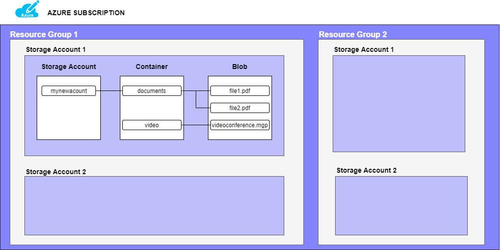

### Задание 1: Создание хранилища Azure Storage Account

1. Авторизируйтесь в [Azure Portal](https://portal.azure.com/)

2. В поисковой строке в верху введите "Storage Account" и выберите соответствующий сервис из выпадающего меню.
    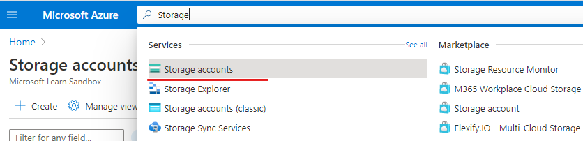
2. Нажмите **Create**. 
    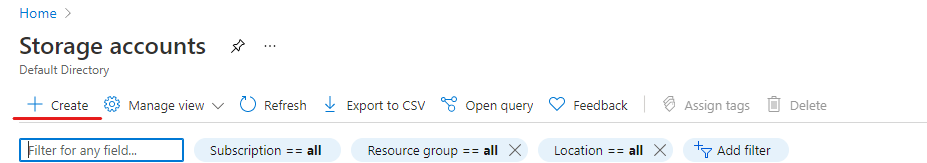
3. На вкладке **Basic** введите следующие данные   
    - *Subscription*: скорее всего у вас **Azure free subscription**
    - *Resource group*: выберите существующую группу или создайте новую.
    - *Storage account name*: должно быть уникальным названием.
        > [*Storage account name*](https://docs.microsoft.com/en-us/azure/storage/common/storage-account-create) будет использоваться для создания общедоступного URL-адреса, используемого для доступа к данным в учетной записи. Имя должно быть уникальным для всех существующих имен хранилищ в Azure. Имя должно содержать от 3 до 24 символов и может содержать только строчные буквы и цифры.
    - *Location*: [локация](https://azure.microsoft.com/en-us/global-infrastructure/geographies/), которая находится ближе всего к вам.
    - *Performance*: **Standard**. Если выбрали **Premium**, нужно также уточнить для каких целей используете.
        > Этот параметр определяет тип дискового хранилища, используемого для хранения данных Storage Account. ***Standard*** использует традиционные жесткие диски, а ***Premium*** использует твердотельные диски (SSD) для более быстрого доступа.
    - *Redundancy*: выберите желаемую конфигурацию резервирования. Обычно зависит от конкретного проекта. 
        > Locally redundant storage (LRS) ваши данные будут реплицироваться в том же дата центре что. Это самая дешевая опция, но не рекомендуется для приложений требующих высокую доступность(High Availability).
        Про другие опции читайте [тут](https://docs.microsoft.com/en-us/azure/storage/common/storage-redundancy).
    
    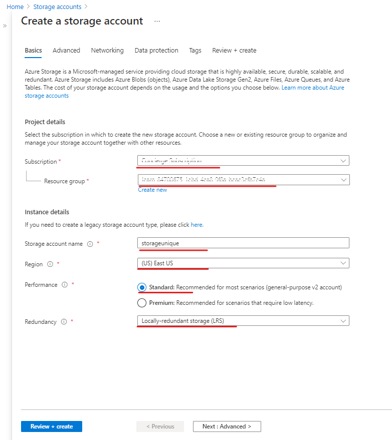
4. На вкладке **Advanced** введите следующие данные:
    - *Enable secure transfer*: поставьте галочку. 
    > Активизировав данный параметр, входящие запросы к этому хранилищу должны осуществляться только через HTTPS
    - *Minimum TLS version*: **Version 1.2**
    - *Enable blob public access*: поставьте галочку.
    > Отключение этого параметра предотвращает любой анонимный публичный доступ к вашему хранилищу.
    - *Blob access tier*: **Cool**
    > Уровни доступа к Blob позволяют хранить данные Blob наиболее экономичным способом в зависимости от использования. Выберите **hot** уровень для часто используемых данных. Выберите **cool** уровень для редко используемых данных.

    Остальные параметры оставьте без изменений.

    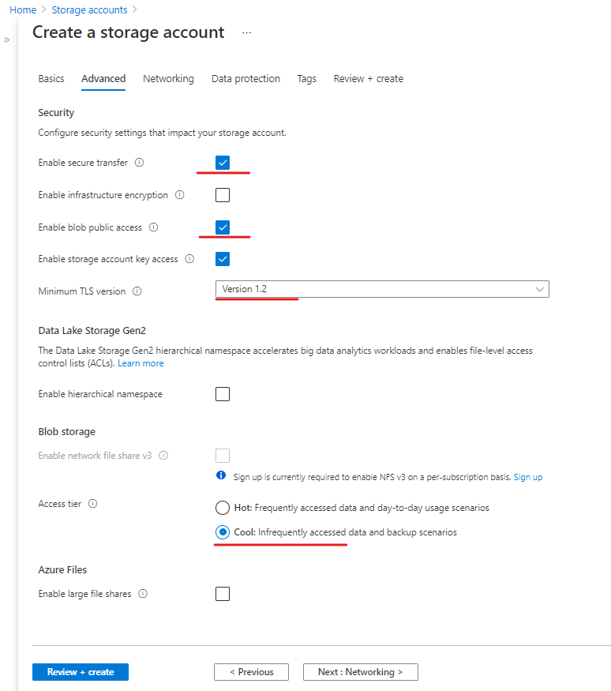

5. На вкладке **Networking** введите следующие данные:
    - *Connectivity method*: **Public endpoint (all networks)**
    - *Routing preference*: **Microsoft network routing**
    
    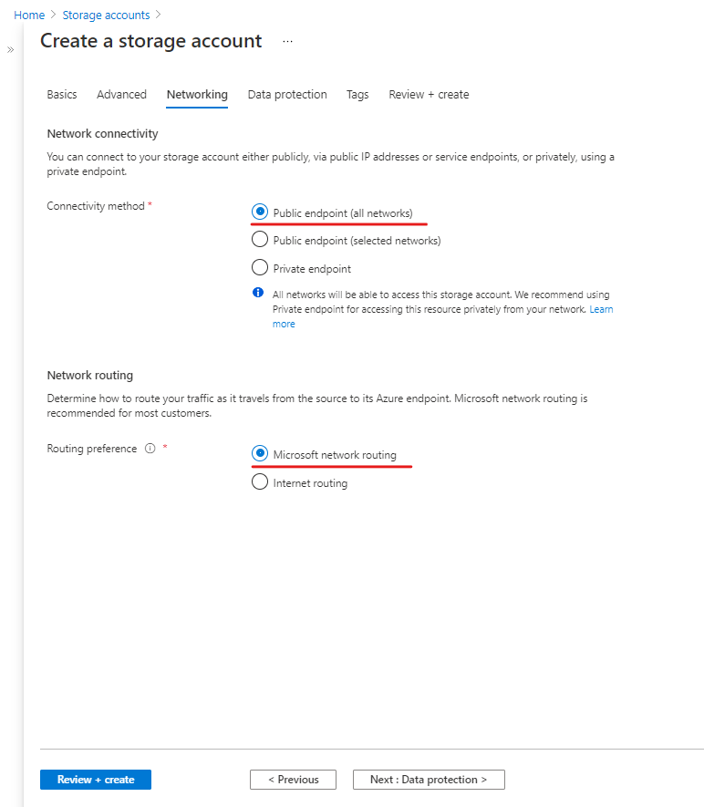

6. На вкладке **Data protection** отключите настройку **Enable soft delete for blobs**.
7. На вкладке **Data protection** параметры оставьте без изменений.
8. На вкладке **Review + create** предоставлен перечень всех настроек. Пролистайте страницу до конца и нажмите кнопку **Create**.
    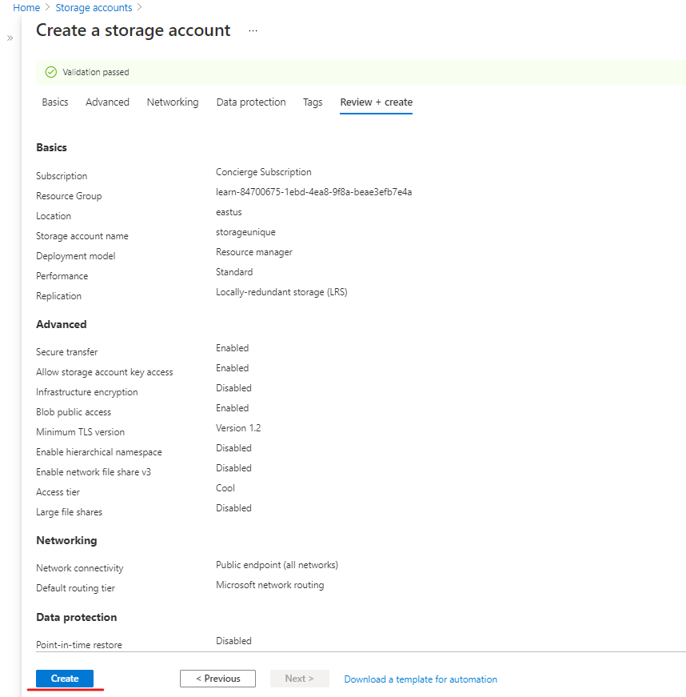

### Задание 2: Создание контейнера

1. Зайдите на страницу вашего, созданного в предыдущем задании, **Storage account**,
2. Нажмите на **Overview** в меню слева.

    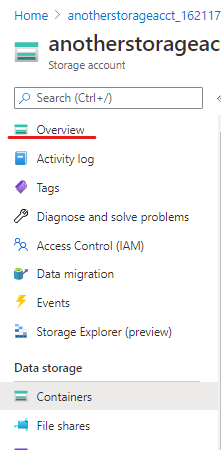
3. Во вкладке **Properties** нажмите на **Blob service**
    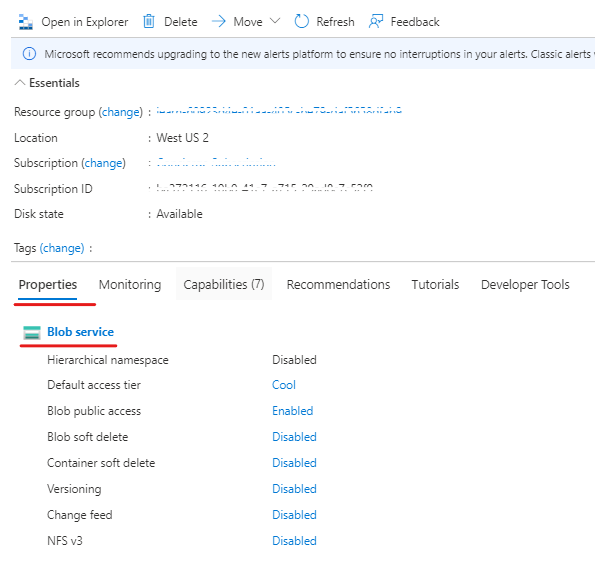
4. Нажмите на **+ Container**.

    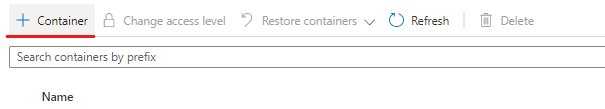
5. Справа экрана появится диалоговое окно. Введите следующие значения и нажмите кнопку **Create**:
    - *Name*: любое, например **mynewcontainer**
    - *Public access level*: **Private (no anonymous access)**

    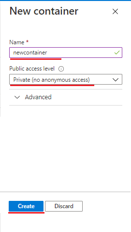

### Задание 3: Загрузка файла в контейнер
1. Зайдите на страницу созданного контейнера и нажмите **Upload**
    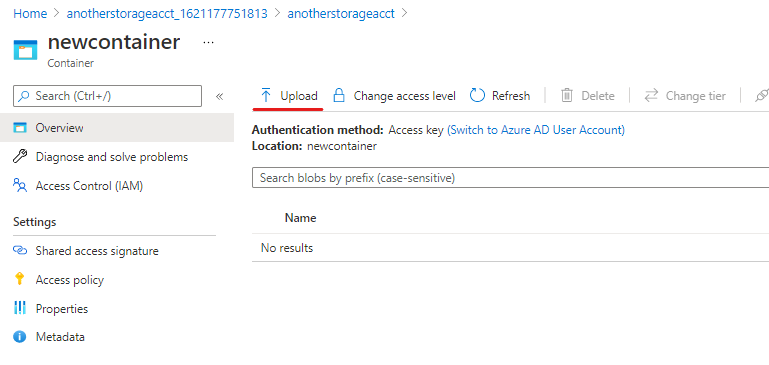

2. Справа экрана появится диалоговое окно. Загрузите файл, введите следующие значения и нажмите кнопку **Upload**:

    - *Overwrite if files already exists*: выберите эту опцию.
    
        Расширьте вкладку **Advanced**:
        - *Authentication type*: **Account key**
        - *Blob type*: **Block blob**. Типы обсуждали выше.   

    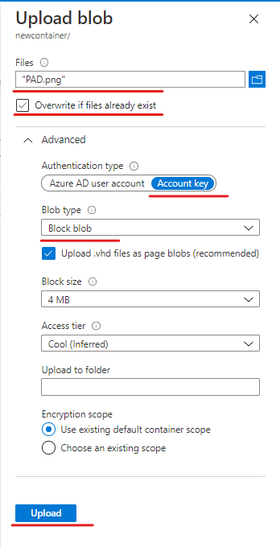

### Задание 4: Получение доступа к файлу контейнера

1. Нажмите на созданный файл. Справа появится панель и на вкладке **Generate SAS** сделайте следующие настройки и нажмите **Generate SAS token and URL**:
    - *Signing method*: **Account key** 
    - *Permissions*: **Read** 
    - Выберите время начала и окончания действия доступа
    - *Allowed protocols*: **HTTPS only**

    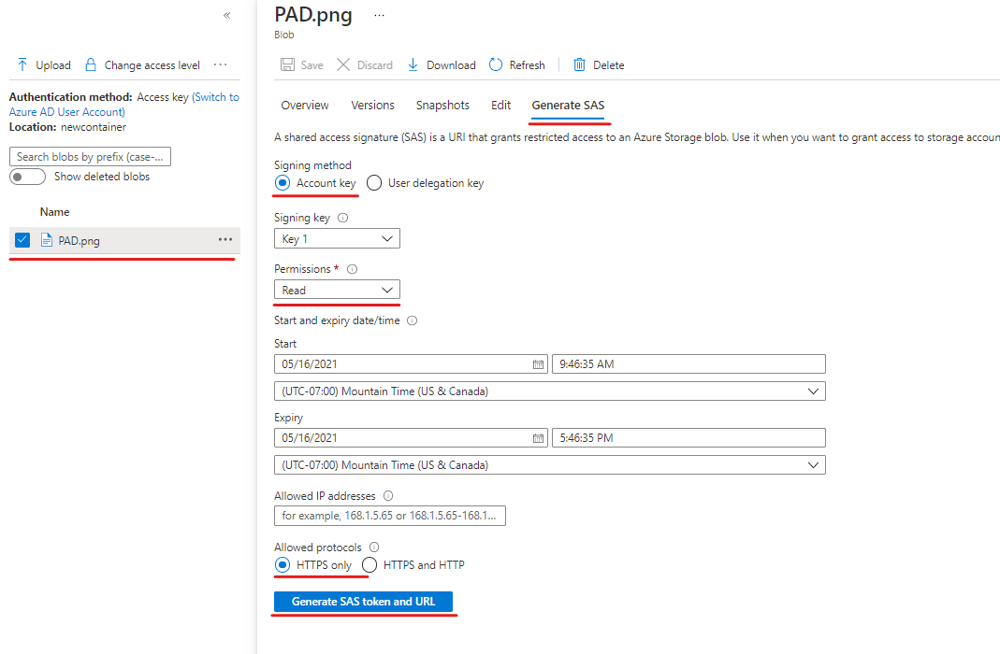

2. Внизу под кнопкой **Generate SAS token and URL** появятся 2 поля. Ссылка для доступу к файлу скопируйте с **Blob SAS URL**

## Вместо заключения
Стоит упомянуть, что получать доступ к файлам и перемещать файлы в **Azure Blob** можно различными способами. Мы делали это через портал для наглядного примера. В реальных проектах скорее всего такой метод часто не применяется

[Доступ к файлам](https://docs.microsoft.com/en-us/azure/storage/blobs/storage-blobs-introduction#about-blob-storage)

[Загрузка в **Azure Blob**](https://docs.microsoft.com/en-us/azure/storage/blobs/storage-blobs-introduction#move-data-to-blob-storage)

### **Поздравляем — вы закончили это практическое задание!**
