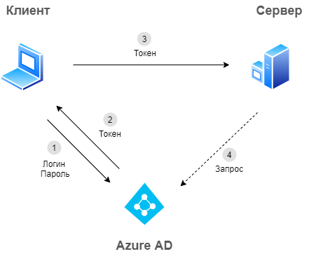
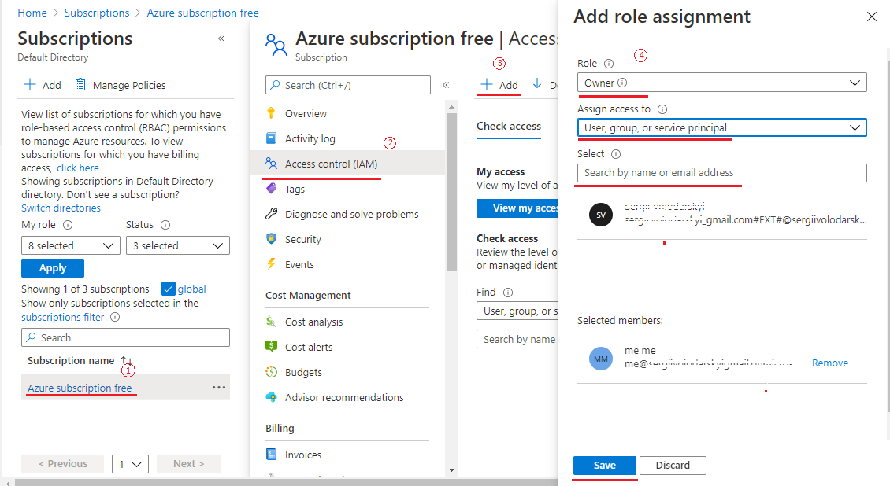

# Введение в Azure Active Directory

**Содержание**
* [Введение](#введение)
* [Что такое Azure Directory (AD)?](#что-такое-Azure-Directory-(AD)?)
    * [Управление идентификацией](#управление-идентификацией)
    * [Что еще кроме аутентификации ](#что-еще-кроме-аутентификации )
* [Практические задания](#практические-задания)
    * [Задание 1: Добавление нового пользователя в Default Directory](#задание-1-Добавление-нового-пользователя-в-Default-Directory)
    * [Задание 2: Назначение роли новому пользователю](#задание-2-назначение-роли-новому-пользователю)

## Введение
**Azure Active Directory (AD)** - это комплексный многофункциональный продукт. Наверняка потребуется цикл из практических и теоретических занятий, чтобы вполне понять, как этот сервис работает.

В этом мы ознакомимся с глобальными задачами, которые  решает Azure Active Directory, а также выполним небольшое практическое задание.

## Что такое Azure Directory (AD)?

Давайте начнем с официального определения Microsoft, оно достаточно четкое.

> **Azure Active Directory (Azure AD)** это облачный сервис управления удостоверениями (identity provider) и доступом (access management) созданный [Майкрософт](https://docs.microsoft.com/en-us/azure/active-directory/fundamentals/active-directory-whatis).

К каким ресурсам обеспечивает защиту доступа Azure AD:
    - внешние ресурсы (Microsoft 365, Azure, SaaS приложения за приделами инфраструктуры Microsoft)
    - внутренние ресурсы в корпоративной сети и приложения разработанные вашей организацией.

### Управление идентификацией

Перед тем, как разобраться что такое *identity provider*, давайте определимся с понятием *identity*. 

В нашем случае *identity(идентичность)* - это то, что подвергается аутентификации (authentication). Аутентификация в свою очередь - это процедура проверки подлинности. 

Скорее всего вам знакома ситуация, когда вам нужно поработать в определенной программе на вашем рабочем компьютере, для которого требуется имя пользователя и пароль.

Именно после того, как вы вводите имя пользователя и пароль и нажимаете кнопку "ОК"/"ACCESS", происходит аутентификация.

Давайте рассмотрим, что происходит "под капотом", если для аутентификации юзеров в вашей организации не пользуется **Azure AD**.

Как видно из схемы сервер самостоятельно должен верифицировать, что логин и пароль, которые предоставил пользователь корректные. При таком подходе данные пользователей хранятся в отдельной базе данных.
Главные потенциальные проблемы с такой системой:
- внедрение дополнительных фич безопасности затратное по времени и вложениям;
- угроза безопасности, связанная с ведением базы данных пользователей;
- чем больше серверов и разных приложений внутри организации, тем больше логинов и паролей придется создать для каждого пользователя. Управление такой инфраструктурой отнимает много времени.

С появлением облачных корпоративных решений, а также распространенности SaaS приложений, появилась необходимость в комплектном решении.
Службы идентификации Azure берет на себя задачу управления удостоверениями и аутентификацией в облаке и на собственных серверах компании.
Схематически это можно представить следующим образом.

1. Вместо того, чтобы отправить реквизиты на сервер, клиент отправляет их в Azure AD.
2. В ответ от Azure AD клиент получает токен - закодированная информация о клиенте и его реквизитах.
3. Токен отправляется к серверу.
4. Сервер, имея доверительные отношения с Azure AD, может ратифицировать, является этот токен легитимным или нет.

Подробнее смотрите в видео [Authentication fundamentals: The basics | Azure Active Directory](https://www.youtube.com/watch?v=fbSVgC8nGz4&t=37s]).

Сервисы аутентификации также включают в себя:
- многофакторная проверка подлинности
- самостоятельный сброс пароля

### Что еще кроме аутентификации 
1. **Единый вход** - позволяет выполнить вход один раз и использовать учетные данные для доступы к другим ресурсам. Т.е. нужно запомнить пароль и идентификатор только один раз. 

    Такой принцип также облегчает управление доступами организации в случае если сотрудник покинул компанию или перешел на другую позицию.
2. **Управление приложениями** - позволяет управлять как облачными так и локальными приложениями.

3. **Управление устройствами** - например, помогает запретить доступ от неизвестных устройств, даже если данные учетной записи корректные.
4. Расширенный [перечень](https://docs.microsoft.com/en-us/azure/active-directory/fundamentals/active-directory-whatis#which-features-work-in-azure-ad).

## Практические задания

### Задание 1: Добавление нового пользователя в Default Directory

1. Авторизируйтесь в [Azure Portal](https://portal.azure.com/)
2. В строке поиска вверху страницы введите и выберите **Azure Active Directory**.
3. В меню слева в разделе **Management**, выберите **Users** > **+ New User**.
4. На странице **New user** введите следующие значения:
    - **User name**: *придумайте*.
    - **User**: *введите имя и фамилию*
5. Выберите **Show password** и скопируйте его в надежное место.
6. Нажмите кнопку **Create**. 

Пользователь создан и зарегистрирован в вашей **Azure AD**.

### Задание 2: Назначение роли новому пользователю
1. В строке поиска вверху страницы введите и выберите **Subscriptions** и на появившейся странице выберите подписку.
2. В меню слева выберите **Access Control (IAM)**.
3. Нажмите **+ Add**
4. В появившейся панели справа выберите следующие значения:
    - **Role**: *Owner*
    - **Assign Access to**: *User, group, or service principal*
    - **Select**: *выберите пользователя, созданного в задании №1*

    

    Тут у вас "свободный полет". Наделяйте пользователя теми правами, которыми считаете нужными.

### **Поздравляем — вы закончили это практическое задание!**
