# Лабораторная работа по Amazon Redshift

В этой лабораторной работе мы создадим и подключимся к Redshift кластеру, создадим несколько наборов таблиц, загрузим данные в таблицы, выполним запросы для сравнения скорости выдачи ответов.

**Содержание**
* [Подготовка](#подготовка)
	* [Cоздание группы безопасности](#создание-группы-безопасности)
	* [Cоздание IAM роли](#создание-iam-роли)
	* [Создание и настройка кластера](#создание-и-настройка-кластера)
     * [Подключение к Redshift кластеру через DBeaver](#подключение-к-redshift-кластеру-через-dbeaver)
* [Создание таблиц и запросов](#создание-таблиц-и-запросов)
	* [Команда COPY](#команда-copy)
    * [Копируем manifest файлы в S3](#копируем-manifest-файлы-в-s3)
    * [Таблицы без сжатия, стиля распределения или ключа сортировки](#таблицы-без-сжатия-стиля-распределения-или-ключа-сортировки)
    * [Таблицы со сжатием, без стиля распределения или ключей сортировки](#таблицы-со-сжатием-без-стиля-распределения-или-ключей-сортировки)
    * [Таблицы со сжатием, стилем распределения и ключами сортировки](#таблицы-со-сжатием-стилем-распределения-и-ключами-сортировки)
* [Заключение](#заключение)
    
### **Чтобы следовать данной лабораторной работе, вам нужно сгенерировать данные и скопировать их в AWS S3 (как показанно в лабораторной работе по генерации данных).**

<br>

# Подготовка

Перед тем как мы запустим кластер, нам необходимо:
- создать группу безопасности (security group), чтобы мы смогли управлять Redshift через DBeaver на своем копьютере. Группа безопасности будет выступать в роли firewall. Позже мы добавим ее в настройках Redshift кластера.
- IAM (identity access management) роль, которую мы также привяжем к Redshift кластеру, для того чтобы мы имели доступ к S3 и могли скопировать данные для наполнения таблиц, которые мы создадим в Redshiftпозже в лабораторной работе.

## Cоздание группы безопасности

1. В консоли AWS в поисковой строке введите *EC2* и выберите соответвенно **EC2**
    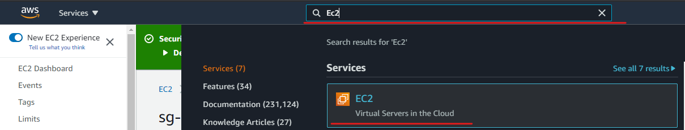

2. В меню слева в разделе **Network & Security** выберите **Security Groups**

3. Справа у вас скорее всего появится список имеющихся групп безопасности.
    В правом верхнем углу нажмите кнопку **Create Security Group**.

    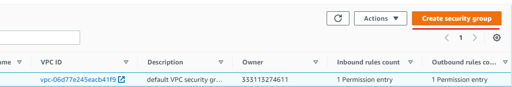

4. Заполните поля cледующим образом:

    В разделе **Basic details**:

    - *Security group name*: **Redshift Cluster Lab**
    - *Description*: **Security Group for Redshift Cluster Lab**
    - *VPC*: в данной лабе не принципиально создавать Virtul Private Cloud(VPC), поэтому можно выбрать VPC по умолчанию (default).

    В разделе **Inboud rules**:
    - нажмите кнопку **Add rule** и появятся поля для уточнения правил для входящего трафика. 
    
    Так как мы знам, что будем работать в Redshift и делать запросы с нашего домашнего компьютера, то:

    - *Type*: **Redshift**
    - *Source*: **My IP**

    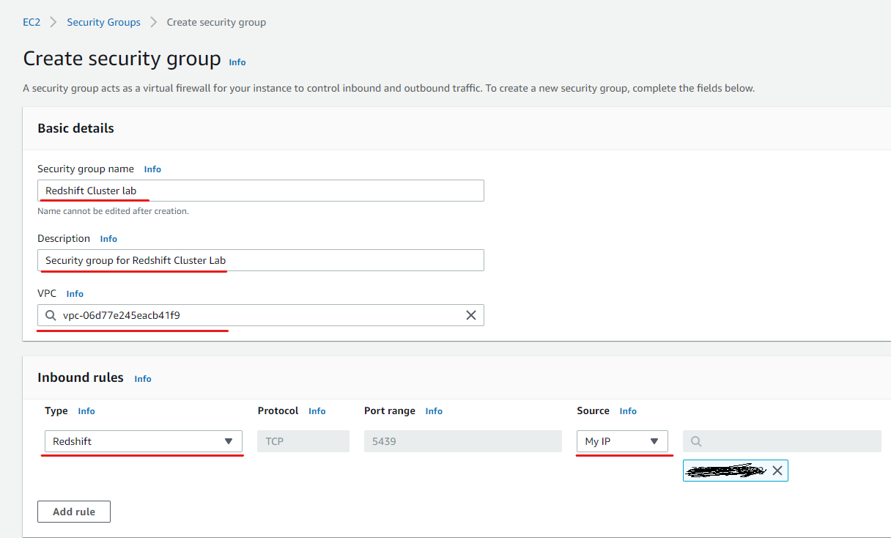

    Далее в правом нижнем углу нажмите **Create Security Group**.

## Cоздание IAM роли

1. В поисковой строке введите *IAM* и выберите соответвенно **IAM**
    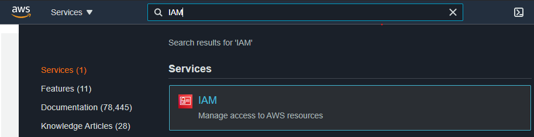

2. В меню слева в разделе **Access management** выберите **Roles**
3. Справа у вас появится список имеющихся ролей.

    В правом верхнем углу нажмите кнопку **Create role**.

    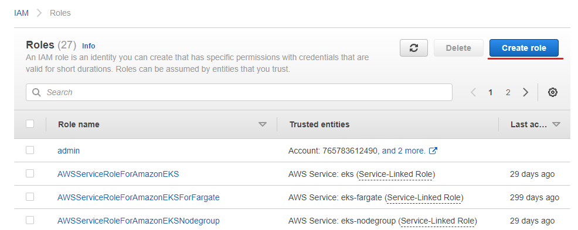   
4. Выберите следующие значения:

    - *Select type of trusted entity*: **AWS Service**
    - *Choose a use case*: **Redshift**
    - *Select your use case*: **Redshift - Customizable**
    
    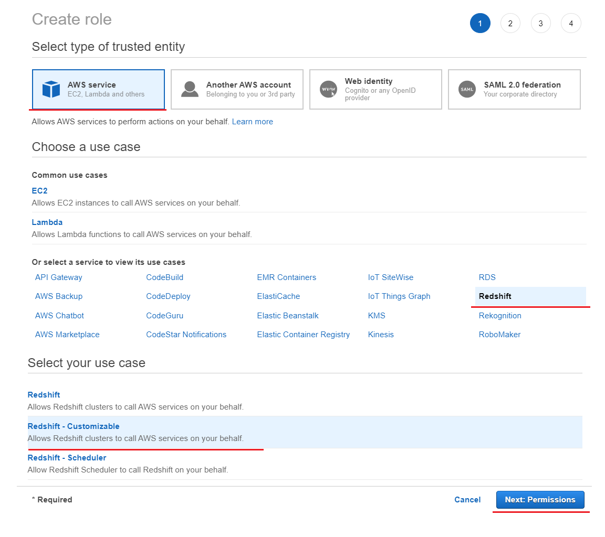   

    Нажмите на кнопку **Next: Permissions**
5. В поисковой строке введите *S3*, в отфильтрованом списке ниже выберите **AmazonS3FullAccess**. Y

    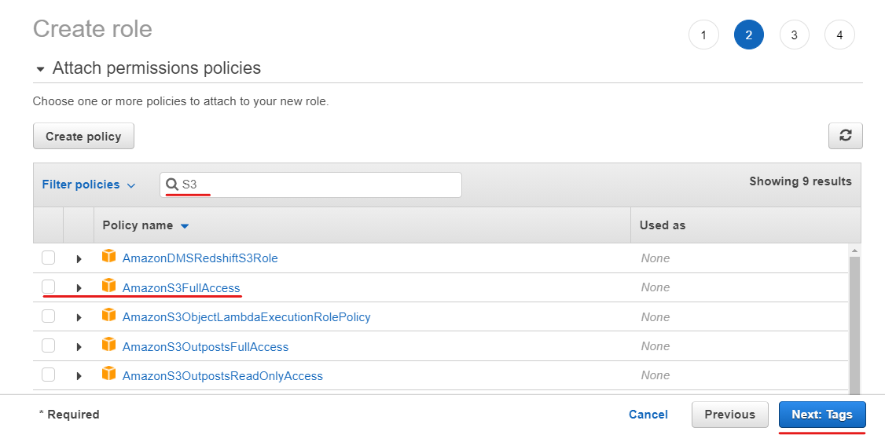

    Нажмите на кнопку **Next: Tags**
6. Нажмите на кнопку **Next: Preview**.
7. В поле *Role name* введите **RedshiftLabRole** 

    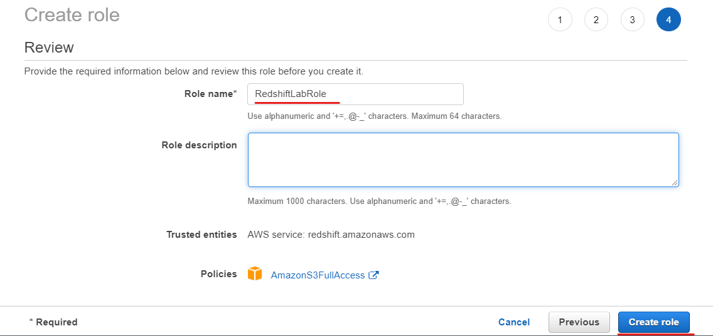

    Нажмите на кнопку **Create role**

## Создание и настройка кластера

1. В меню слева в разделе выберите **Clusters**.
    Справа у вас появится информация касающаяся кластеров. 
    Нажмите на кнопку **Create cluster**.

    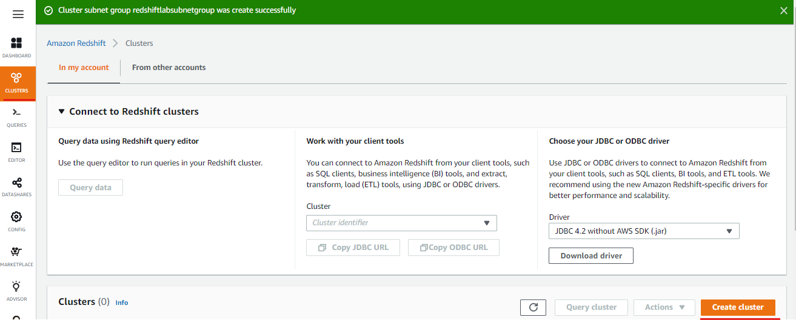

2. В разделе **Cluster Configuration**:
    - введите *Cluster Identifier*, например, **reshift-lab-cluster** 
    - выберите опцию **FREE TRIAL**.

    <br>

    <span style="color:red">ВНИМАНИЕ! Будьте внимательны, какой тип/размер кластера вы выбираете. Если выбираете не бесплатный вариант, обязательно обратите внимание на стоимость. Рекомендуем удалить кластер, как только вы закончили лабораторную работу! </span>.

    Рекомендация для выбора размера кластера - свободное место в ноде должно в 2–2,5 раза превышать размер самой большой таблицы.

    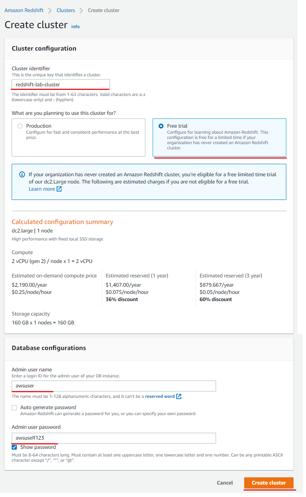

3. В разделе **Cluster Configurations** введите пароль для доступа к кластеру, например, **awsuseR123**.

4. Нажмите кнопку **Create cluster**.

    Обработка вашего запроса на создание кластера займет некоторое время и вы будете видеть статус **Modifying**, как показано ниже.
    

Настройка кластера еще не закончена. В следущих шагах мы откроем публичный доступ к кластеру и привяжем IAM роль.

5. Как только кластер создан и статус изменится на **Available**, нажмите на название созданного кластера.
6. Тут вы увидете общую информацию о кластере, а также настройки. Нажмите на вкладку **Properties**.

    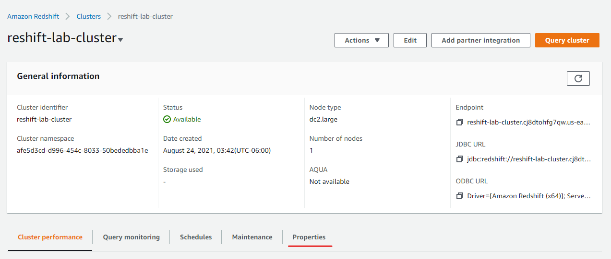

7. В разделе **Network and security settings** нажмите на кнопку **Edit**.

    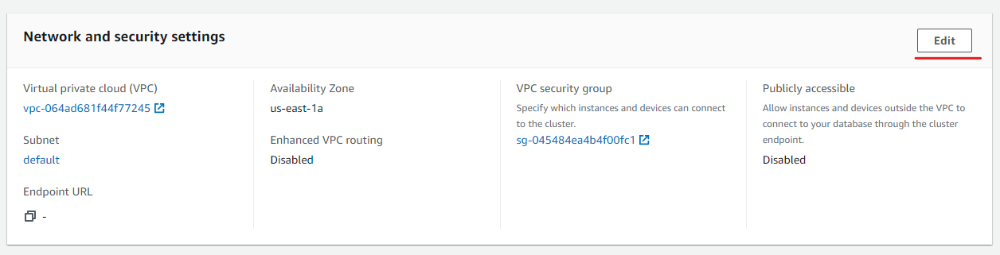

8. В *VPC security groups* выберите только созданную нами в прудыдущих шагах группу безопасности **Redshift Cluster Lab**. Нажмите на кнопку **Save changes**.

    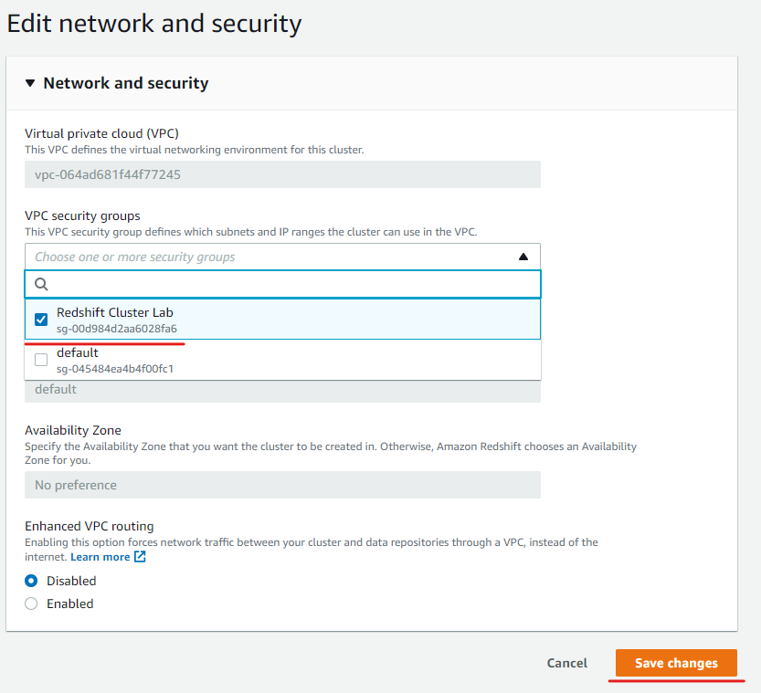

9. Снова на вкладке **Properties** в разделе **Cluster permission** нажмите на кнопку **Attach IAM Role**.

    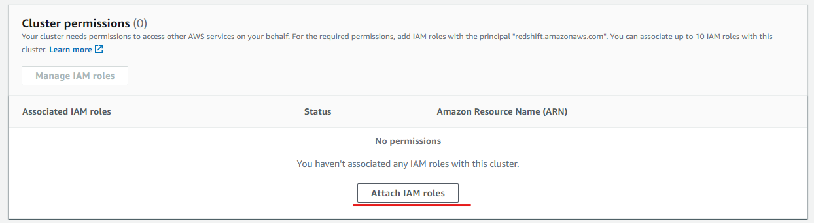
    

   - выыберите роль, созданную нами в прудыдущих шагах, **RedshiftLabRole**
   - нажмите на кнопку **Associate IAM Role**
   - нажмите на кнопку **Save changes**
    
    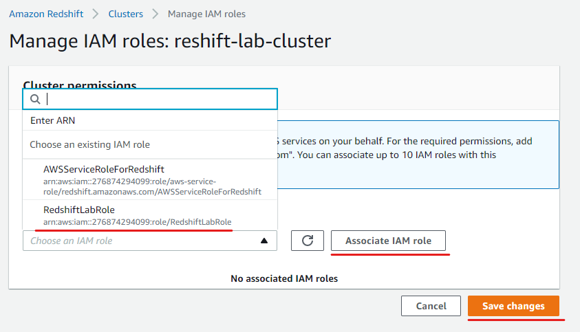

10. Сдалаем наш кластер публично доступным. В правом верхнем углу нажмите кнопку **Actions** и в выпадающем меню выберите **Modify puvlicly accessible setting**.

    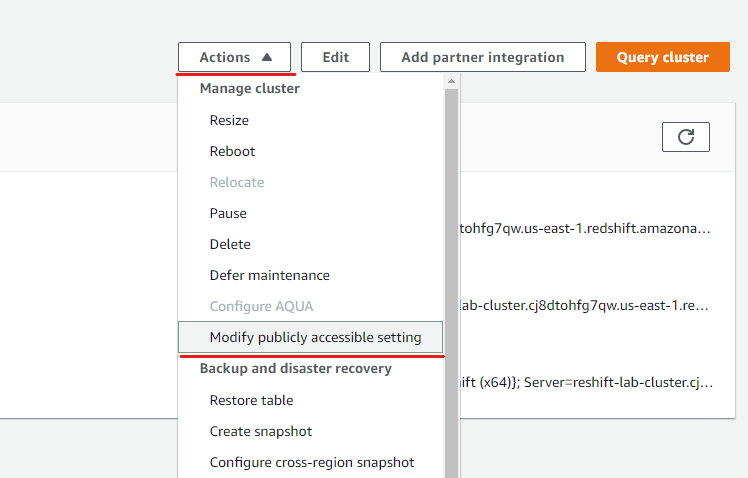

11. Выберите опцию **Enable** и нажмите на кнопку **Save changes**

    


## Подключение к Redshift кластеру через DBeaver

1.  В списке баз данных выберите **Redshift** 

    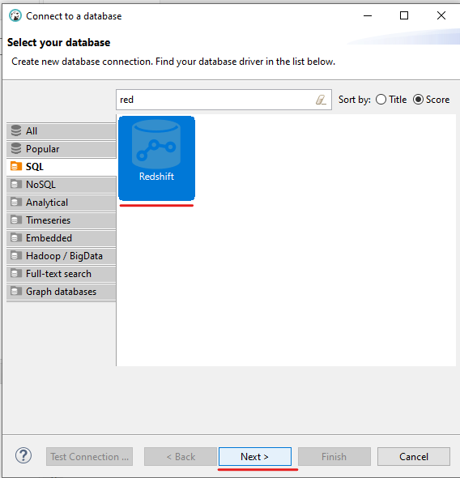

    Нажмите **Next**, перейдя к настройкам соединения.

2.  (опционально) Если к Redshift вы подключаетесь первый раз, то Dbeaver запросит установку драйвера. 

    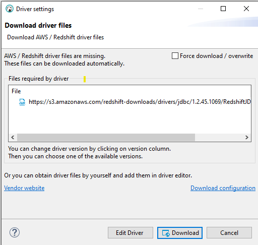

3. Введите следующие параметры подключения:

    - *Host*: скопируйте **Endpoint** в разделе **General information**.
            
            > !обязательно: из endpoint удалите окончание ":5439/dev"

    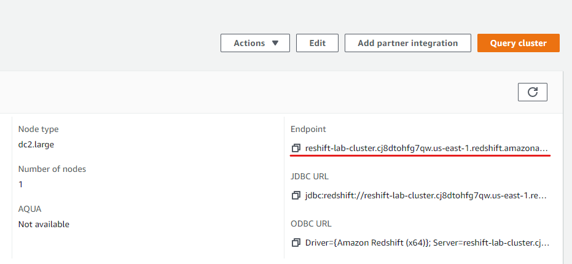

    - *Port*: **5439**
    - *Database*: **dev**
    - *Username*: по умолчанию - **awsuser**. Или введите ваш, если изменили.
    - *Password*: **введите пароль**.  Если забыли, то можно без проблем изменить во вкладке **Properties**.

     

    Нажмите **Test Connection** и должно вывестись сообщение типа

    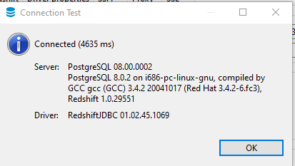

    Если ошибок не возникло, нажмите кнопку **Finish**.

# Создание таблиц и запросов

Мы с вами создадим 3 набора по 2 таблицы в попытке сравнить скорость выдачи ответа на SQL запрос:

- таблицы без сжатия, стиля распределения или ключа сортировки;
- таблицы со сжатием, без стиля распределения или ключей сортировки;
- таблицы со сжатием, стилем распределения и ключами сортировки.

**! Предполагается, что вы уже загрузили файлы в AWS S3, следуя инструкции лабораторной работы по генерации данных.**

## Копируем manifest файлы в S3
Перед тем как мы продолжим, нужно проделать еще один шаг - скопировать manifest файлы в ваш bucket S3, откуда вы будете загружать данные в Redshift. [Что такое manifest файл](https://docs.aws.amazon.com/redshift/latest/dg/r_COPY_command_examples.html#copy-command-examples-manifest). 

- скачайте [manifest файлы](./manifest) на ваш домашний компьютер.
- откройте каждый файл и отредакктируйте его, заменив **your bucket name** на название вашего S3 bucket, куда вы скопировали сгенерированные данные.
     
     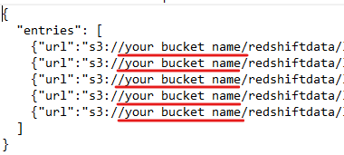

- подгрузите отредактированные manifest файлы в ваш S3 bucket в папку **redshiftdata**

## Команда COPY

Данные в Redshift мы будем загружать из AWS S3 помощью команды COPY - [читать подробнее](https://docs.aws.amazon.com/redshift/latest/dg/t_loading-tables-from-s3.html).

Template команды выглядит следующим образом:
```sh
copy orders_nocomp from 's3://<your bucket>/redshiftdata/orders.manifest' iam_role 'arn:aws:iam::your account number:role/your role'
```

Обратим внимание на следующую часть команды, которая называется Amazon Resourse Name (ARN):
```bash
arn:aws:iam::your account number:role/your role
```

Amazon Resourse Name - это уникальный идентификатор, назначаемый отдельному ресурсу AWS для обозначения прав доступа, например.

Этот идентификатор вы можете найти на странице вашего кластера в разделе **Cluster permissions**.

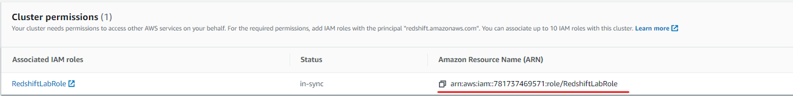

## Таблицы без сжатия, стиля распределения или ключа сортировки

1. Скрипт для создания таблицы

```sql
CREATE TABLE orders_nocomp
(
    o_orderkey BIGINT NOT NULL,
    o_custkey BIGINT NOT NULL,
    o_orderstatus CHAR(1) NOT NULL,
    o_totalprice NUMERIC(12, 2) NOT NULL,
    o_orderdate DATE NOT NULL,
    o_orderpriority CHAR(15) NOT NULL,
    o_clerk CHAR(15) NOT NULL,
    o_shippriority INTEGER NOT NULL,
    o_comment VARCHAR(79) NOT NULL);


CREATE TABLE lineitem_nocomp
(
    l_orderkey BIGINT NOT NULL,
    l_partkey BIGINT NOT NULL,
    l_suppkey INTEGER NOT NULL,
    l_linenumber INTEGER NOT NULL,
    l_quantity NUMERIC(12, 2) NOT NULL,
    l_extendedprice NUMERIC(12, 2) NOT NULL,
    l_discount NUMERIC(12, 2) NOT NULL,
    l_tax NUMERIC(12, 2) NOT NULL,
    l_returnflag CHAR(1) NOT NULL,
    l_linestatus CHAR(1) NOT NULL,
    l_shipdate DATE NOT NULL,
    l_commitdate DATE NOT NULL,
    l_receiptdate DATE NOT NULL,
    l_shipinstruct CHAR(25) NOT NULL,
    l_shipmode CHAR(10) NOT NULL,
    l_comment VARCHAR(44) NOT NULL);
```

2. Скрипт для загрузки данных

```bash
copy orders_nocomp from 's3://<your bucket>/redshiftdata/orders.manifest' iam_role 'arn:aws:iam::your account number:role/your role' delimiter '|' manifest compupdate off;
copy lineitem_nocomp from 's3://<your bucket>/redshiftdata/lineitem.manifest' iam_role 'arn:aws:iam::your account number:role/your role' delimiter '|' manifest compupdate off;
```

3. Запрос для тестирования скорости выдачи ответа

```sql
SELECT
    l_shipmode,
    sum(case
        when o_orderpriority = '1-URGENT'
            OR o_orderpriority = '2-HIGH'
            then 1
        else 0
    end) as high_line_count,
    sum(case
        when o_orderpriority <> '1-URGENT'
            AND o_orderpriority <> '2-HIGH'
            then 1
        else 0
    end) AS low_line_count
FROM
    orders_nocomp,
    lineitem_nocomp
WHERE
    o_orderkey = l_orderkey
    AND l_shipmode in ('AIR', 'SHIP')
    AND l_commitdate < l_receiptdate
    AND l_shipdate < l_commitdate
    AND l_receiptdate >= date '1992-01-01'
    AND l_receiptdate < date '1996-01-01' + interval '1' year
GROUP BY
    l_shipmode
ORDER BY
    l_shipmode;
```

## Таблицы со сжатием, без стиля распределения или ключей сортировки

1. Скрипт для создания таблицы

```sql
CREATE TABLE orders_comp
(
	o_orderkey BIGINT NOT NULL,
	o_custkey BIGINT NOT NULL,
	o_orderstatus CHAR(1) NOT NULL,
	o_totalprice NUMERIC(12, 2) NOT NULL,
	o_orderdate DATE NOT NULL,
	o_orderpriority CHAR(15) NOT NULL,
	o_clerk CHAR(15) NOT NULL,
	o_shippriority INTEGER NOT NULL,
	o_comment VARCHAR(79) NOT NULL);


CREATE TABLE lineitem_comp
(
	l_orderkey BIGINT NOT NULL,
	l_partkey BIGINT NOT NULL,
	l_suppkey INTEGER NOT NULL,
	l_linenumber INTEGER NOT NULL,
	l_quantity NUMERIC(12, 2) NOT NULL,
	l_extendedprice NUMERIC(12, 2) NOT NULL,
	l_discount NUMERIC(12, 2) NOT NULL,
	l_tax NUMERIC(12, 2) NOT NULL,
	l_returnflag CHAR(1) NOT NULL,
	l_linestatus CHAR(1) NOT NULL,
	l_shipdate DATE NOT NULL,
	l_commitdate DATE NOT NULL,
	l_receiptdate DATE NOT NULL,
	l_shipinstruct CHAR(25) NOT NULL,
	l_shipmode CHAR(10) NOT NULL,
	l_comment VARCHAR(44) NOT NULL);
```
2. Скрипт для загрузки данных

```sh
copy orders_comp from 's3://<your bucket>/redshiftdata/orders.manifest' iam_role 'arn:aws:iam::your account number:role/your role' delimiter '|' manifest;
copy lineitem_comp from 's3://<your bucket>/redshiftdata/lineitem.manifest' iam_role 'arn:aws:iam::your account number:role/your role' delimiter '|' manifest;
```

3. Запрос для тестирования скорости выдачи ответа

```sql
SELECT
    l_shipmode,
    sum(case
        when o_orderpriority = '1-URGENT'
            OR o_orderpriority = '2-HIGH'
            then 1
        else 0
    end) as high_line_count,
    sum(case
        when o_orderpriority <> '1-URGENT'
            AND o_orderpriority <> '2-HIGH'
            then 1
        else 0
    end) AS low_line_count
FROM
    orders_comp,
    lineitem_comp
WHERE
    o_orderkey = l_orderkey
    AND l_shipmode in ('AIR', 'SHIP')
    AND l_commitdate < l_receiptdate
    AND l_shipdate < l_commitdate
    AND l_receiptdate >= date '1992-01-01'
    AND l_receiptdate < date '1996-01-01' + interval '1' year
GROUP BY
    l_shipmode
ORDER BY
    l_shipmode;
```

## Таблицы со сжатием, стилем распределения и ключами сортировки

1. Скрипт для создания таблицы

```sql
CREATE TABLE orders
(
	o_orderkey BIGINT NOT NULL DISTKEY,
	o_custkey BIGINT NOT NULL,
	o_orderstatus CHAR(1),
	o_totalprice NUMERIC(12, 2),
	o_orderdate DATE NOT NULL,
	o_orderpriority CHAR(15) NOT NULL,
	o_clerk CHAR(15) NOT NULL,
	o_shippriority INTEGER NOT NULL,
	o_comment VARCHAR(79) NOT NULL
)
SORTKEY
(
	o_orderdate
);

CREATE TABLE lineitem
(
	l_orderkey BIGINT NOT NULL DISTKEY,
	l_partkey BIGINT NOT NULL,
	l_suppkey INTEGER NOT NULL,
	l_linenumber INTEGER NOT NULL,
	l_quantity NUMERIC(12, 2) NOT NULL,
	l_extendedprice NUMERIC(12, 2) NOT NULL,
	l_discount NUMERIC(12, 2) NOT NULL,
	l_tax NUMERIC(12, 2) NOT NULL,
	l_returnflag CHAR(1) NOT NULL,
	l_linestatus CHAR(1) NOT NULL,
	l_shipdate DATE NOT NULL,
	l_commitdate DATE NOT NULL,
	l_receiptdate DATE NOT NULL,
	l_shipinstruct CHAR(25) NOT NULL,
	l_shipmode CHAR(10) NOT NULL,
	l_comment VARCHAR(44) NOT NULL
)
SORTKEY
(
	l_shipdate
);
```

2. Скрипт для загрузки данных

```sh
copy orders from 's3://<your bucket>/redshiftdata/orders.manifest' iam_role 'arn:aws:iam::your account number:role/your role' delimiter '|' manifest;
copy lineitem from 's3://<your bucket>/redshiftdata/lineitem.manifest' iam_role 'arn:aws:iam::your account number:role/your role' delimiter '|' manifest;
```

3. Запрос для тестирования скорости выдачи ответа

```sql
SELECT
    l_shipmode,
    sum(case
        when o_orderpriority = '1-URGENT'
            OR o_orderpriority = '2-HIGH'
            then 1
        else 0
    end) as high_line_count,
    sum(case
        when o_orderpriority <> '1-URGENT'
            AND o_orderpriority <> '2-HIGH'
            then 1
        else 0
    end) AS low_line_count
FROM
    orders,
    lineitem
WHERE
    o_orderkey = l_orderkey
    AND l_shipmode in ('AIR', 'SHIP')
    AND l_commitdate < l_receiptdate
    AND l_shipdate < l_commitdate
    AND l_receiptdate >= date '1992-01-01'
    AND l_receiptdate < date '1996-01-01' + interval '1' year
GROUP BY
    l_shipmode
ORDER BY
    l_shipmode;
```


## Заключение
Вы должны заметить разную скорость выполнения тестовых запросов. Но, вероятно, даже если в таблицах 50 Гб данных и мы используем одноузловой(node) кластер, разница будет не велика.  
