# Azure Synapse Analyics Workshop

**Содержание**
* [Введение](#введение)
* [Подготовка ресурсов](#подготовка-ресурсов)
	* [Создание юзера в Azure AD и настройка подписки](#создание-юзера-в-azure-ad-и-настройка-подписки)
	* [Авторизируйтесь от имеи созданного юзера](#авторизируйтесь-от-имеи-созданного-юзера)
	* [Создание SQL Server](#создание-sql-server)
	* [Создание dedicated SQL pool](#создание-dedicated-sql-pool)
	* [Включение возможностей рабочей области Synapse для выделенного пула SQL](#включение-возможностей-рабочей-области-synapse-для-выделенного-пула-sql)
* [Лаба 1 Проектирование и создание запросов к хранилищу данных](#лаба-1-проектирование-и-создание-запросов-к-хранилищу-данных)
	* [Упражнение 1 Создание таблиц с параметрами по умолчанию](#упражнение-1-создание-таблиц-с-параметрами-по-умолчанию)
	* [Упражнение 2 Создание распределенных таблиц](#упражнение-2-создание-распределенных-таблиц)
	* [Упражнение 3 Реплицированные таблицы](#упражнение-3-реплицированные-таблицы)
	* [Упражнение 4 Управление статистикой](#упражнение-4-управление-статистикой)
	* [Упражнение 5 Добавление секций(partitions)](#упражнение-5-добавление-секций(partitions))
* [Лаба 2 Загрузка данных в dedicated SQL Pool](#лаба-2-загрузка-данных-в-dedicated-sql-pool)
	* [Упражнение 1 Загрузка данных с помощью Azure Data Factory(ADF)](#упражнение-1-загрузка-данных-с-помощью-azure-data-factory(adf))
	* [Упражнение 2 Загрузка данных с помощью PolyBase](#упражнение-2-загрузка-данных-с-помощью-polybase)
* [Лаба 3 Business Intelligence с dedicated SQL Pool](#лаба-3-business-intelligence-с-dedicated-sql-pool)
	* [Упражнение 1 Подключение к Power BI](#упражнение-1-подключение-к-power-bi)
	* [Упражнение 2 Построение дашборда в power bi Service](#упражнение-2-построение-дашборда-в-power-bi-service)
* [Удаление ресурсов](#удаление-ресурсов)


# Введение
В этой серии лабораторных работ вы познакомитесь с концепциями, стратегиями и передовыми методами проектирования облачного хранилища данных с использованием Synapse Analytics, хранилища данных петабайтного масштаба в Azure. Мы продемонстрируем, как собирать, хранить и готовить данные для хранилища данных с помощью других служб Azure. Мы также узнаем, как использовать инструменты бизнес-аналитики (BI) и ETL для анализа ваших данных и интеграции. Это поможет вам понять фундаментальные принципы облачной аналитики и изучить основные функции Synapse Analytics и экосистемы Azure Data Platform.


## ПОСЛЕ ОКОНЧАНИЯ ЛАБОРАТОРНЫХ РАБОТ УДАЛИТЕ РЕСУРСЫ, ЧТОБЫ НЕ ПОДВЕРГАТЬСЯ ДОПОЛНИТЕЛЬНЫМ ЗАТРАТАМ 

# Подготовка ресурсов

## Создание юзера в Azure AD и настройка подписки

1. Создайте юзера в Azure AD. Запомните/запишите пароль, он вам понадобится скоро.
2. В поле поиска вверху выполните поиск по слову **Subscriptions**. 
3. В поисковых результатах в разделе *Services* выберите **Subscriptions**.
4. Выберите необходимый *subscription* из списка

	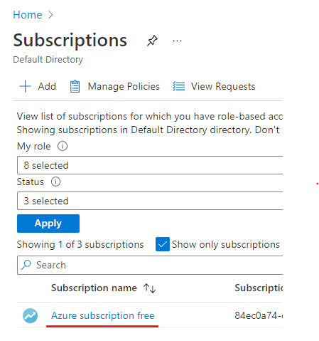

5. Далее в меню справа выберите **Access control(IAM) >> Role assignements >> Add >> Add Role Assignement**

	
6. Появится всплывающее окно. Заполните следующим образом и нажмите **Save**:

	- **Role**: *Owner*
	- **Assign access to**: *User, group, or service principal*
	- **Select**: начните вводить имя созданного юзера. См. пункт 1.

	

## Авторизируйтесь от имеи созданного юзера
1. Выйдете(sign out) из Azure портала. Нажмите на аватарку в правом верхнем углу и в появившемся окне нажмите, **sign out** как показано ниже:

	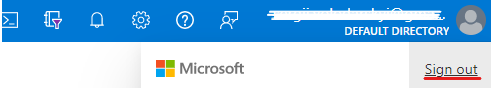

2. Теперь авторизируйтесь от имени юзера который вы создали в предыдущем упражнении и создавайте все ресурсы от его имени.


## Создание SQL Server

1. В поле поиска вверху выполните поиск по слову **SQL Servers**.
2. В поисковых результатах в разделе *Services* выберите **SQL Servers**.
3. Выберите **Create SQL server**.
4. На вкладке **Basic** введите следующие значения:
	- **Subscription**: выберите индивидуально
	- **Resource group**: создайте новую ресурсную группу, например **synapse-learn**. 
	- **Server name**: придумайте уникальное имя
	- **Location**: выберите локацию сервера индивидуально.
	- Введите *Server admin login*, а также пароль и его подтверждение.
5. Нажмите **Review + Create**, убедитесь что вы правильно ввели информацию и нажмите  **Create**

Подождите, пока закончится создание хранилища. 

## Создание dedicated SQL pool

1. В поле поиска вверху выполните поиск по слову *SQL Servers*.
2. В поисковых результатах в разделе *Services* выберите **SQL Servers**.
3. Выберите SQL Server, который вы только что создали.
4. Нажмите на **New Dedicated SQL pool(formerly SQl DW)**
5. На вкладке **Basic** введите название вашего SQL Pool, например **synapsepool**.

	

	> Для уровня производительности мы будем использовать самый маленький DW - DW100c. Это единый узел с 60 дистрибутивами в нем. Microsoft рекомендует начинать с малого и контролировать хранилище и при необходимости масштабировать. 

6. Нажмите на **Select performance level**

	

	>Процессор, память и операции ввода-вывода хранилища данных объединены в единицы масштабирования вычислений, называемые единицами хранилища данных (DWU). DWU представляет собой абстрактную нормализованную меру вычислительных ресурсов и производительности. 

7. В появивщемся меню выберите наименьную можность *DW - DW100c*

	

8. На вкладке **Additional setting** выберите опцию **Sample** в поле **Use existing data**

	

9. Нажмите **Review + Create**, убедитесь что вы правильно ввели информацию и нажмите  **Create**

Подождите, пока закончится создание **Dedicated SQL pool**. 


	## Включение возможностей рабочей области Synapse для выделенного пула SQL

1. В поле поиска вверху выполните поиск по слову *SQL Servers*.
2. В поисковых результатах в разделе *Services* выберите **SQL Servers**.
3. Выберите ваш SQL Server и меню справа в разделе **Security** выберите **Firewalls and virtual networks**.
	- **Allow Azure services and resources to access this server**: *yes*
	- **Add client IP**
	- Нaжмите **Save** 

	

4. На вкладке **Overview** Выберите экземпляр Dedicated SQL pool, который вы толоко что создали и откройте страницу обзора.
5. Выберите **New Synapse Workspace** в верхней строке меню или в сообщении под ней.

	

6. Далее в появивщемся окне нажмите **Continue**. 
7. Подписка, Группа ресурсов и имя рабочей области, регион за вас уже выбраны, чтобы связать рабочую область Synapse с уже существующими ресурсами.
8. В разделе **Select Data Lake Storage Gen2** вам необходимо создать хранилище и файловую систему и нажмите **Next: Security**.

9. (опционально) Придумайте пароль для бессерверного SQL пула. Мы его не будем использовать в данном практическом занятии. Возможно вы захотите исследовать его возможности самостоятельно.  
9. Нажмите **Review + create**, убедитесь что вы правильно ввели информацию и нажмите  **Create**

Подождите, пока закончится создание **Azure Workspace**. 

1. В поле поиска вверху выполните поиск по слову *Synapse*.
2. В поисковых результатах в разделе *Services* выберите **Azure Synapse Analytics**.
3. Выберите ваш **Synapse Workspace** и откройте страницу обзора.
4. Справа в разделе **SQL pools** должно быть 2 обьекта. **Build-in** - бессерверный SQL pool. Он создается автоматически, как только создается **Synapse Workspace**. Как мы уже упомянули, с ним мы работать в данном практическом занятии мы не будем. 
5. Выберите **SQL Dedicated Pool**, который вы создали в предыдущем шаге и откройте страницу обзора и нажмите **Launch Synapse Studio**.
6. Убедитесь, что вы авторизированы в Synapse от имени юзера, который создали специально для данного практического занятия. 
7. Выберите **Data >> Workspace >> Databases >> <название вашего пула> >> правой клавишей мыши на вашем пуле >> New SQL script >> Empty Script**

	

	Справа появится окно в котором вы можете вводить последующие команды.


# Лаба 1 Проектирование и создание запросов к хранилищу данных

## Упражнение 1 Создание таблиц с параметрами по умолчанию

В этом упражнении вы создадите две таблицы, и узнаете какие у них по умолчанию  методы распределения и индексы.

1.	Open SQL Client (Azure Data Studio or similar) and connect SQL DW.
2.	Выполните 2 следующих DDL запроса. Они создадут 2 таблицы.

Таблица без явного метода распределения:
```sql
CREATE TABLE [dbo].[FactInternetSalesWithoutDistr]
(
    [ProductKey] [int] NOT NULL,
    [OrderDateKey] [int] NOT NULL,
    [DueDateKey] [int] NOT NULL,
    [ShipDateKey] [int] NOT NULL,
    [CustomerKey] [int] NOT NULL,
    [PromotionKey] [int] NOT NULL,
    [CurrencyKey] [int] NOT NULL,
    [SalesTerritoryKey] [int] NOT NULL,
    [SalesOrderNumber] [nvarchar](20) NOT NULL,
    [SalesOrderLineNumber] [tinyint] NOT NULL,
    [RevisionNumber] [tinyint] NOT NULL,
    [OrderQuantity] [smallint] NOT NULL,
    [UnitPrice] [money] NOT NULL,
    [ExtendedAmount] [money] NOT NULL,
    [UnitPriceDiscountPct] [float] NOT NULL,
    [DiscountAmount] [float] NOT NULL,
    [ProductStandardCost] [money] NOT NULL,
    [TotalProductCost] [money] NOT NULL,
    [SalesAmount] [money] NOT NULL,
    [TaxAmt] [money] NOT NULL,
    [Freight] [money] NOT NULL,
    [CarrierTrackingNumber] [nvarchar](25) NULL,
    [CustomerPONumber] [nvarchar](25) NULL
);
```

Таблица с явным методом распределения
```sql
CREATE TABLE [dbo].[FactInternetSalesWithDistr]
(
    [ProductKey] [int] NOT NULL,
    [OrderDateKey] [int] NOT NULL,
    [DueDateKey] [int] NOT NULL,
    [ShipDateKey] [int] NOT NULL,
    [CustomerKey] [int] NOT NULL,
    [PromotionKey] [int] NOT NULL,
    [CurrencyKey] [int] NOT NULL,
    [SalesTerritoryKey] [int] NOT NULL,
    [SalesOrderNumber] [nvarchar](20) NOT NULL,
    [SalesOrderLineNumber] [tinyint] NOT NULL,
    [RevisionNumber] [tinyint] NOT NULL,
    [OrderQuantity] [smallint] NOT NULL,
    [UnitPrice] [money] NOT NULL,
    [ExtendedAmount] [money] NOT NULL,
    [UnitPriceDiscountPct] [float] NOT NULL,
    [DiscountAmount] [float] NOT NULL,
    [ProductStandardCost] [money] NOT NULL,
    [TotalProductCost] [money] NOT NULL,
    [SalesAmount] [money] NOT NULL,
    [TaxAmt] [money] NOT NULL,
    [Freight] [money] NOT NULL,
    [CarrierTrackingNumber] [nvarchar](25) NULL,
    [CustomerPONumber] [nvarchar](25) NULL
)
WITH
(
    DISTRIBUTION = ROUND_ROBIN,
    CLUSTERED COLUMNSTORE INDEX
);

    [CarrierTrackingNumber] [nvarchar](25) NULL,
    [CustomerPONumber] [nvarchar](25) NULL
);
```

3.	Мы можем проверить стили распределения созданных таблиц с помощью системных таблиц. Для этого выполните следующий запрос:

```sql
SELECT o.name AS tableName, distribution_policy_desc
FROM sys.pdw_table_distribution_properties ptdp
JOIN sys.objects o
ON ptdp.object_id = o.object_id
WHERE ptdp.object_id = object_id('FactInternetSalesWithoutDistr')
OR ptdp.object_id = object_id('FactInternetSalesWithDistr')
```
Результат запроса показывает, что обе таблицы имеют метод распределения round-robin


4.	По умолчанию в SQL Dedicated Pool таблица хранится как кластерное хранилище столбцов. Таким образом, если кластеризованный индекс не указан во время создания таблицы не указан, он применяется автоматически. 

Чтобы проверить, так ли есть на самом деле, сгенерируйте DDL запрос для таблицы FactInternetSalesWithoutDistr. Нажмите правой клавищей мыши на таблицу FactInternetSalesWithoutDistr **New SQL script >> Create**:

Вы должны увидеть следующий код в конце скрипта.

```sql
WITH
(
    DISTRIBUTION = ROUND_ROBIN,
    CLUSTERED COLUMNSTORE INDEX
)
GO
```

## Упражнение 2 Создание распределенных таблиц

Для начала немного теории с [официальной документациии]( https://docs.microsoft.com/ru-ru/azure/synapse-analytics/sql-data-warehouse/sql-data-warehouse-tables-distribute)

В этом упражнении мы создадим две разные таблицы, чтобы понять, как данные распределяются с использованием методов распределения round robin(распределение методом циклического перебора) и hash distribution (хэш-распределение).

1. Создайте таблицу Orders следующим запросом:

```sql
CREATE TABLE dbo.Orders
(
OrderID int IDENTITY(1,1) NOT NULL
,OrderDate datetime NOT NULL
,OrderDescription char(15) DEFAULT 'NewOrder' )
WITH
( CLUSTERED INDEX (OrderID)
, DISTRIBUTION = ROUND_ROBIN
);
```

2. Затем выполните следующий запрос, который вставит 60 строк в таблицу Orders:

```sql
SET NOCOUNT ON
DECLARE @i INT SET @i = 1
DECLARE @date DATETIME SET @date = dateadd(mi,@i,'2019-08-01') WHILE (@i <= 60)
BEGIN
INSERT INTO dbo.Orders (OrderDate) SELECT @date
SET @i = @i+1;
END;
```

Мы можем проверить наличие данных, выполнив простой SQL-запрос:

```sql 
select count(*) from dbo.Orders;
```

Должно быть 60,


3. Используя системные представления, мы можем увидеть, как данные распределялись по распределению, используя метод распределения round robin. Выполните следующий запрос:	

```sql
SELECT
o.name AS tableName, pnp.pdw_node_id, pnp.distribution_id,
pnp.rows FROM
sys.pdw_nodes_partitions AS pnp JOIN sys.pdw_nodes_tables AS NTables ON pnp.object_id = NTables.object_id
AND pnp.pdw_node_id = NTables.pdw_node_id
JOIN sys.pdw_table_mappings AS TMap ON NTables.name = TMap.physical_name
AND substring(TMap.physical_name,40, 10) = pnp.distribution_id
JOIN sys.objects AS o
ON TMap.object_id = o.object_id
WHERE o.name in ('orders')
ORDER BY distribution_id
```

В результате мы видим, что данные были распределены примерно равномерно по 60 распределениям


>Распределение представляет собой базовую единицу хранения и обработки параллельных запросов, выполняемых для распределенных данных. При выполнении запроса в Synapse SQL формируются 60 небольших запросов, которые выполняются параллельно.

> Каждый из этих 60 небольших запросов выполняется в одном из распределений данных. Каждый вычислительный узел управляет одним или несколькими из 60 распределений. Выделенный пул SQL (ранее — Хранилище данных SQL) с максимальным количеством вычислительных ресурсов содержит одно распределение на каждом вычислительном узле. Выделенный пул SQL (ранее — Хранилище данных SQL) с минимальным количеством вычислительных ресурсов содержит все распределения на каждом вычислительном узле. 

Читать больше о [дистрибутивах]( https://docs.microsoft.com/ru-ru/azure/synapse-analytics/sql-data-warehouse/massively-parallel-processing-mpp-architecture)


4. Далее мы увидим, как работает хеш-распределение.

```sql
	CREATE TABLE dbo.Orders2
(
OrderID int IDENTITY(1,1) NOT NULL
,OrderDate datetime NOT NULL
,OrderDescription char(15) DEFAULT 'NewOrder'
)
WITH
( CLUSTERED INDEX (OrderID)
, DISTRIBUTION = HASH(OrderDate)
);

```

Затем выполните следующий запрос, который вставит 60 строк в таблицу Orders2.

```sql
SET NOCOUNT ON
DECLARE @i INT SET @i = 1
DECLARE @date DATETIME SET @date = dateadd(mi,@i,'2019-08-01')
WHILE (@i <= 60)
BEGIN
INSERT INTO dbo.Orders2 (OrderDate) SELECT @date
SET @i = @i+1;
END
```

Проверяем количество строк:

```sql
select count(*) from dbo.Orders2;
```

Просмотреть распределения для таблицы Orders2:

```sql
SELECT
o.name AS tableName, pnp.pdw_node_id, pnp.distribution_id, pnp.rows FROM sys.pdw_nodes_partitions AS pnp JOIN sys.pdw_nodes_tables AS NTables ON pnp.object_id = NTables.object_id
AND pnp.pdw_node_id = NTables.pdw_node_id
JOIN sys.pdw_table_mappings AS TMap ON NTables.name = TMap.physical_name
AND substring(TMap.physical_name,40, 10) = pnp.distribution_id
JOIN sys.objects AS o
ON TMap.object_id = o.object_id
WHERE o.name in ('orders2')
```

Результаты запроса показывают, что все строки попали в одно и то же распределение, поскольку для каждой строки использовалась одна и те же данные, а хеш-функция является детерминированной (каждая строка назначается одному распределению на основе хеш-функции).

Распределенная хеш-таблица может обеспечить высочайшую производительность запросов для объединений и агрегатов для больших таблиц.

Чтобы сегментировать данные в таблицу с распределением по хешу, выделенный пул SQL
использует хеш-функцию для детерминированного присвоения каждой строки одному распределению. В определении таблицы один из столбцов обозначен как столбец распределения. Хеш-функция использует значения в столбце распределения, чтобы назначить каждую строку распределению.

Давайте перезагрузим данные с более уникальными значениями для нашего хеш-ключа. Сначала мы должны удалить данные из таблицы Orders2

```sql
TRUNCATE TABLE dbo.Orders2;
```

Затем запустите новый скрипт:
``` sql
SET NOCOUNT ON
DECLARE @i INT SET @i = 1
DECLARE @date DATETIME SET @date = dateadd(mi,@i,'2019-08-01')
WHILE (@i <= 10)
BEGIN
INSERT INTO dbo.Orders2 (OrderDate) SELECT @date
INSERT INTO dbo.Orders2 (OrderDate) SELECT dateadd(week,1,@date)
INSERT INTO dbo.Orders2 (OrderDate) SELECT dateadd(week,2,@date)
INSERT INTO dbo.Orders2 (OrderDate) SELECT dateadd(week,3,@date)
INSERT INTO dbo.Orders2 (OrderDate) SELECT dateadd(week,4,@date)
INSERT INTO dbo.Orders2 (OrderDate) SELECT dateadd(week,5,@date)
SET @i = @i+1;
END
```

Теперь проверьте распределение с новыми данными:

```sql
SELECT
o.name AS tableName, pnp.pdw_node_id, pnp.distribution_id, pnp.rows FROM sys.pdw_nodes_partitions AS pnp JOIN sys.pdw_nodes_tables AS NTables ON pnp.object_id = NTables.object_id
AND pnp.pdw_node_id = NTables.pdw_node_id
JOIN sys.pdw_table_mappings AS TMap ON NTables.name = TMap.physical_name
AND substring(TMap.physical_name,40, 10) = pnp.distribution_id
JOIN sys.objects AS o
ON TMap.object_id = o.object_id
WHERE o.name in ('orders2')
```

Теперь мы видим, что наши данные распределены лучше. Лучшие практики рекомендуют как можно больше использовать распределение хэшей, чтобы свести к минимуму перемещение данных, что повысит производительность запросов. В частности, для хэша рекомендуется выбирать столбец, содержащий не менее 60 строк.


## Упражнение 3 Реплицированные таблицы

В этом упражнении мы реплицируем таблицу. Реплицируемые таблицы устраняют необходимость передачи данных между вычислительными узлами, реплицируя полную копию данных указанной таблицы на каждый вычислительный узел. Лучшими кандидатами на роль реплицированных таблиц являются таблицы размером менее 2 ГБ в сжатом виде, которые представляют собой небольшие таблицы измерений(dimension tables). В этом упражнении вы преобразуете существующую таблицу с распределением round robin(распределение методом циклического перебора)  в реплицированную таблицу.

Все таблицы в AdventureWorksDW используют метод распределения хэшей, поэтому для преобразования таблицы с циклическим перебором в реплицированную таблицу сначала необходимо преобразовать таблицу из распределения хешей в распределение по циклическому алгоритму. Этот шаг необходим для более равномерного распределения данных по распределениям, чтобы показать движение данных.

1.	Создайте две новые таблицы со стилем распределения Round-robin, используя оператор **CREATE AS SELECT**:

```sql
CREATE TABLE dbo.DimSalesTerritory_REPLICATE WITH
(
CLUSTERED COLUMNSTORE INDEX,
DISTRIBUTION = ROUND_ROBIN
)
AS SELECT * FROM dbo.DimSalesTerritory
OPTION (LABEL = 'CTAS : DimSalesTerritory_REPLICATE');
```

А также
```sql
CREATE TABLE dbo.DimDate_REPLICATE
WITH
(
CLUSTERED COLUMNSTORE INDEX,
DISTRIBUTION = ROUND_ROBIN
)
AS SELECT * FROM dbo.DimDate
OPTION (LABEL = 'CTAS : DimDate_REPLICATE')
```

Операторы **CREATE TABLE** в этом примере используют функцию **CREATE TABLE AS SELECT** или **CTAS**. Этот оператор представляет собой полностью распараллеленную операцию, которая создает новую таблицу на основе вывода оператора SELECT.

2. Поменяем названия таблиц:

```sql
RENAME OBJECT dbo.DimDate to DimDate_old;
RENAME OBJECT dbo.DimDate_REPLICATE TO DimDate;
RENAME OBJECT dbo.DimSalesTerritory to DimSalesTerritory_old;
RENAME OBJECT dbo.DimSalesTerritory_REPLICATE TO DimSalesTerritory;
```

3. Мы можем проверить стиль распределения новых таблиц с помощью системных таблиц, выполнив следующий запрос:

```sql
SELECT o.name as tableName, distribution_policy_desc
FROM sys.pdw_table_distribution_properties ptdp
JOIN sys.objects o
ON ptdp.object_id = o.object_id
WHERE o.name in ('DimDate','DimSalesTerritory','FactInternetSales')
```

Что должно вывестись в ответ:


Мы видим, что таблицы измерений имеют стиль Round Robin, а таблица фактов имеет стиль Hash.

4. Давайте запустим SQL и проверим распределения по таблице DimDate с помощью Round Robin:

```sql
SELECT
o.name AS tableName, pnp.pdw_node_id, pnp.distribution_id, pnp.rows FROM sys.pdw_nodes_partitions AS pnp JOIN sys.pdw_nodes_tables AS NTables ON pnp.object_id = NTables.object_id
AND pnp.pdw_node_id = NTables.pdw_node_id
JOIN sys.pdw_table_mappings AS TMap ON NTables.name = TMap.physical_name
AND substring(TMap.physical_name,40, 10) = pnp.distribution_id
JOIN sys.objects AS o
ON TMap.object_id = o.object_id
WHERE o.name in ('DimDate') ORDER BY distribution_id
```

Кроме того, вы можете сравнить разницу с DimDate_old (распределение HASH), выполнив следующую функцию:

```sql
SELECT
o.name AS tableName, pnp.pdw_node_id, pnp.distribution_id, pnp.rows FROM sys.pdw_nodes_partitions AS pnp JOIN sys.pdw_nodes_tables AS NTables ON pnp.object_id = NTables.object_id
AND pnp.pdw_node_id = NTables.pdw_node_id
JOIN sys.pdw_table_mappings AS TMap ON NTables.name = TMap.physical_name
AND substring(TMap.physical_name,40, 10) = pnp.distribution_id
JOIN sys.objects AS o
ON TMap.object_id = o.object_id
WHERE o.name in ('DimDate_old') ORDER BY distribution_id
```

Следующие запросы мы выполним для анализа таблиц и данных AdventureWorksDW,

1. Выполните следующий запрос которые возвращает общую сумму продаж за 2004 год в Северной Америке,

```sql
SELECT TotalSalesAmount = SUM(SalesAmount)
FROM dbo.FactInternetSales s
INNER JOIN dbo.DimDate d
ON d.DateKey = s.OrderDateKey
INNER JOIN dbo.DimSalesTerritory t
ON t.SalesTerritoryKey = s.SalesTerritoryKey
WHERE d.FiscalYear = 2004
AND t.SalesTerritoryGroup = 'North America'
OPTION (LABEL = 'STATEMENT:RoundRobinQuery');
```

Мы использовали **OPTION LABEL**. Это поможет нам отследить проблемные запросы. Например, мы можем использовать системные таблицы для получения информации обо всех запросах, которые в настоящее время или недавно были активны. 

Следующий запрос поможет узнать список шагов и типов операций которые были выполнены.

```sql
SELECT step_index, operation_type
FROM sys.dm_pdw_exec_requests er
JOIN sys.dm_pdw_request_steps rs
ON er.request_id = rs.request_id
WHERE er.[label] = 'STATEMENT:RoundRobinQuery';
```
В ответ вы должны получить:


У нас есть несколько операций перемещения, таких как BroadcastMoveOperation, которые замедляют скорость выполненя запроса в базу данных. Обе таблицы DimDate и DimSalesTerritory имеют метод распределения Round Robin. Для выполнения запроса происходило объединение копий каждой таблицы в полном объеме на каждый вычислительный узел.

2. Попробуем повысить производительность этого запроса и изменить стили распределения для таблиц измерений:

```sql
CREATE TABLE dbo.DimSalesTerritory_REPLICATE WITH
(
CLUSTERED COLUMNSTORE INDEX,
DISTRIBUTION = REPLICATE
)
AS SELECT * FROM dbo.DimSalesTerritory
OPTION (LABEL = 'CTAS : DimSalesTerritory_REPLICATE');
```
```sql
CREATE TABLE dbo.DimDate_REPLICATE
WITH
(
CLUSTERED COLUMNSTORE INDEX,
DISTRIBUTION = REPLICATE
)
AS SELECT * FROM dbo.DimDate
OPTION (LABEL = 'CTAS : DimDate_REPLICATE');
```
Переименуем таблицы

```sql
RENAME OBJECT dbo.DimSalesTerritory to DimSalesTerritory_RR;
RENAME OBJECT dbo.DimSalesTerritory_REPLICATE TO DimSalesTerritory;
RENAME OBJECT dbo.DimDate to DimDate_RR;
RENAME OBJECT dbo.DimDate_REPLICATE TO DimDate;
```

Теперь мы можем снова выполнить наш SQL-запрос, который поможет нам найти объем продаж в 2004 г. для Северной Америки:

```sql
SELECT TotalSalesAmount = SUM(SalesAmount)
FROM dbo.FactInternetSales s
INNER JOIN dbo.DimDate d
ON d.DateKey = s.OrderDateKey
INNER JOIN dbo.DimSalesTerritory t
ON t.SalesTerritoryKey = s.SalesTerritoryKey
WHERE d.FiscalYear = 2004
AND t.SalesTerritoryGroup = 'North America'
OPTION (LABEL = 'STATEMENT:ReplicatedTableQuery');
```

Когда запрос будет завершен, мы должны снова проверить список шагов и типов операций, используя тот же запрос:

```sql
SELECT step_index, operation_type
FROM sys.dm_pdw_exec_requests er
JOIN sys.dm_pdw_request_steps rs
ON er.request_id = rs.request_id
WHERE er.[label] = 'STATEMENT:RoundRobinQuery';
```

Он по-прежнему будет иметь операции перемещения, потому что при первом выполнении запроса (с таблицей, имеющей метод распределения REPLICATE) данные реплицируются на другие вычислительные узлы. Вот почему нам нужно запустить наш SQL еще раз, чтобы получить реальный список шагов:

```sql
SELECT TotalSalesAmount = SUM(SalesAmount)
FROM dbo.FactInternetSales s
INNER JOIN dbo.DimDate d
ON d.DateKey = s.OrderDateKey
INNER JOIN dbo.DimSalesTerritory t
ON t.SalesTerritoryKey = s.SalesTerritoryKey
WHERE d.FiscalYear = 2004
AND t.SalesTerritoryGroup = 'North America'
OPTION (LABEL = 'STATEMENT:ReplicatedTableQuery_lucky');
```

Затем быстро проверьте типы операций:

```sql
SELECT step_index, operation_type
FROM sys.dm_pdw_exec_requests er
JOIN sys.dm_pdw_request_steps rs
ON er.request_id = rs.request_id
WHERE er.[label] = 'STATEMENT:ReplicatedTableQuery_lucky';
```

Вы должны увидеть значительное улучшение улучшение. У нас больше нет BroadcastMoveOperation:


 

Вот как мы можем настроить наши запросы и сделать дизайн выделенного пула SQL
более эффективным. 


## Упражнение 4 Управление статистикой

В этом упражнении мы добавим статистику в таблицы, созданные в предыдущем упражнении. Применение статистики - одна из самых важных вещей, которые вы можете сделать для оптимизации запросов и повышения производительности запросов, поскольку она сообщает оптимизатору запросов о ваших данных, чтобы он мог создавать более качественные планы запросов.

1. Проверьте статус статистики для наших таблиц размеров:
```sql
SELECT
tb.name AS table_name, co.name AS column_name, STATS_DATE(st.object_id,st.stats_id) AS stats_last_updated_date FROM
sys.objects ob
JOIN sys.stats st ON ob.object_id = st.object_id
JOIN sys.stats_columns sc ON st.stats_id = sc.stats_id
AND st.object_id = sc.object_id
JOIN sys.columns co ON sc.column_id = co.column_id
AND sc.object_id = co.object_id
JOIN sys.types ty ON co.user_type_id = ty.user_type_id
JOIN sys.tables tb ON co.object_id = tb.object_id WHERE
st.user_created = 1
AND tb.name IN ('DimDate', 'DimSalesTerritory');
```

Статистика самапо себе не собирается, для этого нужно выполнить специальный запрос:

```sql
CREATE STATISTICS SalesTerritoryKey ON DimSalesTerritory (SalesTerritoryKey);
CREATE STATISTICS SalesTerritoryAlternateKey ON DimSalesTerritory (SalesTerritoryAlternateKey);
CREATE STATISTICS SalesTerritoryRegion ON DimSalesTerritory (SalesTerritoryRegion);
CREATE STATISTICS SalesTerritoryCountry ON DimSalesTerritory (SalesTerritoryCountry);
CREATE STATISTICS SalesTerritoryGroup ON DimSalesTerritory (SalesTerritoryGroup);
CREATE STATISTICS DateKey ON DimDate (DateKey);
CREATE STATISTICS FullDateAlternateKey ON DimDate (FullDateAlternateKey); 
CREATE STATISTICS DayNumberOfWeek ON DimDate (DayNumberOfWeek);
CREATE STATISTICS EnglishDayNameOfWeek ON DimDate (EnglishDayNameOfWeek);
CREATE STATISTICS SpanishDayNameOfWeek ON DimDate (SpanishDayNameOfWeek);
CREATE STATISTICS FrenchDayNameOfWeek ON DimDate (FrenchDayNameOfWeek);
CREATE STATISTICS DayNumberOfMonth ON DimDate (DayNumberOfMonth); 
CREATE STATISTICS DayNumberOfYear ON DimDate (DayNumberOfYear);
CREATE STATISTICS WeekNumberOfYear ON DimDate (WeekNumberOfYear);
CREATE STATISTICS EnglishMonthName ON DimDate (EnglishMonthName);
CREATE STATISTICS SpanishMonthName ON DimDate (SpanishMonthName);
CREATE STATISTICS FrenchMonthName ON DimDate (FrenchMonthName);
CREATE STATISTICS MonthNumberOfYear ON DimDate (MonthNumberOfYear);
CREATE STATISTICS CalendarQuarter ON DimDate (CalendarQuarter);
CREATE STATISTICS CalendarYear ON DimDate (CalendarYear);
CREATE STATISTICS CalendarSemester ON DimDate (CalendarSemester);
CREATE STATISTICS FiscalQuarter ON DimDate (FiscalQuarter);
CREATE STATISTICS FiscalYear ON DimDate (FiscalYear);
CREATE STATISTICS FiscalSemester ON DimDate (FiscalSemester);
```
Если мы снова запустим запрос с шага 1, мы увидим обновленную статистику:

 

Согласно передовой практике, статистика должна обновляться по мере добавления новых строк в таблицу. Следующий запрос обновляет столбец статистики для столбца DateKey в таблице DimDate:

```sql
UPDATE STATISTICS dbo.DimDate (DateKey);
```
Следующий запрос обновляет статистику для всех столбцов в таблице DimDate:
```sql
UPDATE STATISTICS dbo.DimDate;
```

## Упражнение 5 Добавление секций(partitions)

В этом упражнении мы создадим секционную таблицу (partitioned tables) и будем двигать данные из партиции и в партиции. Секционирование может иметь преимущества как для обслуживания данных, таких как ускорение загрузки и архивирования данных, так и для производительности запросов, позволяя оптимизатору запросов получать доступ только к соответствующим секциям.

1. Мы начнем с создания новой таблицы OrderPartition и укажем разделы в DDL. Выполните следующую команду DDL:

```sql
CREATE TABLE OrdersPartition
(
OrderID int IDENTITY(1,1) NOT NULL
,OrderDate datetime NOT NULL
,OrderDescription char(15) DEFAULT 'NewOrder'
)
WITH
(
CLUSTERED COLUMNSTORE INDEX,
DISTRIBUTION = ROUND_ROBIN,
PARTITION
(
OrderDate RANGE RIGHT FOR VALUES
(
'2017-02-05T00:00:00.000'
, '2017-02-12T00:00:00.000'
, '2017-02-19T00:00:00.000'
, '2017-02-26T00:00:00.000'
, '2017-03-05T00:00:00.000'
, '2017-03-12T00:00:00.000'
, '2017-03-19T00:00:00.000'
)
)
);
```

Затем сгенерируем фиктивные данные и вставим в таблицу:

```sql
SET NOCOUNT ON
DECLARE @i INT SET @i = 1
DECLARE @date DATETIME SET @date = dateadd(mi,@i,'2017-02-05')
WHILE (@i <= 10)
BEGIN
INSERT INTO OrdersPartition (OrderDate) SELECT @date
INSERT INTO OrdersPartition (OrderDate) SELECT dateadd(week,1,@date)
INSERT INTO OrdersPartition (OrderDate) SELECT dateadd(week,2,@date)
INSERT INTO OrdersPartition (OrderDate) SELECT dateadd(week,3,@date)
INSERT INTO OrdersPartition (OrderDate) SELECT dateadd(week,4,@date)
INSERT INTO OrdersPartition (OrderDate) SELECT dateadd(week,5,@date)
SET @i= @i+1;
END
```

Вы можете проверить количество строк, должно быть 60:
```sql
SELECT COUNT(*) FROM OrdersPartition;
```

1. Используя системные таблицы, мы можем найти информацию о секциях для конкретной таблицы:

```sql
SELECT
o.name AS Table_name, pnp.partition_number AS Partition_number, sum(pnp.rows) AS Row_count
FROM sys.pdw_nodes_partitions AS pnp
JOIN sys.pdw_nodes_tables AS NTables ON pnp.object_id = NTables.object_id
AND pnp.pdw_node_id = NTables.pdw_node_id
JOIN sys.pdw_table_mappings AS TMap ON NTables.name = TMap.physical_name
AND substring(TMap.physical_name,40, 10) = pnp.distribution_id
JOIN sys.objects AS o ON TMap.object_id = o.object_id
WHERE o.name in ('OrdersPartition')
GROUP BY partition_number, o.name, pnp.data_compression_desc;
```

Мы получим такой вывод:

  

1. Создадим еще одну таблицу без секций:

```sql
CREATE TABLE dbo.Orders_Staging
(OrderID int IDENTITY(1,1) NOT NULL
,OrderDate datetime NOT NULL
,OrderDescription char(15) DEFAULT 'NewOrder'
);
```
Используя запрос из шага 2, мы можем проверить секции:
```sql
SELECT
o.name AS Table_name, pnp.partition_number AS Partition_number, sum(pnp.rows) AS Row_count
FROM sys.pdw_nodes_partitions AS pnp
JOIN sys.pdw_nodes_tables AS NTables ON pnp.object_id = NTables.object_id
AND pnp.pdw_node_id = NTables.pdw_node_id
JOIN sys.pdw_table_mappings AS TMap ON NTables.name = TMap.physical_name
AND substring(TMap.physical_name,40, 10) = pnp.distribution_id
JOIN sys.objects AS o ON TMap.object_id = o.object_id
WHERE o.name in ('Orders_Staging')
GROUP BY partition_number, o.name, pnp.data_compression_desc;
```
В этой таблице нет секций:

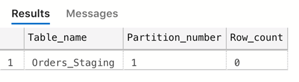  
 
1. Мы можем использовать команду ALTER TABLE, чтобы переместить секции 3 в таблице OrdersPartition в секцию по умолчанию таблицы Orders_Staging.
```sql
ALTER TABLE dbo.OrdersPartition SWITCH PARTITION 3 to dbo.Orders_Staging;
```

После этого шага мы рассмотрим информацию о секциях для таблицы OrdersPartition:

```sql
SELECT
o.name AS Table_name, pnp.partition_number AS Partition_number, sum(pnp.rows) AS Row_count
FROM sys.pdw_nodes_partitions AS pnp
JOIN sys.pdw_nodes_tables AS NTables ON pnp.object_id = NTables.object_id
AND pnp.pdw_node_id = NTables.pdw_node_id
JOIN sys.pdw_table_mappings AS TMap ON NTables.name = TMap.physical_name
AND substring(TMap.physical_name,40, 10) = pnp.distribution_id
JOIN sys.objects AS o ON TMap.object_id = o.object_id
WHERE o.name in ('OrdersPartition')
GROUP BY partition_number, o.name, pnp.data_compression_desc;
```

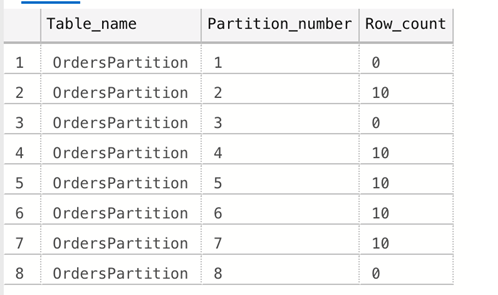  

И для таблицы Orders_Staging:

```sql
SELECT
o.name AS Table_name, pnp.partition_number AS Partition_number, sum(pnp.rows) AS Row_count
FROM sys.pdw_nodes_partitions AS pnp
JOIN sys.pdw_nodes_tables AS NTables ON pnp.object_id = NTables.object_id
AND pnp.pdw_node_id = NTables.pdw_node_id
JOIN sys.pdw_table_mappings AS TMap ON NTables.name = TMap.physical_name
AND substring(TMap.physical_name,40, 10) = pnp.distribution_id
JOIN sys.objects AS o ON TMap.object_id = o.object_id
WHERE o.name in ('Orders_Staging')
GROUP BY partition_number, o.name, pnp.data_compression_desc;
```
Итак, мы физически перемещали строки из одной таблицы в другую.


# Лаба 2 Загрузка данных в dedicated SQL Pool

## Упражнение 1 Загрузка данных с помощью Azure Data Factory(ADF)

В этом упражнении мы сначала создадим таблицу, а затем создадим пайплайн для интеграции и перемещения данных из хранилища Azure blob storage в таблицу в нашем хранилище данных. Мы будем использовать txt-файл, который содержит данные о продажах и информацию о продукте. 

(важно!!) Чтобы следовать данному пражнению, необходимо загрузить txt файл в  Azure Blob Storage в контейнер(Containers). Это можно сделать через портал – загрузить в ручную с вашего компьютера через интерфейс.

1.	Using Azure Data Studio make sure that your connection to DW is active. Then we will create new table - SuperStoreOrders using DDL below:

```sql
CREATE TABLE [dbo].[SuperStoreOrders]
(
    RowID [int] NOT NULL,
    OrderID [nvarchar](200) NOT NULL,
    OrderDate DATE NOT NULL,
    ShipDate DATE NOT NULL,
    ShipMode [nvarchar](200) NOT NULL,
    CustomerID [nvarchar](200) NOT NULL,
    CustomerName [nvarchar](200) NOT NULL,
    Segment [nvarchar](200) NOT NULL,
    Country [nvarchar](200) NOT NULL,
    City [nvarchar](200) NOT NULL,
    State [nvarchar](200) NOT NULL,
    PostalCode int,
    Region [nvarchar](200) NOT NULL,
    ProductID [nvarchar](200) NOT NULL,
    Category [nvarchar](200) NOT NULL,
    SubCategory [nvarchar](200) NOT NULL,
    ProductName [nvarchar](200) NOT NULL,
    Sales [money] NOT NULL,
    Quantity int,
    Discount [money] NOT NULL,
    Profit [money] NOT NULL
)
WITH
(
    DISTRIBUTION = HASH ( RowID ),
    CLUSTERED COLUMNSTORE INDEX
);
```

2.	Перейдите в Data Factory который находится внутри вашего Synapse Workspace, как показано ниже. После нажатия на **Copy Data tool*, откроется Copy Data tool wizard.

	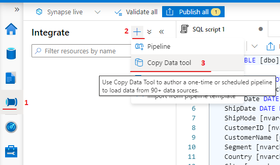  	 

На вкладке **Properties** 
- **Task type**: *Build-in copy task*
- **Task cadence or task schedule**: *Run once now*

На вкладке **Source** 
- **Source type**: *Azure Data Lake Storage Gen2*
- **Connection**: выберите из списка с названием идентичному вашему Synapse Workspace
- **File or folder**: выберите файл который вы предварительно загрузили в Storage.

Нажмите **Next**  и вам предложится выбрать конфигурацию фала с данными. Выберите опцию **First row as header** и остальное без изменений.

  	 
 
На вкладке **Target** 
- **Target type**: *Azure Synapse Analytics*
- **Connection**: нажмите на *New connection*

Во всплывабщем окне **New Connection** выберите следующие значени и нажмите **Create**

- **Account selection method**: *From Azure subscription*
- **Azure subscription**: выберите вашу подписку
- **Server name**: выберите название вашего сервера
- **Database name**: выберите название вашего dedicated SQL pool
- **Authentication type**: пароль, который указывали при создании SQL Server

Далее вам предложится конкретизировать куда конкретно вы скопируете данные, нажмите **Use existing table** и из выпадающего списка выберите таблицу 
[dbo].[SuperStoreOrders].

  	 

Далее необходимо соотнести колонки в исходном файле и в таблице [dbo].[SuperStoreOrders].

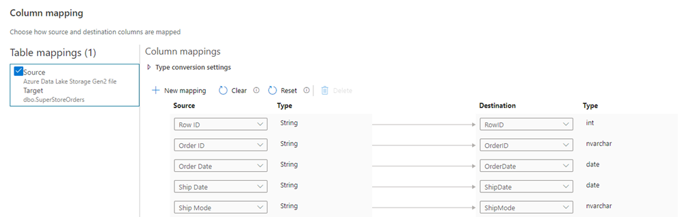  	 

На вкладке **Settings** в раздере **Advanced** выберите опцию **Bulk Insert**

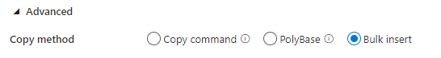  	 

После того, как вы нажали **Review + Create** начнется развертывание вашего пайплайна.

  	 
 
Нажмите **Finish**.

3. Далее нужно нажать на панели сверху **Publish**

	  	 
 
4. Мы можем запустить нашу работу с помощью команды Debug. Нажмите Debug. Это запустит наш job и загрузит данные в таблицу.. В случае сбоя он покажет нам журналы сбоев.

	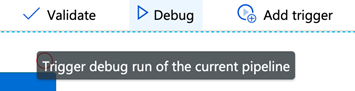  	 
 
5. Мы можем увидеть данные, выполнив cледующий запрос:
select City, SUM (Sales) as Sales_Amount 
from dbo.SuperStoreOrders
group by City
order by City desc


## Упражнение 2 Загрузка данных с помощью PolyBase 


1. Начнем с создания внешней схемы и таблицы, которые можно использовать в качестве входных данных для дальнейшего преобразования данных. Сначала мы создадим мастер-ключ, если он еще не создан.

Главный ключ базы данных - это симметричный ключ, используемый для защиты закрытых ключей сертификатов и асимметричных ключей, которые присутствуют в базе данных.

```sql
CREATE MASTER KEY;
```
Если он существует, тогда отлично, продолжаем.

2.	Создайте внешний источник данных – расположение Azure Blob, откуда будем забирать данные:

```sql
CREATE EXTERNAL DATA SOURCE WWIStorage
WITH
(
    TYPE = Hadoop,
    LOCATION = 'wasbs://wideworldimporters@sqldwholdata.blob.core.windows.net'
);
```

3. Выполните следующий запрос, который указывает характеристики и параметры форматирования для внешнего файла данных (внешние данные хранятся в виде текста, а значения разделяются символом вертикальной черты (|)).
```sql
CREATE EXTERNAL FILE FORMAT TextFile WITH (
FORMAT_TYPE = DelimitedText, FORMAT_OPTIONS (FIELD_TERMINATOR = ',')
);

```
4. Создайте внешнюю таблицу. Определения таблиц хранятся в базе данных, но таблицы ссылаются на данные, которые хранятся в хранилище BLOB-объектов Azure

```sql
CREATE EXTERNAL TABLE [ext_dimension_City](
    [City Key] [int] NOT NULL,
    [WWI City ID] [int] NOT NULL,
    [City] [nvarchar](50) NOT NULL,
    [State Province] [nvarchar](50) NOT NULL,
    [Country] [nvarchar](60) NOT NULL,
    [Continent] [nvarchar](30) NOT NULL,
    [Sales Territory] [nvarchar](50) NOT NULL,
    [Region] [nvarchar](30) NOT NULL,
    [Subregion] [nvarchar](30) NOT NULL,
    [Location] [nvarchar](76) NULL,
    [Latest Recorded Population] [bigint] NOT NULL,
    [Valid From] [datetime2](7) NOT NULL,
    [Valid To] [datetime2](7) NOT NULL,
    [Lineage Key] [int] NOT NULL
)
WITH (LOCATION='/v1/dimension_City/',
    DATA_SOURCE = WWIStorage,  
    FILE_FORMAT = TextFileFormat,
    REJECT_TYPE = VALUE,
    REJECT_VALUE = 0
);  

```


5. Загрузка данных в пул SQL. Теперь, когда мы создали внешнюю таблицу, содержащую необработанные данные, вы создадите вторую таблицу в нашем аналитическом хранилище, преобразуете данные и загрузите их.

```sql
CREATE TABLE [wwi_dimension_City]
WITH
(
    DISTRIBUTION = REPLICATE,
    CLUSTERED COLUMNSTORE INDEX
)
AS
SELECT * FROM [ext_dimension_City]
OPTION (LABEL = 'CTAS : Load [wwi_dimension_City]')
;
```

6.	Мы можем проверить только что созданную таблицу:

SELECT * FROM wwi_dimension_City;


# Лаба 3 Business Intelligence с dedicated SQL Pool

В этой лабораторной работе мы узнаем, как подключить dedicated SQL Pool к Microsoft Power BI.

Примечание. Power BI Desktop доступен только в Windows. Если у вас Mac OS, вы можете попробовать использовать Azure Data Studio и построить там несколько диаграмм или использовать свой собственный инструмент business intelligence.

## Упражнение 1 Подключение к Power BI

1.	Запустите Power BI Desktop и нажмите **Get Data**
2.	Выберите из списка источников **Azure Synapse Analytics**

	  

3.	Если Power BI выдает ошибку о том, что вашему IP-адресу не разрешен доступ к серверу, перейдите к https://portal.azure.com, 
Выберите хранилище данных в списке ресурсов, откройте **Firewalls and virtual networks**, нажмите **Add client IP** и **Save**.
Это внесет вашу текущую машину в белый список. В качестве альтернативы вы можете указать диапазон IP-адресов для своей организации.

	  

4. Далее вас просят ввести имя сервера и выбрать режим подключения. 

	  

	- cкопируйте имя сервера с портала Azure.

	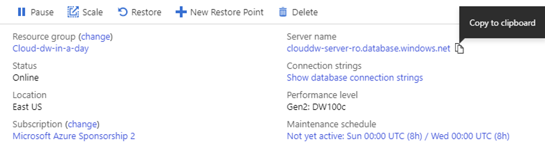  

	- выберите Import vs DirectQuery. 

Обычно в режиме импорта весь набор данных загружается в память, где он затем нарезается на кусочки для создания визуальных элементов.

DirectQuery, как следует из названия, отправляет на сервер запросы в реальном времени каждый раз, когда запрашивается часть данных для визуального элемента.
Для больших наборов данных, которые обычно используются, когда требуется хранилище данных, DirectQuery - единственный выход. У него нет ограничений на размер набора данных.

Другой вариант - создать табличную модель службы анализа Azure и подключить ее к Power BI. Это было бы хорошим выбором для многонациональной организации, у которой есть глобальная модель данных, к которой имеют доступ аналитики в разных странах для построения своих отчетов бизнес-аналитики с использованием единого набора полей, показателей и взаимосвязей.

В нашем семинаре давайте сосредоточимся на режиме импорта, затем вы можете попробовать другие методы и сравнить производительность.


5. Выберите таблицы 

Для наших целей выберем 7 таблиц:
1)	DimDate
2)	DimCustomer
3)	DimGeography
4)	DimProduct
5)	DimProductCategory
6)	DimProductSubcategory
7)	FactInternetSales

	  

[Необязательно] При нажатии Transform Data открывается редактор Power Query - интегрированный инструмент подготовки данных, который позволяет очищать данные, объединять и добавлять запросы, выполнять вычисления, агрегировать значения, сводные / несводные таблицы и многое другое. Большинство операций в Power Query можно выполнить без написания кода!

6. Создание связей. Power BI автоматически определяет связи при загрузке. Тем не мение, иногда есть несколько способов создания связей между таблицами. Щелкните на вкладку **Model** на левой панели. Чтобы связать 2 таблицы, просто перетащите поле из одной таблицы в соответствующее поле в другой таблице. Затем выберите тип связи и направление фильтрации.

  
 
7. Проверьте данные на вкладке **Data**. Они очень полезны для построения отчетов и измерений. Обратите внимание, что у вас нет этого представления, если вы подключены Live (DirectQuery или Tabular)
 
  

8. Выбери те таблилицу DimGeography. Заметьте, что поля сдесь имеют иерархическую зависимость CountryRegionName > StateProvinceName > City > PostalCode
Это может быть использовано для детализации в визуальных элементах, в данном случае, по локации.

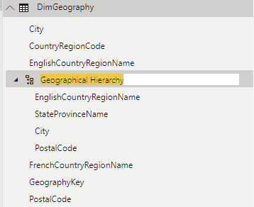  

В панели **Fields** перетяните **StateProvinceName** на **EnglishCountryRegionName**. 
Далее перетяните **City** и **PostalCode** на иерархию **EnglishCountryRegionName**.

Опционально, вы можете переименовать иерархию, нажав дважды на название и введя новое название.

## Упражнение 2 Построение дашборда в Power BI Service
		
1. Создание визуальных элементов
Перейдите на вкладку Reports  и перетяните созданную иерархию на дашборд. Заметьте, что Power BI распоздает что наши данные географические и создает карту, располагая Country в легенде карты. Давайте добавим поля StateProvinceName, City и PostalCode  на карту. Это можно сделать или просто перетянув поля на карту или поставив галочку волзе необходимого поля. Тогда Power BI поймет что мы пытаемся активировать функцию детализации нашей иерархии.

  

2. Вы можете построить дашборд который мы привели как пример ниже или придумать самостоятельно свой. Поиграйтесь с детализацией и иерархиями что лучше понять как они работают. Ниже мы привели скриншоты настроек визуальных элементов

  

Карта   		

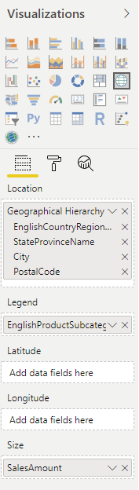  

Столбиковая диаграмма  		 

  

Таблица  

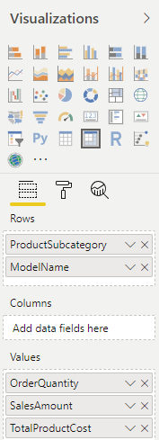  

3. Сохраните свой отчет и опубликуйте в Power BI Service 

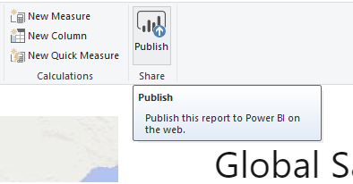   

4. Выберите My Workspace подождите когда ваш макет опубликуется.

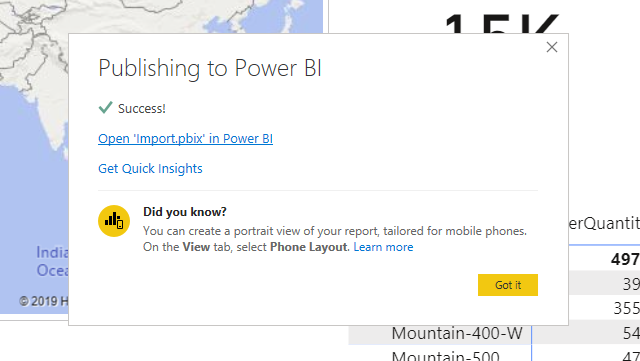

Зайдите в Power BI Service и проверьте опубликовался ваш макет или нет. Из Power BI Service вы можете распространять свой дашборд различными способами (требуется профессиональная лицензия), экспортировать в различные форматы, загружать данные, распечатывать и т.д.


## ПОСЛЕ ОКОНЧАНИЯ ЛАБОРАТОРНЫХ РАБОТ УДАЛИТЕ РЕСУРСЫ, ЧТОБЫ НЕ ПОДВЕРГАТЬСЯ ДОПОЛНИТЕЛЬНЫМ ЗАТРАТАМ 

# Удаление ресурсов
1. В поле поиска вверху выполните поиск по слову **Resource groups**.
2. В поисковых результатах в разделе *Services* выберите **Resource groups**.
3. Выберите ресурсную группу в которой вы создали ресурсы для лабораторных работ и удалите ее.

