# Snowflake Workshop

**Содержание**
* [Модуль 1 Подготовка лабораторной среды](#модуль-1-подготовка-лабораторной-среды)
* [Модуль 2 Пользовательский интерфейс Snowflake и история лабораторной работы](#модуль-2-пользовательский-интерфейс-snowflake-и-история-лабораторной-работы)
* [Модуль 3 Подготовка к загрузке данных](#модуль-3-подготовка-к-загрузке-данных)
* [Модуль 4 Загрузка данных](#модуль-4-загрузка-данных)
* [Модуль 5 Аналитические запросы, кэш результатов, клонирование](#модуль-5-аналитические-запросы-кэш-результатов-клонирование)
* [Модуль 6 Работа с полуструктурированными данным и представлениями](#модуль-6-работа-с-полуструктурированными-данным-и-представлениями)
* [Модуль 7 Использование путешествий во времени](#модуль-7-использование-путешествий-во-времени)
* [Модуль 8 Контроль доступа на основе ролей и администратор учетных записей](#модуль-8-контроль-доступа-на-основе-ролей-и-администратор-учетных-записей)
* [Модуль 9 Обмен данными](#модуль-9-обмен-данными)
* [Сброс окружения Snowflake](#сброс-окружения-snowflake)

Данная лабораторная работа является переводом HANDS-ON LAB GUIDE FOR SNOWFLAKE FREE TRIAL.

# Модуль 1 Подготовка лабораторной среды

Если это еще не сделано, зарегистрируйтесь для получения 30-дневной бесплатной пробной версии Snowflake на https://trial.snowflake.com.
● Версия Snowflake (например, Standard, Enterprise), облачный провайдер (AWS, Azure, например) и регион **не** имеют значения для этой лабораторной работы. Но мы предлагаем вам выбрать регион, который физически ближе всего к вам. 
● После регистрации вы получите электронное письмо со ссылкой для активации и URL-адресом вашей учетной записи Snowflake. Добавьте этот URL-адрес в закладки для быстрого доступа в будущем. После активации вы создадите логин и пароль. Запишите эти полномочия.

Перейдите по ссылке https://s3.amazonaws.com/snowflake-workshop-lab/lab_scripts_free_trial.sql
и загрузите файл lab_scripts_free_trial.sql на свой локальный компьютер. Этот файл содержит предварительно записанные команды SQL, и мы будем использовать этот файл позже в лабораторной работе.

# Модуль 2 Пользовательский интерфейс Snowflake и история лабораторной работы

## 2.1 Вход в пользовательский интерфейс Snowflake (UI)

2.1.1 Откройте окно браузера и введите URL-адрес 30-дневной пробной среды Snowflake.

2.1.2 Вы должны увидеть экран входа в систему ниже. Введите свои уникальные учетные данные для входа.

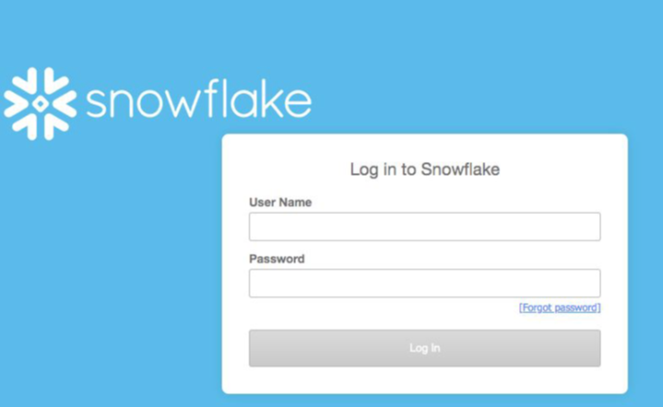

## 2.2 Закройте все приветственные окна и руководства

2.2.1 При первом входе в систему вы можете увидеть поля «приветствие» и «помощник» в пользовательском интерфейсе.
Также имеется лента «Наслаждайтесь бесплатной пробной версией…» в верхней части пользовательского интерфейса. Сверните и закройте их, нажав на элементы в красных полях на скриншоте ниже.

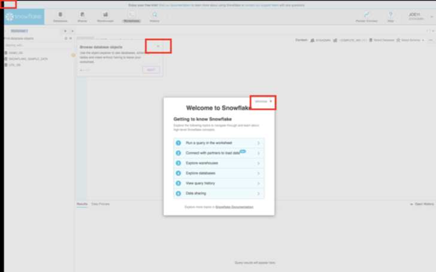

## 2.3 Навигация по пользовательскому интерфейсу Snowflake

Сначала познакомим вас со Snowflake! 

2.3.1 В верхнем меню можно переключаться между различными областями Snowflake:


2.3.2 На вкладке **Databases** отображается информация о базах данных, которые вы создали или имеете права доступа. Вы можете создавать, клонировать, удалять или передавать право собственности на базы данных, а также загружать данные (ограниченные) в пользовательском интерфейсе. Обратите внимание, что в вашей среде уже существует несколько баз данных. Однако мы не будем использовать их в этой лабораторной работе.

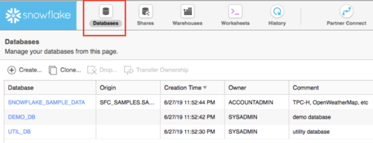
 
2.3.3 На вкладке **Shares** можно настроить совместное использование данных для простого и безопасного совместного использования таблиц Snowflake между отдельными учетными записями Snowflake или внешними пользователями без необходимости создания второй копии данных таблицы. В конце этой лабораторной работы находится модуль по совместному использованию данных.

2.3.4 Вкладка **Warehouses** предназначена для настройки и управления вычислительными ресурсами (виртуальными хранилищами) для загрузки или запроса данных в Snowflake. Обратите внимание, что в вашей среде уже существует хранилище под названием «COMPUTE_WH (XL)».

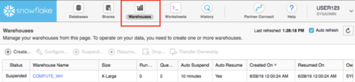
 

2.3.5 Вкладка **Worksheets** предоставляет интерфейс для отправки запросов SQL, выполнения операций DDL и DML и просмотра результатов по мере выполнения ваших запросов / операций. Появится стандартный **Worksheets 1**.

На левой панели находится браузер объектов базы данных, который позволяет пользователям просматривать все базы данных, схемы, таблицы и представления, доступные для роли, выбранной для рабочего листа.

На нижней панели отображаются результаты запросов и операций. Размер различных окон на этой странице можно изменять, перемещая по ним маленькие ползунки. А если во время лабораторной работы вам понадобится больше места для работы на листе, сверните браузер объектов базы данных на левой панели. На многих снимках экрана в этом руководстве браузер объектов базы данных закрыт.

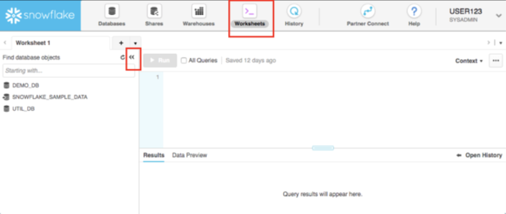

2.3.6 В верхнем левом углу **Worksheets 1** по умолчанию, справа от вкладки рабочего листа, нажмите на небольшую стрелку, направленной вниз, выберите **Load Script**, затем перейдите к файлу **lab_scripts.sql**, который вы загрузили в предыдущем модуле, и выберите **Open**. Все команды SQL, которые необходимо выполнить до конца этой лабораторной работы, теперь появятся на новом листе. Пока не запускайте ни одну из команд SQL. Мы вернемся к ним позже в лаборатории и будем выполнять их по одному.


    Рабочие листы и пользовательские интерфейсы

    Большая часть конфигураций в этой лабораторной работе будет выполняться с помощью  предварительно написанного SQL-кода в рабочем листе, чтобы сэкономить время. Эти конфигурации также могут быть выполнены через пользовательский интерфейс менее технически, но потребуют больше времени.

2.3.7 Вкладка **History** позволяет просматривать сведения обо всех запросах, выполненных за последние 14 дней в учетной записи Snowflake (щелкните идентификатор запроса, чтобы перейти к запросу и получить более подробные сведения).

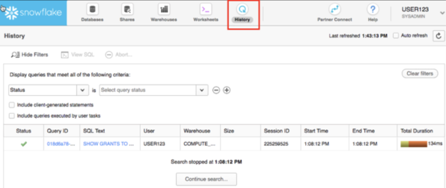 
 
2.3.8 Если вы щелкните в правом верхнем углу пользовательского интерфейса, где отображается ваше имя пользователя, вы увидите, что здесь вы можете делать такие вещи, как менять свой пароль, роли или предпочтения. Snowflake имеет несколько ролей, определенных системой. В настоящее время вы выполняете роль **SYSADMIN** по умолчанию, и мы останемся в этой роли до конца этой лабораторной работы.

 

    SYSADMIN

    На протяжении большей части этой лабораторной работы вы останетесь в роли SYSADMIN (системный администратор), которая имеет права создавать хранилища, базы данных и другие объекты в учетной записи.
    В реальной среде вы должны использовать разные роли для задач в этой лабораторной работе и назначать роли своим пользователям. Подробнее о контроле доступа в Snowflake будет ближе к концу этой лабораторной работы, а также на
    https://docs.snowflake.net/manuals/user-guide/security-access-control.html

## 2.4 "История" лабораторной работы

2.4.1 Кейс, который мы рассматриваем на даннйо лабораторной работе, основана на работе аналитической группы Citi Bike, реальной общегородской системы проката велосипедов в Нью-Йорке, США. Эта команда хочет иметь возможность анализировать данные, чтобы лучше понимать своих гонщиков и то, как им лучше всего обслуживать.

Сначала мы загрузим структурированные данные **.csv** . Эти данные взяты из внутренних транзакционных систем Citi Bike. Позже мы загрузим полуструктурированные данные о погоде в формате JSON, чтобы увидеть, есть ли какая-либо корреляция между количеством поездок на велосипеде и погодой.

# Модуль 3 Подготовка к загрузке данных

Начнем с подготовки к загрузке структурированных данных о транзакциях  пользователей Citi Bike в Snowflake.

В данном модуле мы вручную настроим процесс, чтобы вы увидели все задействованные в нем шаги.  На практике, скорее всего, вы будет использовать автоматизированный процесс или продукт ETL, чтобы процесс загрузки данных полностью автоматизирован и упрощен.

Мы будем использовать данные о прокате велосипедов, предоставленные [Citi Bike NYC]( https://ride.citibikenyc.com/system-data). Данные были экспортированы и предварительно подготовлены для вас в корзине Amazon AWS S3. Данные состоят из информации о времени поездки, местонахождении, типе пользователя, поле, возрасте пассажиров и т. Д. На AWS S3 данные представляют 61,5 млн строк, 377 объектов и общий размер сжатых 1,9 ГБ.

Ниже приведен фрагмент одного из CSV-файлов данных Citi Bike:

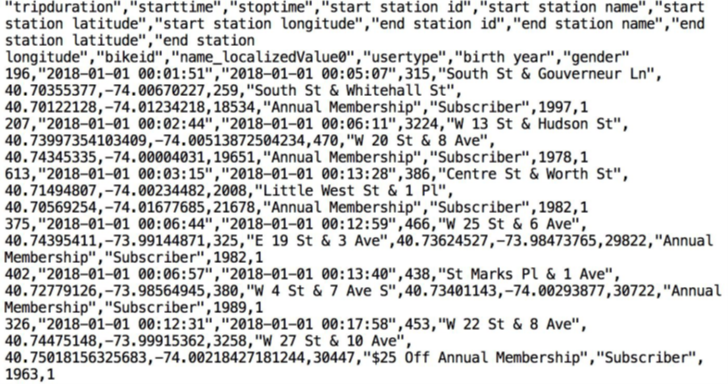

## 3.1	Создание базы данных и таблицы

3.1.1 Для начала, создадим базу данных CITIBIKE, которая будет использоваться для загрузки структурированных данных.
Вверху пользовательского интерфейса выберите вкладку . **Databases**. Затем нажмите **Create**, назовите базу данных **CITIBIKE** и нажмите **Finish**.

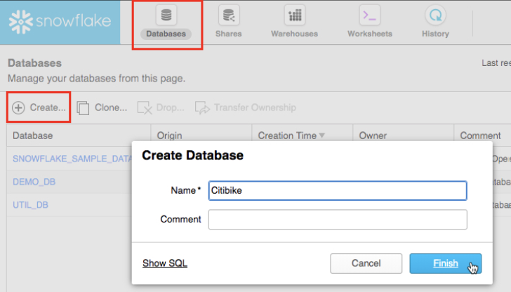

3.1.2 Вверху пользовательского интерфейса Snowflake щелкните вкладку **Worksheets**. 

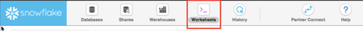

В левом верхнем углу **Worksheet 1**, справа от вкладки рабочего листа, нажмите на маленькую направленную вниз стрелку и выберите **Load Script**, затем перейдите в папку с файлом [lab_scripts.sql]( https://s3.amazonaws.com/snowflake-workshop-lab/lab_scripts_free_trial.sql) и выберите **Open**.  В этом файле содержатcя команды SQL, которые необходимо выполнить до конца этой лабораторной работы и они должны повится на экране справа. Пока не запускайте ни одну из команд SQL. Мы вернемся к ним позже в будем выполнять их по одному.

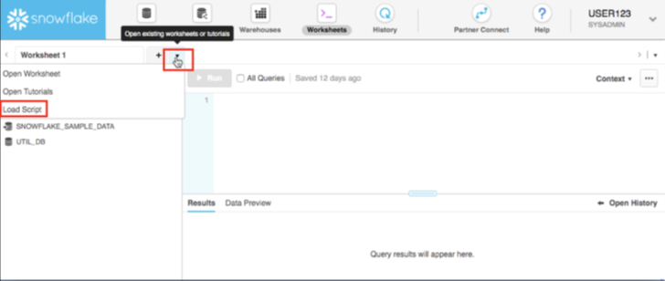

3.1.3 Далее, нам нужно правильно установить контекст в рабочем листе. 

В правом верхнем углу щелкните стрелку раскрывающегося списка рядом с разделом **Context**, чтобы отобразить контекстное меню рабочего листа. Здесь мы с помощью пользовательского интерфейса контролируем, какие элементы пользователь может видеть и запускать на каждом листе.
Позже в лабораторной работе мы установим контекст рабочего листа с помощью команд SQL на рабочем листе.

Выберите следующие значения:

- **Role**: SYSADMIN
- **Warehouse**: COMPUTE_WH (XL)
- **Database**: CITIBIKE
- **Schema** = PUBLIC


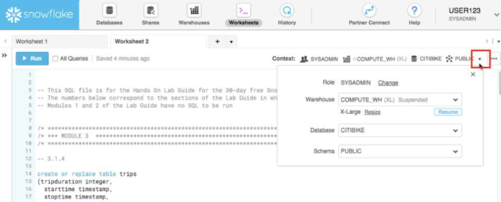


> Обратите внимание, что все операции, которые мы сделали до сих пор, НЕ требуют вычисления ресурсов, поэтому мы можем создавать все наши объекты бесплатно.

3.1.4 Теперь давайте создадим таблицу с названием TRIPS, которая будет использоваться для загрузки csv файла . 

Мы будем использовать вкладку **Worksheets** в пользовательском интерфейсе Snowflake для запуска DDL для создания таблицы. 

Далее  мы запуститим первую команду поместив курсор в любом месте команды и нажав синюю кнопку **Run** вверху страницы или нажав `Ctrl / Cmd + Enter` на клавиатуре. 

> ВНИМАНИЕ В этой лабораторной работе никогда не выбирайте **All Queries** вверху **Worksheets** . Нам нужно запускать SQL-запросы по одному в определенном порядке; не все сразу.

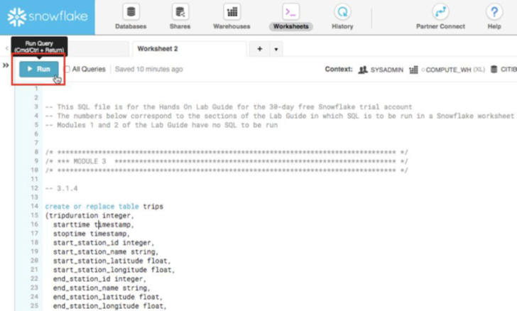

3.1.5 Запустите следующий скрипт:

```sql
create or replace table trips
(
    tripduration integer,
    starttime timestamp,
    stoptime timestamp,
    start_station_id integer,
    start_station_name string,
    start_station_latitude float,
    start_station_longitude float,
    end_station_id integer,
    end_station_name string,
    end_station_latitude float,
    end_station_longitude float,
    bikeid integer,
    membership_type string,
    usertype string,
    birth_year integer,
    gender integer
);
```

3.1.6 Если вы выделили весь текст SQL команды (не просто поместили курсор в команду) и выполнили ее, должно появиться окно подтверждения с вопросом **Do you want to run the following queries?** (Вы хотите выполнить следующие запросы?). Щелкните синюю кнопку **Run** в поле. В дальнейшем вы можете продолжать нажимать кнопку **Run** в этом окне или установить флажок **Don’t ask me again (AllWorksheets)** (Больше не спрашивать (Все Рабочие листы).

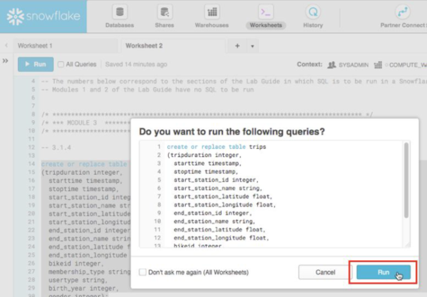

3.1.7 Убедитесь, что ваша таблица TRIPS создана. 

Внизу рабочего листа вы должны увидеть раздел **Results** с надписью **Table TRIPS successfully created** (Таблица TRIPS успешно создана).

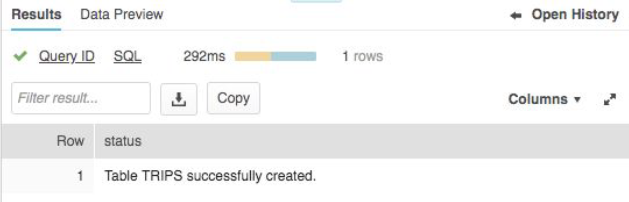

3.1.8 Вверху страницы перейдите на вкладку **Databases** и нажмите **CITIBIKE**. Вы должны увидеть свою недавно созданную таблицу TRIPS.

> Если вы не видите базы данных, разверните браузер, поскольку они могут быть скрытымм.

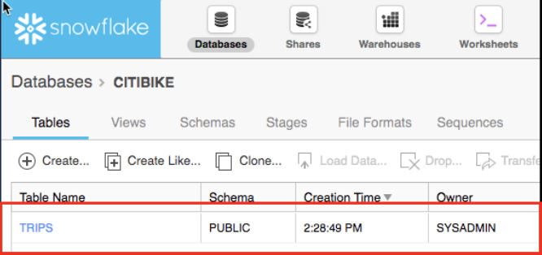

3.1.9 Щелкните гиперссылку **TRIPS**, чтобы увидеть структуру таблицы, которую вы только что настроили для нее.

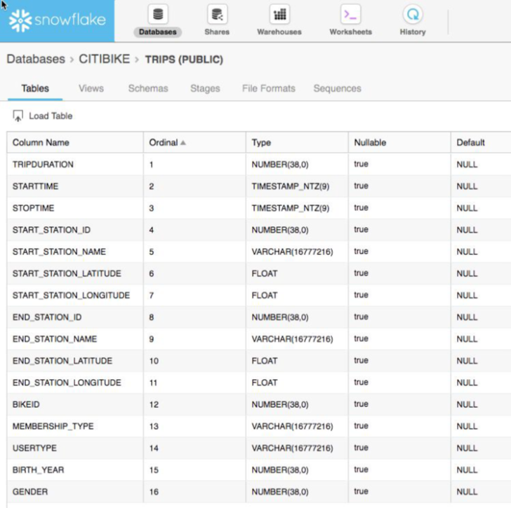

## 3.2 Создание прожемежуточного местоположения для внешних источников 

Мы работаем с csv файлами, которые уже были размещены в публичном доступе, во внешнем S3 бакете. Прежде чем мы сможем использовать эти данные, нам сначала нужно создать промежуточное местоположение для внешнего S3 бакета.

>ПРИМЕЧАНИЕ. В этой лабораторной работе мы используем бакет AWS-East. В реальном кейсе, чтобы избежать затраты на передачу данных, вам нужно выбрать промежуточное местоположение у того же поставщика облачных услуг и региона, в котором находится ваша среда Snowflake.

3.2.1 На вкладке **Databases** нажмите на базу данных **CITIBIKE**, затем нажмите на **Stages** и **Create…**

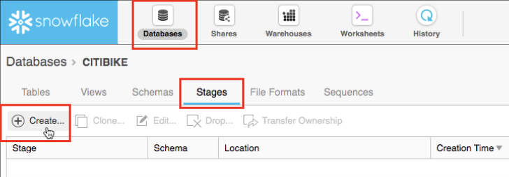

3.2.2 Выберите опцию **Existing Amazon S3 Location** и нажмите **Next**:


3.2.3 На всплывающеи окне **Create Stage**, введите / выберите следующие настройки, затем нажмите **Finish**.

- **Name** citibike_trips
- **Schema Name** PUBLIC
- **URL** s3://snowflake-workshop-lab/citibike-trips

>ПРИМЕЧАНИЕ. Бакет S3 для этой лабораторной работы находистя в открытом доступе, поэтому вы можете оставить поля с указанием ключей доступа пустыми.

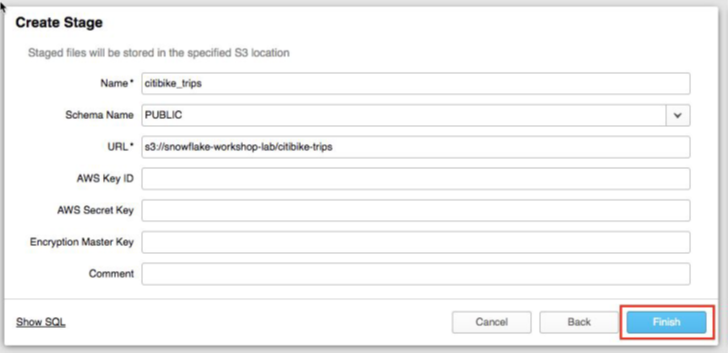

3.2.4 Теперь посмотрим на содержимое citibike_trips, которые содержатсья во внешнем S3 бакете. Вверху страницы щелкните вкладку **Worksheet**. Затем выполните следующий запрос:

```sql
list @citibike_trips;
```
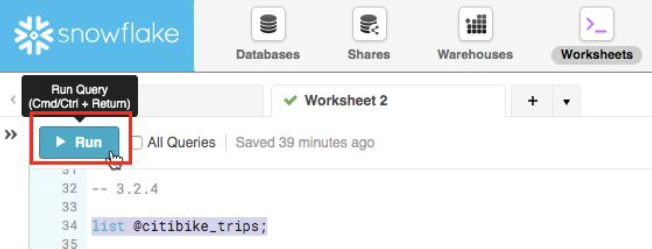

Вы должны увидеть результат в окне результатов на нижней панели:

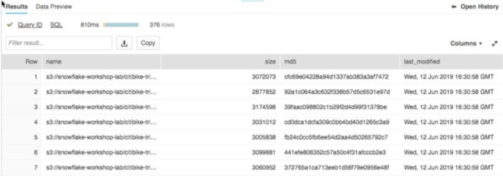


## 3.3 Создание File Format

Прежде чем мы сможем загрузить данные в Snowflake, мы должны создать File Format, который соответствует структуре данных.

3.3.1 На вкладке **Databases** нажмите на базу данных **CITIBIKE**, Затем нажмите на **File Formats**. Затем нажмите **Create**.

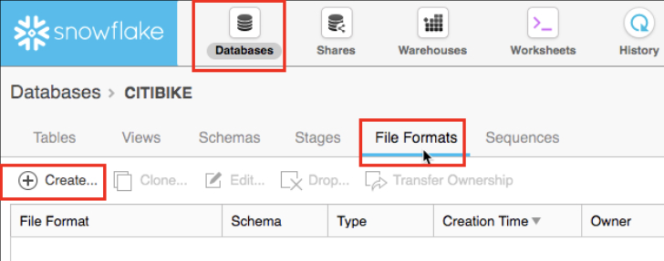

3.3.2 В появившемся окне оставьте все настройки по умолчанию как есть, но внесите следующие изменения:

- **Name**: CSV
- **Field optionally enclosed by:** Double Quote
- **Null string:** <Delete the existing text in this field so it is empty>
- **Выберите** Error on Column Count Mismatch: <uncheck this box>


**ВАЖНО:** Если вы не видите **Error on Column Count Mismatch**, прокрутите вниз в диалоговом окне. Когда вы закончите, диалоговое окно должно выглядеть так:


Затем нажмите на **Finish** чтобы создать File Format.

# Модуль 4 Загрузка данных

В этой части мы будем использовать хранилище данных и команду **COPY**, чтобы инициировать массовую загрузку структурированных данных в только что созданную таблицу Snowflake.

## 4.1 Изменение размера и использование хранилища для загрузки данных

Для загрузки данных требуется вычислительная мощность. Вычислительные узлы (compute nodes) в Snowflake называются хранилищами (Warehouses), и их размер можно динамически увеличивать или уменьшать в зависимости от рабочей нагрузки, будь то загрузка данных, выполнение запроса или выполнение операции DML. И каждая рабочая нагрузка может иметь собственное хранилище данных, поэтому не будет конкуренции за ресурсы.

4.1.1 Перейдите на вкладку **Warehouses**. Обратите внимание на опцию **Create…** вверху, где можно быстро создать новое хранилище. Однако мы хотим использовать существующее хранилищe **COMPUTE_WH** которое поставляется с 30-дневной пробной средой.

Щелкните строку этого **COMPUTE_WH** хранилища (не синяя гиперссылка с надписью **COMPUTE_WH**) так что вся строка будет выделена. Затем нажмите на Configure...чтобы увидеть детали конфигурации **COMPUTE_WH**. Мы будем использовать это хранилище для загрузки данных из AWS S3.

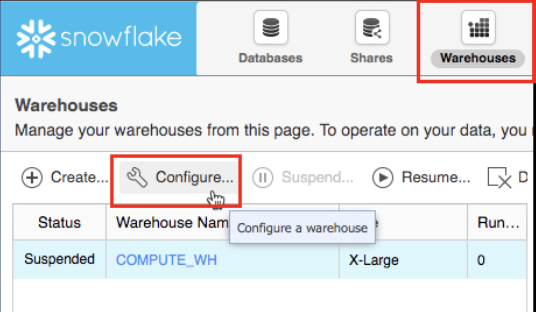

4.1.2 Давайте пройдемся по настройкам этого хранилища, поскольку здесь много функций, большая часть которых уникальна для Snowflake по сравнению с другими хранилищами данных.
ПРИМЕЧАНИЕ. - Если у вас не Snowflake Edition of Enterprise или более продвинутая, вы НЕ увидите конфигурации Maximum Clusters** или **Scaling Policy** из скриншота ниже. Мульти-кластеризация не используется в этой лабораторной работе, но мы все равно обсудим ее, поскольку это ключевая возможность Snowflake.

- В раскрывающемся списке **Size** выбирается размер хранилища. Для более крупных операций загрузки данных или более ресурсоемких запросов потребуется хранилище большего размера. 
Размеры t-shirt соответствуют базовым вычислительным узлам: AWS EC2 или виртуальным машинам Azure. Чем больше размер t-shirt, тем больше вычислительных ресурсов от облачного провайдера выделяется для этого хранилища. Например, вариант 4-XL выделяет 128 узлов. Кроме того, этот размер может быть увеличен или уменьшен на лету простым щелчком.

- Если у вас Snowflake Edition или выше, вы увидите раздел Maximum Clusters. Здесь вы можете настроить одно хранилище для работы с несколькими кластерами до 10 кластеров. В качестве примера, если только что упомянутому складу 4-XL был назначен максимальный размер кластера 10, его можно было бы масштабировать до 1280 (128 * 10) режимов AWS EC2 или виртуальных машин Azure, обеспечивающих питание этого хранилища ... и это может быть сделано за секунды! Мультикластер идеально подходит для сценариев параллелизма, например, когда многие бизнес-аналитики одновременно выполняют разные запросы, используя одно и то же хранилище. В этом сценарии различные запросы могут быть распределены между несколькими кластерами, чтобы обеспечить их быструю работу.

- Последняя секция настроек позволяет автоматически приостанавливать работу хранилища, чтобы он приостанавливал (останавливал) сам себя, когда не использовался, чтобы кредиты не использовались. Существует также возможность автоматически возобновлять (запускать) приостановленное хранилище, поэтому, когда ему назначается новая рабочая нагрузка, он автоматически запускает резервное копирование. Эта функция позволяет Snowflake использовать справедливую модель ценообразования для вычислений **плати по мере использования**, которая позволяет клиентам минимизировать затраты на хранилище данных.

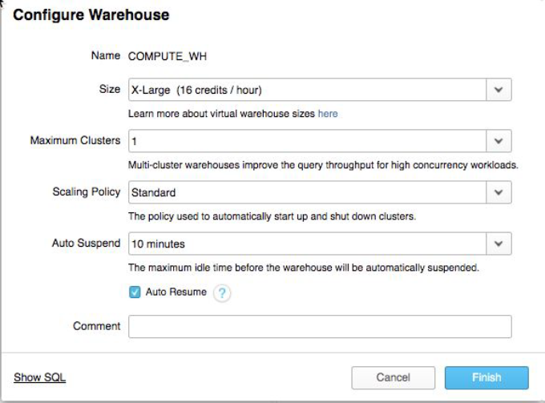

4.1.3 Мы собираемся использовать **COMPUTE_WH**  хранилище данных для загрузки структурированных данных в Snowflake.

Однако сначала мы собираемся уменьшить размер хранилища, чтобы уменьшить содержащуюся в нем вычислительную мощность. Затем на более поздних этапах мы отметим время, которое занимает эта загрузка, затем повторно проделаем ту же операцию загрузки с большим хранилищем и увидим, насколько быстрее происходит загрузка с большим хранилищем.

Измените размер вашего хранилища данных с X-Large на Small. Затем нажмите кнопку **Finish**.


## 4.2 Загрузите данные

Теперь мы можем запустить команду COPY, чтобы загрузить данные в таблицу TRIPS, которую мы создали ранее.

4.2.1 Через верхнюю часть пользовательского интерфейса вернитесь на вкладку **Worksheets**. Убедитесь, что контекст правильный, установив его в правом верхнем углу листа:

- **Role**: SYSADMIN
- **Warehouse**: COMPUTE_WH (S)
- **Database**: CITIBIKE
- **Schema** = PUBLIC

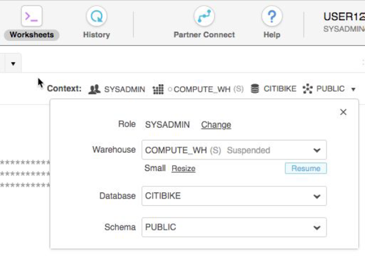

4.2.2 Выполните следующие операторы на листе, чтобы загрузить поэтапные данные в таблицу. Это может занять до 30 секунд.

```sql
copy into trips from @citibike_trips
file_format=CSV;
```

В окне результатов вы должны увидеть статус загрузки:

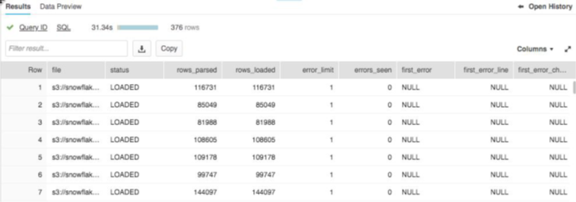 

4.2.3 Как только загрузка будет завершена, в правом нижнем углу листа щелкните маленькую стрелку рядом с текстом **Open History** чтобы показать историю операций Snowflake, выполненных на этом конкретном листе.

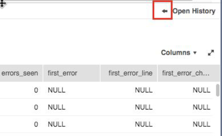 

4.2.4 В окне истории вы увидете `copy into trips from @citibike_trips file_format=CSV;` SQL-запрос, который вы только что выполнили, и отметьте продолжительность, просмотренные байты и строки. Используйте ползунок в левой части панели, чтобы развернуть его, если необходимо, чтобы увидеть все детали на нем.

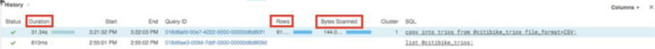  

4.2.5 Вернитесь на рабочий лист, чтобы очистить таблицу от всех данных и метаданных, используя команду:

```sql
truncate table trips;
```

4.2.6 Вверху пользовательского интерфейса перейдите на вкладку Warehouses., затем нажмите на **Configure..**. Измените размер хранилища до размера       Large и нажмите **Finish. Это хранилище в четыре раза больше Small. 

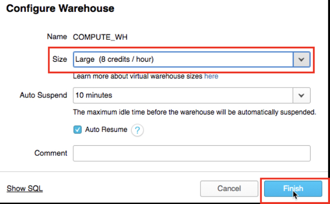  

4.2.7 Вернитесь на вкладку Worksheets. Выполните следующие операторы на листе, чтобы снова загрузить те же данные.

```sql
copy into trips from @citibike_trips
file_format=CSV;
```

4.2.8 Once the load is done, at the bottom of the worksheet in the History window compare the times between the two loads. The one with the Large warehouse was significantly faster.
После завершения загрузки в нижней части рабочего листа в окне History сравните время между двумя загрузками. Время у хранилища Large было значительно быстрее.

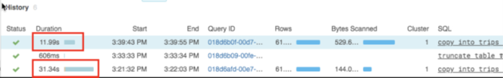  


## 4.3 Создать новое хранилище для аналитики данных
Возвращаясь к истории в лабораторной работе, предположим, что команда Citi Bike хочет гарантировать отсутствие конфликта ресурсов между их рабочими нагрузками загрузки данных/ETL и конечными пользователями, использующими инструменты BI для запросов в Snowflake.
Как упоминалось ранее, Snowflake может легко сделать это, назначив разные хранилища подходящего размера для разных рабочих нагрузок. Поскольку в Citi Bike уже есть хранилище для загрузки данных, давайте создадим новое хранилище для конечных пользователей, выполняющих аналитику. Затем мы будем использовать это хранилище для выполнения аналитики в следующем модуле.

4.3. В верхней части пользовательского интерфейса щелкните на вкладку Warehouses и нажмите **Create…**. Назовите это хранилище**ANALYTICS_WH**, размер**Large**. Если у вас Snowflake Edition Enterprise или выше, вы увидите настройку для **Maximum Clusters**. Выберите **1**.
Остальные настройки оставьте по умолчанию. Должно получиться так:

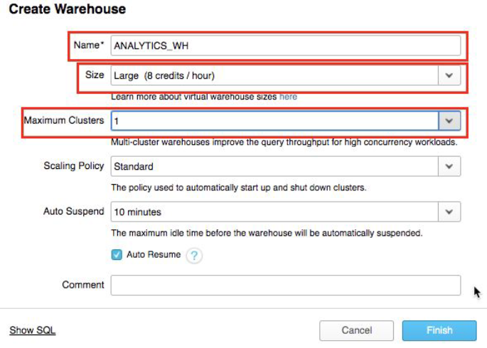  

Затем нажмите кнопку **Finish**, чтобы создать хранилище.


# Модуль 5 Аналитические запросы, кэш результатов, клонирование

В предыдущих упражнениях мы загружали данные в две таблицы с помощью массового загрузчика (bulk loader) Snowflake (команда COPY) и хранилища **COMPUTE_WH**. Теперь мы собираемся представить, что мы являемся пользователями аналитики в Citi Bike, которым нужно запрашивать данные в этих таблицах, используя рабочий лист и второе хранилище **ANALYTICS_WH**.

    Роли и запросы в **реальном мире**

    В **реальном мире** пользователи аналитики, вероятно, будут играть другую роль, чем **SYSADMIN**; чтобы не усложнять лабораторную работу, мы останемся с ролью **SYSADMIN**  для этого модуля.

    Кроме того, в **реальном мире** запросы обычно выполняются с помощью продуктов бизнес-аналитики, таких как Tableau, Looker, PowerBI и т. Д. Или для более продвинутой аналитики продукты для обработки данных, такие как Spark или R, могут запрашивать Snowflake. По сути, любая технология, использующая JDBC / ODBC, может выполнять аналитику данных в Snowflake. Но чтобы не усложнять эту лабораторную работу, все запросы выполняются через рабочий лист Snowflake.

## 5.1 Выполнение операторов SELECT и кеша результатов

5.1.1 Go the Worksheets tab. Within the worksheet, make sure you set your context appropriately:
Перейдите на вкладку Worksheets. Убедитесь, что вы правильно установили контекст на листе:

- **Role**: SYSADMIN
- **Warehouse**: ANALYTICS_WH (L)
- **Database**: CITIBIKE
- **Schema** = PUBLIC

5.1.2 Выполните запрос ниже, чтобы просмотреть образец данных о поездках.

```sql
select * 
from trips 
limit 20;
```

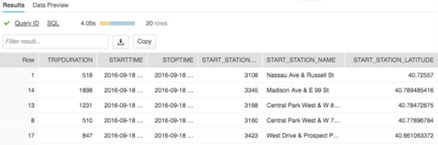  


5.1.3 Сначала давайте посмотрим на базовую почасовую статистику использования Citi Bike. Выполните приведенный ниже запрос. Он будет показывать для каждого часа количество поездок, среднюю продолжительность поездки и среднее расстояние поездки.

```sql
select 
    date_trunc('hour', starttime) as "date",
    count(*) as "num trips",
    avg(tripduration)/60 as "avg duration (mins)",
    avg(haversine(start_station_latitude, start_station_longitude, end_station_latitude,
    end_station_longitude)) as "avg distance (km)"
from trips
group by 1 
order by 1;
```

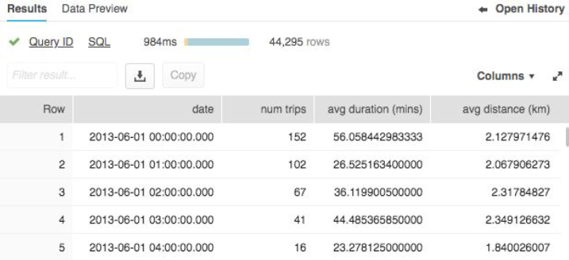  

5.1.4 Snowflake имеет кеш результатов, в котором хранятся результаты каждого запроса, выполненного за последние 24 часа. Они доступны во всех хранилищах, поэтому результаты запроса, возвращенные одному пользователю, доступны любому другому пользователю в системе, который выполняет тот же запрос, при условии, что базовые данные не изменились. Эти повторяющиеся запросы не только очень быстро возвращаются, но и не требуют вычислений.
Давайте посмотрим, как работает кеш результатов, снова запустив тот же запрос.

```sql
select 
    date_trunc('hour', starttime) as "date",
    count(*) as "num trips",
    avg(tripduration)/60 as "avg duration (mins)",
    avg(haversine(start_station_latitude, start_station_longitude, end_station_latitude,
    end_station_longitude)) as "avg distance (km)"
from trips
group by 1 
order by 1;
```

В окне **History** обратите внимание, что теперь запрос выполняется значительно быстрее, поскольку результаты были кэшированы.

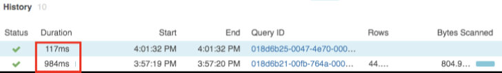  
 
5.1.5 Затем давайте запустим этот запрос, чтобы узнать, какие дни недели самые загруженные:

```sql
select
    dayname(starttime) as "day of week",
    count(*) as "num trips"
from trips
group by 1 
order by 2 desc;
```

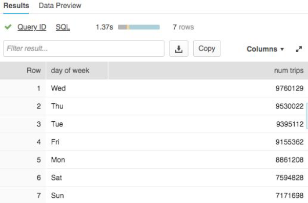  

## 5.2 Клонирование таблицы

Snowflake позволяет создавать клоны, также известные как **клоны с нулевым копированием**, таблиц, схем и баз данных за секунды. Моментальный снимок данных, имеющихся в исходном объекте, создается при создании клона и становится доступным для клонированного объекта. Клонированный объект доступен для записи и не зависит от источника клона. То есть изменения, внесенные либо в исходный объект, либо в объект-клон, не являются частью другого.
Популярным вариантом использования клонирования с нулевым копированием является клонирование production среды для использования в отделе разработки и тестирования для проведения тестирования и экспериментов без (1) неблагоприятного воздействия на production среду и (2) исключения необходимости настройки и управления двумя отдельными среды для production и разработки и тестирования.

    Клонирование без копирования.

    Огромным преимуществом является то, что базовые данные не копируются; изменяются только метаданные / указатели на базовые данные. Следовательно, требования к **нулевому копированию** и хранилищу не удваиваются при клонировании данных. Большинство хранилищ данных не могут этого сделать; для Snowflake это просто!


5.2.1 Выполните следующую команду, чтобы создать таблицу разработчика

```sql
create table trips_dev 
clone trips
```

5.2.2 Если закрыт, разверните обозреватель объектов базы данных в левой части рабочего листа. Нажмите небольшую кнопку **Refresh** на левой панели и разверните дерево объектов в базе данных Citibike. Убедитесь, что вы видите новую таблицу в базе данных CITIBIKE с именем TRIPS_DEV. Команда разработчиков теперь может делать с этой таблицей все, что угодно, в том числе даже удалять ее, не оказывая никакого влияния на таблицу TRIPS или любой другой объект.

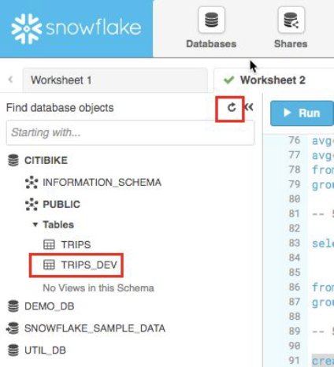  


# Модуль 6 Работа с полуструктурированными данным и представлениями 

> ПРИМЕЧАНИЕ. - Первые шаги здесь аналогичны предыдущим Модульм, но мы будем делать большую часть этого через SQL на рабочем листе, а не через пользовательский интерфейс, чтобы сэкономить время.

Возвращаясь к "истории" лабораторной работы, аналитическая группа Citi Bike хочет увидеть, как погода влияет на количество поездок. Для этого в этом модуле мы:

- Загрузим данные о погоде в формате JSON, хранящиеся в общедоступной корзине S3.
- Создадим представление и запросим полуструктурированные данные, используя точечную нотацию SQL.
- Выполним запрос, который объединяет данные JSON с данными TRIPS из предыдущего модуля.
- Узнаем, как погода влияет на количество поездок.


Данные JSON состоят из информации о погоде, предоставленной OpenWeatherMap с подробным описанием исторических условий в Нью-Йорке с 5 июля 2016 года по 25 июня 2019 года. Он также размещен на AWS S3, где данные представляют 57,9 тыс. строк, 61 объектов и общий размер сжатых данныъ 2,5 МБ.

Необработанный JSON в файлах GZ и в текстовом редакторе выглядит так:

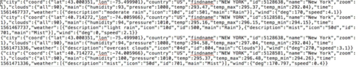  


    Полуструктурированные данные 

    Snowflake может легко загружать и запрашивать полуструктурированные данные, такие как JSON, Parquet или Avro, без преобразования. Это важно, потому что все большее количество бизнес-данных, которые генерируются сегодня, являются частично структурированными, и многие традиционные хранилища данных не могут легко загружать и запрашивать данные такого типа. Со Snowflake это просто!


## 6.1 Создание базы данных и таблицы

6.1.1 Во-первых, давайте создадим базу данных под названием **WEATHER**, которая будет использоваться для хранения неструктурированных данных.

```sql
create database weather;
```

6.1.2 Установите соответствующий контекст на Worksheet.

```sql
use role sysadmin;
use warehouse compute_wh;
use database weather;
use schema public;
```

6.1.3 Теперь давайте создадим таблицу с именем **JSON_WEATHER_DATA**, которая будет использоваться для загрузки данных JSON. Запустите приведенный ниже SQL. Snowflake имеет специальный тип столбца под названием **VARIANT**, который позволяет нам хранить весь объект JSON и в конечном итоге запрашивать его напрямую.
 
```sql
create table json_weather_data (v variant);
```

    Магия полуструктурированных данных

    Тип данных VARIANT Snowflake позволяет Snowflake принимать частично структурированные данные без предварительного определения схемы.

6.1.4 Убедитесь, что ваша таблица **JSON_WEATHER_DATA** создана. Внизу рабочего листа вы должны увидеть раздел **Results**, в котором в колонке status должно быть: **Table JSON_WEATHER_DATA successfully created**.

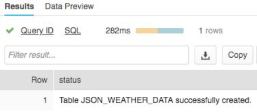  

6.1.5 Вверху страницы перейдите на вкладку **Databases** и щелкните ссылку базы данных **WEATHER**. Вы должны увидеть свою недавно созданную таблицу **JSON_WEATHER_DATA**.

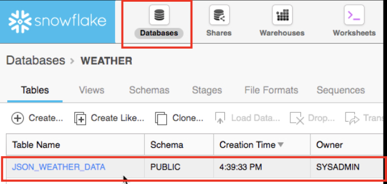  

## 6.2 Создайте связь с внешним источником

6.2.1 С помощью **Worksheet** создайте связь с внешним источником – бакетом AWS S3, в котором хранятся неструктурированные данные.

```sql
create stage nyc_weather
url = 's3://snowflake-workshop-lab/weather-nyc';
```

6.2.2 Теперь давайте посмотрим на содержимое **nyc_weather**. Вверху страницы щелкните вкладку **Worksheets**. Там выполните следующий оператор с командой **LIST**, чтобы увидеть список файлов:

```sql
list @nyc_weather;
```

Вы должны увидеть результат в окне **Results** на нижней панели, показывающий множество файлов **gz** из **S3.**:

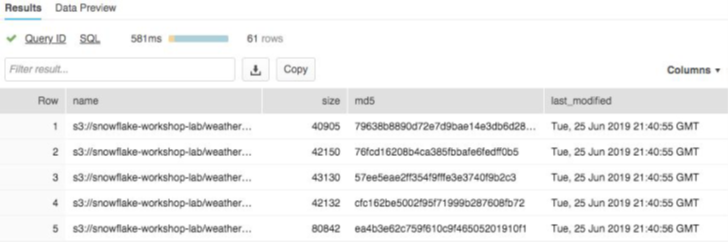   

# 6.3 Загрузка и проверка неструктурированных данных

В этом разделе мы будем использовать хранилище для загрузки данных из корзины S3 в только что созданную таблицу Snowflake.

6.3.1 Через рабочий лист запустите команду **COPY**, чтобы загрузить данные в таблицу **JSON_WEATHER_DATA**, которую мы создали ранее.

Обратите внимание, как здесь в SQL мы можем указать **FILE FORMAT**. В предыдущем модуле, где мы загружали структурированные данные, нам нужно было подробно определить **FILE FORMAT**. Но поскольку данные JSON здесь хорошо отформатированы, мы используем настройки по умолчанию и просто указываем тип JSON.

```sql
copy into json_weather_data
from @nyc_weather
file_format = (type=json);
```

6.3.2 Посмотрим на загруженные данны:

```sql
select * 
from json_weather_data 
limit 10;
```

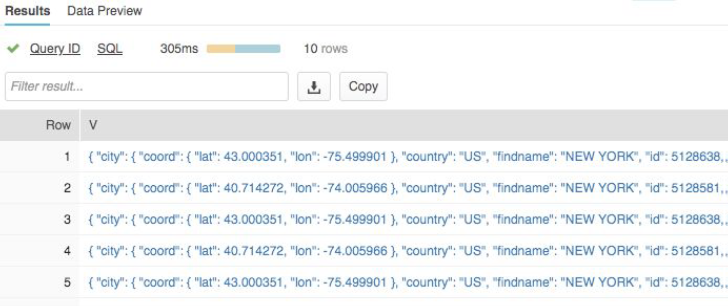    

6.3.3 Щелкните одно из значений. Обратите внимание, как данные хранятся в необработанном формате JSON. Нажмите **Done** когда закончите.

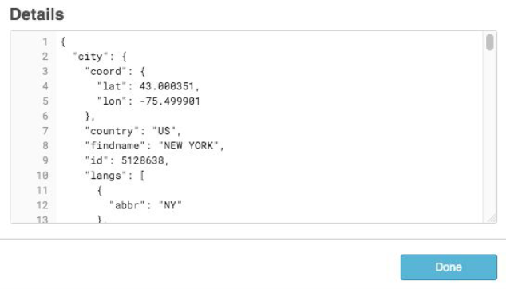    

## 6.4 Создание представления и запрос полуструктурированных данных

Давайте посмотрим, как Snowflake позволяет нам создавать представление, а также запрашивать данные JSON напрямую с помощью SQL.

    Представление и материализованные представления 

    Представление позволяет получить доступ к результату запроса, как если бы он был таблицей. Представления могут помочь вам: представить данные конечным пользователям более понятным образом (например, в этой лабораторной работе мы представим **безобразный** JSON в столбчатом формате), ограничить то, что конечные пользователи могут просматривать в исходной таблице из соображений конфиденциальности / безопасности, или написать более модульный SQL.

    Существуют также материализованные представления, в которых результаты SQL сохраняются, как если бы результаты были таблицей. Это обеспечивает более быстрый доступ, но требует места для хранения. Материализованные представления требуют Snowflake Enterprise Edition или выше.

6.4.1 На вкладке Worksheet перейдите на рабочий лист и выполните следующую команду. Он создаст представление неструктурированных данных о погоде в формате JSON в виде столбцов, чтобы аналитикам было легче понять и запросить. К вашему сведению - идентификатор города Нью-Йорка - 5128638.

```sql
create view json_weather_data_view as

select
    v:time::timestamp as observation_time,
    v:city.id::int as city_id,
    v:city.name::string as city_name,
    v:city.country::string as country,
    v:city.coord.lat::float as city_lat,
    v:city.coord.lon::float as city_lon,
    v:clouds.all::int as clouds,
    (v:main.temp::float)-273.15 as temp_avg,
    (v:main.temp_min::float)-273.15 as temp_min,
    (v:main.temp_max::float)-273.15 as temp_max,
    v:weather[0].main::string as weather,
    v:weather[0].description::string as weather_desc,
    v:weather[0].icon::string as weather_icon,
    v:wind.deg::float as wind_dir,
    v:wind.speed::float as wind_speed
from json_weather_data
where city_id = 5128638;
```

6.4.2 Предыдущий шаг показал, как можно использовать точечную нотацию `SQL (v.city.coord.lat)` для извлечения значений на более низких уровнях иерархии JSON. Это позволяет нам рассматривать каждое поле, как если бы оно было столбцом в реляционной таблице.

6.4.3 Проверьте представление в верхнем левом углу пользовательского интерфейса, где новое представление должно появиться сразу под таблицей json_weather_data. Вам может потребоваться развернуть и / или обновить браузер объектов базы данных, чтобы увидеть его.

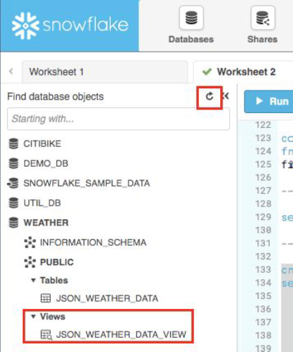    

6.4.4 С помощью рабочего листа проверьте представление с помощью следующего запроса. Обратите внимание, что результаты выглядят так же, как обычный структурированный источник данных (ПРИМЕЧАНИЕ - ваш набор результатов может иметь разные значения наблюдения_времени).


```sql
select * 
from json_weather_data_view
where date_trunc('month',observation_time) = '2018-01-01'
limit 20;
```

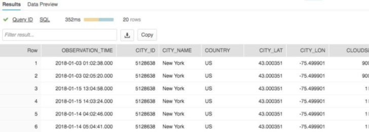     

## 6.5 Использование операции соединения для корреляции с наборами данных

Теперь мы присоединим данные о погоде в формате JSON к нашим данным **CITIBIKE.PUBLIC.TRIPS**, чтобы определить ответ на наш исходный вопрос о том, как погода влияет на количество поездок.

6.5.1 Выполните команду ниже, чтобы присоединить WEATHER к TRIPS и подсчитать количество поездок, связанных с определенными погодными условиями.

> Примечание! Поскольку, по умолчанию, мы все еще находимся в базе данных WEATHER, мы укажем полную ссылку на таблицу TRIPS, указав ее базу данных и имя схемы.

```sql
select 
    weather as conditions
    ,count(*) as num_trips
from citibike.public.trips
left outer join json_weather_data_view
    on date_trunc('hour', observation_time) = date_trunc('hour', starttime)
where conditions is not null
group by 1 
order by 2 desc;
```

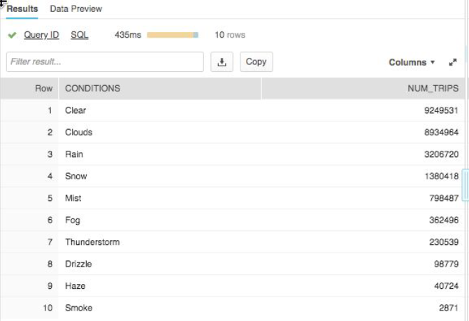    
 
6.5.2 Первоначальная цель Citi Bike заключалась в том, чтобы выяснить, существует ли какая-либо корреляция между количеством поездок на велосипеде и погодой, анализируя данные о количестве пассажиров и погоде. В таблице выше у нас есть четкий ответ. Как и следовало ожидать, в хорошую погоду количество поездок значительно больше!


# Модуль 7 Использование путешествий во времени


У Snowflake  есть возможность **Time Travel**. Она позволяет получить доступ к историческим данным в любой момент в течение предварительно настраиваемого периода времени. По умолчанию период времени составляет 24 часа, а в Snowflake Enterprise Edition он может составлять до 90 дней. Большинство хранилищ данных не могут предложить эту функцию; со Snowflake  это просто!

Некоторые полезные применения этой фичи включают:

- Восстановление связанных с данными объектов (таблиц, схем и баз данных), которые могли быть случайно или намеренно удалены.
- Дублирование и резервное копирование данных из ключевых моментов в прошлом.
- Анализ использования данных / манипуляции с ними за определенные периоды времени.

## 7.1 Drop & Undrop

Сначала давайте посмотрим, как мы можем восстановить объекты данных, которые были случайно или намеренно удалены.

7.1.1 На рабочем листе выполните следующую команду, которая удалит (drop) таблицу **json_weather_data**:

```sql
drop table json_weather_data;
```

7.1.2 Теперь запустите SQL запрос для таблицы **json_weather_data**. На панели **Results** вы должны увидеть ошибку, потому что таблица была удалена.

```sql
select * 
from json_weather_data 
limit 10;
```

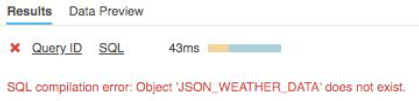     
 
7.1.3 Теперь восстановим таблицу:

```sql
undrop table json_weather_data;
```

7.1.4 Таблица json_weather_data должна быть восстановлена.

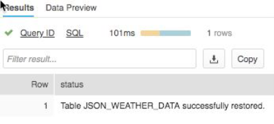     


## 7.2 Откатить (Roll Back) таблицу 

Теперь давайте рассмотрим откат таблицы к предыдущему состоянию, чтобы исправить непреднамеренную ошибку DML, которая заменяет все названия станций в таблице **TRIPS** базы данных **Citibike** словом 'oops'.

7.2.1 Сначала убедитесь, что рабочий лист находится в правильном контексте:

```sql
use role sysadmin;
use warehouse compute_wh;
use database citibike;
use schema public;
```

7.2.2 Затем выполните следующую команду, которая заменяет все имена станций в таблице словом 'oops'.

```sql
update trips set start_station_name = 'oops';
```

7.2.3 Теперь запустите запрос, который возвращает 20 лучших станций по количеству поездок - обратите внимание, как мы напортачили с названиями станций, поэтому получаем только одну строку:
 
```sql
select
start_station_name as "station",
count(*) as "rides"
from trips
group by 1
order by 2 desc
limit 20;
```

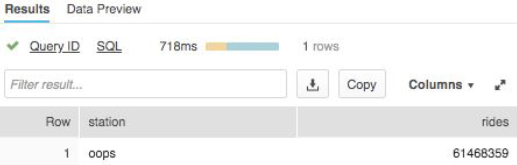     
 

7.2.4 В такой ситуации нам нужно надеяться, что у нас есть резервная копия. Но в Snowflake мы можем просто запускать команды, чтобы найти идентификатор запроса последней команды UPDATE и сохранить его в переменной с именем $ QUERY_ID…

```sql
set query_id =
(
    select 
        query_id 
    from table(information_schema.query_history_by_session (result_limit=>5))
    where query_text like 'update%' 
    order by start_time 
    limit 1
);
```

7.2.5 Затем заново создайте таблицу, которая была до обновления:

```sql
create or replace table trips as
(
    select * 
    from trips 
    before (statement => $query_id)
);
```

7.2.6 Снова сделайте SQL запрос, чтобы убедиться, что имена станций были восстановлены:

```sql
select
    start_station_name as "station",
    count(*) as "rides"
from trips
group by 1
order by 2 desc
limit 20;
```
 
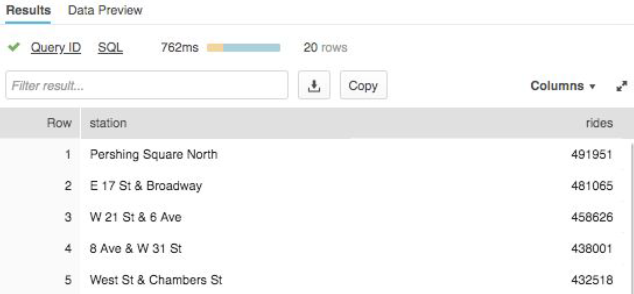     


# Модуль 8 Контроль доступа на основе ролей и администратор учетных записей

В этом модуле мы покажем некоторые аспекты управления доступом на основе ролей Snowflake (RBAC), включая создание новой роли и предоставление ей определенных разрешений. Мы также рассмотрим роль ACCOUNTADMIN (также известную как администратор учетной записи).

Чтобы продолжить историю Citi Bike, предположим, что младший администратор баз данных присоединился к Citi Bike, и мы хотим создать для него новую роль с меньшими привилегиями, чем определяемая системой роль по умолчанию SYSADMIN.

    Контроль доступа на основе ролей (RBAC)

    Snowflake предлагает очень мощный и детализированный RBAC, который может контролировать, к каким объектам и возможностям может получить доступ роль или пользователь и какой уровень доступа у них есть. Подробнее см. [документацию](https://docs.snowflake.net/manuals/user-guide/security-access-control.html).


## 8.1 Создать новую роль и добавить к ней пользователя

8.1.1 На листе (worksheet) давайте переключимся на роль ACCOUNTADMIN, чтобы создать новую роль. Эта роль инкапсулирует роли SYSADMIN и SECURITYADMIN, определенные системой. Это роль верхнего уровня в системе, и она должна предоставляться только ограниченному / контролируемому количеству пользователей в вашей учетной записи. Запустите следующую команду:

```sql
use role accountadmin;
```

Когда команда обработается, обратите внимание в правом верхнем углу листа, контекст рабочего листа изменился, поэтому теперь роль - ACCOUNTADMIN.

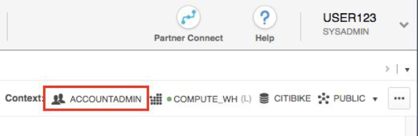     

8.1.2 Чтобы любая роль функционировала, нам нужен хотя бы один назначенный ей пользователь. Итак, давайте создадим новую роль под названием **junior_dba** и назначим ей ваше имя пользователя. Это имя пользователя, которое вы создали при первом открытии 30-дневной бесплатной пробной учетной записи Snowflake. Это имя также отображается в правом верхнем углу пользовательского интерфейса. На скриншоте ниже это **USER123**. Конечно, у вас будет другое. 


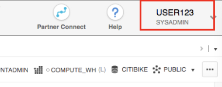      

8.1.3 Теперь давайте создадим роль и добавим к ней пользователя с вашим уникальным именем:

```sql
create role junior_dba;
grant role junior_dba to user YOUR_USER_NAME_GOES HERE;
```

> ПРИМЕЧАНИЕ! Если вы попытаетесь выполнить эту операцию, находясь в роли типа SYSADMIN, она завершится неудачно из-за недостаточных привилегий, поскольку роль SYSADMIN по умолчанию не может создавать новые роли или пользователей.

8.1.4 Измените контекст рабочего листа на новую роль **junior_dba**

```sql
use role junior_dba;
```

Обратите внимание, что в правом верхнем углу листа контекст изменился, чтобы отразить роль **junior_dba**.

      

8.1.5 Обратите внимание, что в левой части пользовательского интерфейса на панели обозревателя объектов базы данных не отображаются базы данных **Citibike** и **Weather**. Это потому, что роль junior_dba не имеет доступа для их просмотра.

  

8.1.6 Давайте вернемся к роли ACCOUNTADMIN и предоставим junior_dba возможность просматривать и использовать базы данных CITIBIKE и WEATHER.

```sql
use role accountadmin;
grant usage on database citibike to role junior_dba;
grant usage on database weather to role junior_dba;
```

8.1.7 Переключитесь на роль junior_dba и обратите внимание на то, что слева в браузере объектов базы данных появятся базы данных Citibike и Weather. Щелкните значок обновления, если они не отображаются.

```sql
use role junior_dba;
```

  

## 8.2 Просмотр администратора учетной записи

Давайте изменим нашу роль безопасности для сеанса на **ACCOUNTADMIN**, чтобы видеть другие части пользовательского интерфейса, которые видит только эта роль.

    Роли в предпочтениях пользователя (User Preference) и листе (Worksheet)

    Мы только что изменили роль безопасности для сеанса в меню настроек пользователя в правом верхнем углу пользовательского интерфейса. Это меняет то, что мы видим в пользовательском интерфейсе. Это отличается от контекстного меню рабочего листа, в котором мы назначаем роль, которая применяется к командам, выполняемым на этом конкретном рабочем листе. Кроме того, роль безопасности сеанса может одновременно отличаться от роли, используемой на листе.


8.2.1 В правом верхнем углу пользовательского интерфейса щелкните свое имя пользователя, чтобы отобразить меню пользовательских настроек. Затем перейдите в раздел **Switch Role** и выберите роль **ACCOUNTADMIN**.

  

8.2.2 Обратите внимание, что в самом верху пользовательского интерфейса вы увидите шестую вкладку под названием **Account**, которую вы можете просматривать только в роли **ACCOUNTADMIN**.

Перейдите на вкладку **Account**. Затем в верхней части этой страницы нажмите **Usage**, которое по умолчанию уже отображается. Здесь вы видите подробную информацию о кредитах, хранилище и ежедневном использовании.

   

8.2.3 Справа от **Usage** находится **Billing**, где вы можете добавить кредитную карту, если вы хотите выйдете за пределы своих бесплатных кредитов на сумму 400 долларов полученых в рамках бесплатной пробной версии. Справа находится информация о пользователях, ролях и мониторах ресурсов. Последний устанавливает лимиты на использование кредита вашей учетной записи, чтобы вы могли надлежащим образом контролировать и управлять потреблением кредита.

ПРИМЕЧАНИЕ! Для следующей лабы оставайтесь в роли **ACCOUNTADMIN**.

# Модуль 9 Обмен данными

Snowflake позволяет обмениваться данными между учетными записями посредством общих ресурсов, которые создаются поставщиками данных и **импортируются** потребителями данных либо через их собственную учетную запись Snowflake, либо через подготовленную учетную запись Snowflake Reader. Потребителем может быть внешняя организация / партнер или другая внутренняя бизнес-единица, которая должна иметь собственную уникальную учетную запись Snowflake.

Когда вы обмениваеть данными:
- Есть только одна копия данных и она хранится в аккаунте поставщика данных.
- Данными, которыми вы поделились, всегда доступны в реальном времени и сразу же доступны для потребителей.
- Тот, кто предоставляет данные, моджет устанавливать отзывные, детализированные разрешения на доступ к общим ресурсам.
- Обмен данными прост и безопасен, особенно по сравнению со **старым** способом обмена данными, который часто выполнялся вручную и предполагал передачу больших файлов .csv через Интернет небезопасным способом.

## 9.1 Проверка уже расшареных данных

9.1.1 Нажмите на синий логотип Snowflake в самом верхнем левом углу пользовательского интерфейса. В левой части пользовательского интерфейса в обозревателе объектов базы данных обратите внимание на базу данных **SNOWFLAKE_SAMPLE_DATA**. Маленькая стрелка на значке базы данных указывает, что вы расшарили этот ресурс.

   

9.1.2 В правом верхнем углу пользовательского интерфейса убедитесь, что вы находитесь в роли **ACCOUNTADMIN**. Затем в верхней части пользовательского интерфейса щелкните вкладку Shares. Обратите внимание, что на этой странице вы просматриваете свои **Inbound Secure Shares** (входящие защищенные общие ресурсы), и Snowflake расшарил два ресурса для вашей учетной записи. Один содержит информацию об использовании вашей учетной записи, а другой - образцы данных, которые вы можете использовать. Это обмен данными в действии - ваша учетная запись Snowflake является потребителем данных, предоставленных Snowflake!

   

## 9.2 Что делать если вы хотите поделиться данными 

9.2.1 Вернемся к истории Citi Bike и предположим, что мы являемся администратором учетной записи Snowflake в Citi Bike. У нас есть надежный партнер, который хочет заниматься анализом данных в нашей базе данных TRIPS практически в режиме реального времени для дальнейшего анализа. У этого партнера также есть собственный аккаунт Snowflake в нашем регионе. Итак, давайте воспользуемся функцией обмена данными Snowflake, чтобы поделиться с ними этими данными, чтобы он мог их проанализировать.

Вверху пользовательского интерфейса щелкните вкладку Shares. Затем ниже на странице нажмите кнопку **Outbound**.

    

9.2.2 Нажмите кнопку **Создать** и в появившиеся  поля заполните, как показано ниже.
- В поле **Secure Share Name** введите **TRIPS_SHARE**.
- В **Database** в раскрывающемся списоке выберите **CITIBIKE**.
- В **Tables & Views** воспользуйтесь браузером объектов базы данных, чтобы перейти к **CITIBIKE PUBLIC TRIPS**.
- Нажмите кнопку **Apply**.

   

9.2.3 Нажмите синюю кнопку **Create**внизу поля. Обратите внимание, что в окне указано, что неоходимый нам ресурс был успешно создан.

   

В реальном кейсе администратор учетной записи Citi Bike Account нажал бы кнопку **Next: Add Consumers, чтобы добавить информацию об имени и типе учетной записи Snowflake своего партнера. Но поскольку в лабораторной работе мы просто используем свою учетную запись, мы остановимся на этом.

9.2.4 Нажмите кнопку **Done** внизу поля.Обратите внимание, что на этой странице теперь отображается ресурс **TRIPS_SHARE**, который вы расшарили. Потребовалось всего несколько секунд, чтобы предоставить другим учетным записям доступ к данным в Snowflake безопасным способом без необходимости создания копий данных!

   

Наконец, обратите внимание, что Snowflake предоставляет несколько способов безопасного обмена данными без ущерба для конфиденциальности. Вы можете делиться не только таблицами и представлениями, но и безопасными представлениями, защищенными UDF (определяемыми пользователем функциями) и безопасными соединениями. Дополнительные сведения о том, как использовать эти методы для обмена данными при предотвращении доступа к конфиденциальной информации, читайте в документации Snowflake.

# Сброс окружения Snowflake

Если вы хотите выполнить сброс среды, удалив все объекты, созданные в рамках этой лабораторной работы, запустите приведенныениже SQL-запросы.

Запустите этот SQL, чтобы установить контекст рабочего листа:

```sql
use role accountadmin;
use warehouse compute_wh;
use database weather;
use schema public;
```

Затем запустите этот SQL, чтобы отбросить все объекты, которые мы создали в лабораторной работе:

```sql
drop share if exists trips_share;
drop database if exists citibike;
drop database if exists weather;
drop warehouse if exists analytics_wh;
drop role if exists junior_dba;
```

Поздравляем, вы закончили эту лабораторную работу! 

 

