# How to: База данных в облаке на примере Amazon RDS

## Введение

В данной инструкции содержится информация по установке PostgreSQL в сервисе AWS RDS с бесплатными лимитами. Также будет показано как настроить необходимые доступы для подключения к базе со своего компьютера, с серверов Data Studio и Tableau Online. 

Amazon Relational Database Service (Amazon RDS) – это управляемый сервис реляционных баз данных для MySQL, PostgreSQL, MariaDB, Oracle (с поддержкой собственных лицензий) и SQL Server.

## Установка

1. Создаем учетную запись с бесплатными лимитами в AWS по этой [инструкции](https://github.com/Data-Learn/data-engineering/blob/master/how-to/How%20to%20create%20AWS%20Account.md), если еще нет.
2. Заходим на сайт [AWS](https://aws.amazon.com/), в верхнем правом углу жмем на Мой Аккаунт и выбираем Консоль управления -> Вводим email, жмем next и вводим пароль -> Попадаем в консоль управления
3. Среди списка доступных сервисов находим RDS и кликаем по нему  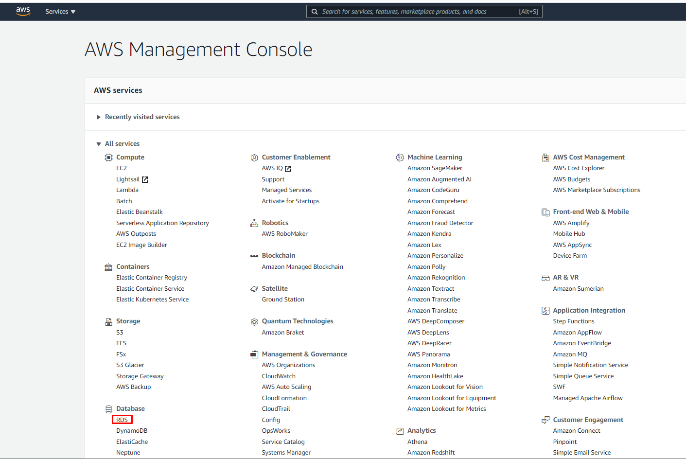 

4. Кликаем по оранжевой кнопке Create database. 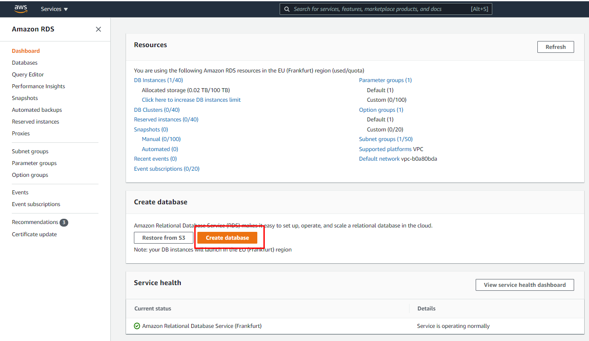

5. В блоке Choose a database creation method оставялем вариант по умолчанию - Standart create.
RDS поддерживает множество реляционных баз данных. Например, PostgreSQL, MySQL, Microsoft SQL Server. Выбираем PostgresSQL и версию с которой будем работать. 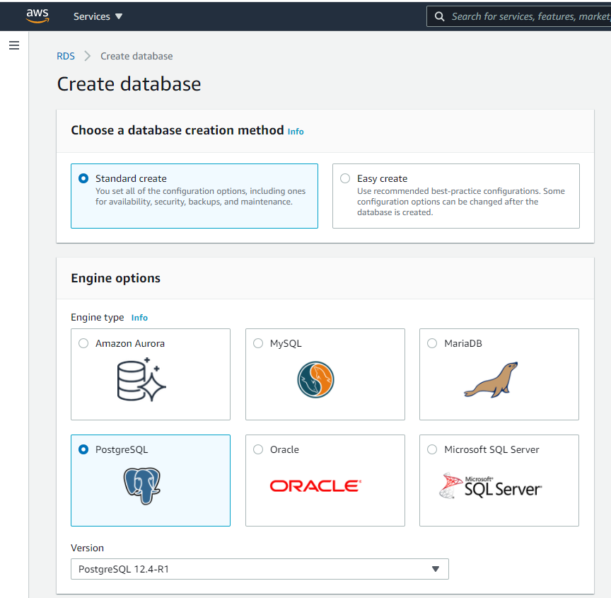

6. Далее важно в блоке Templates выбрать Free tier, чтобы уложиться в бесплатные лимиты. 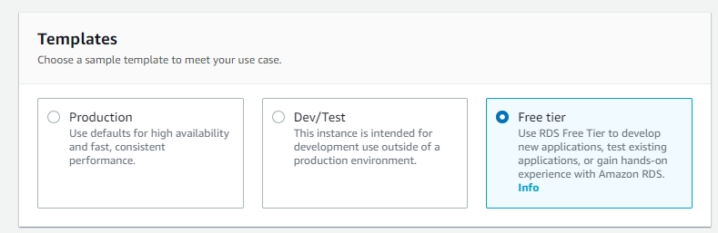
7. В блоке Settings задаем имя DB instance и master username с паролем. 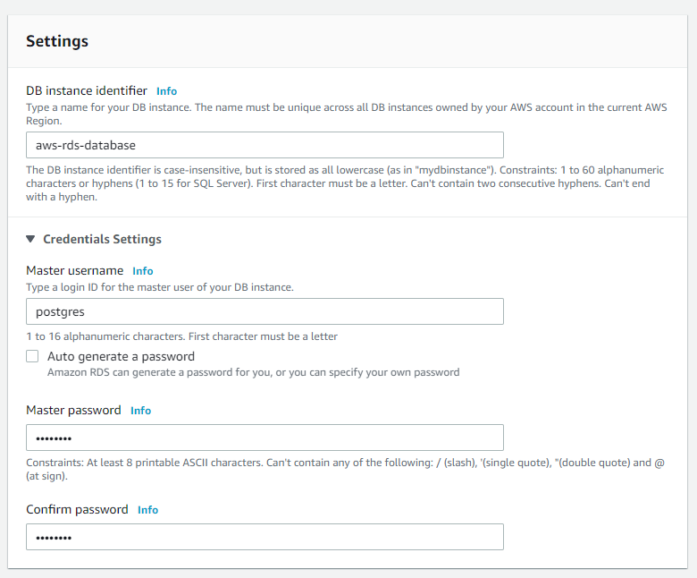
8. В блоках Storage и Availability & durability оставляете все по умолчанию
9. Далее идет важный для нас блок “Connectivity” с настройкой доступов к базе.

	9.1 Надо **включить Public access**. Важно понимать, что это еще не значит, что к базе теперь можно подключаться из любого места. Это лишь означает что у базы теперь появился публичный ip адрес, что дает возможность подключиться к ней из интернета.
	
	9.2 Все остальные настройки оставляем все по умолчанию. Группы безопасности VPC указывает на одну или несколько групп безопасности VPC, которые определяют, какие EC2 instances и устройства могут подключаться к нашей базе данных. Вот здесь мы и будем потом прописывать наши ip, откуда хотим коннектиться к базе. 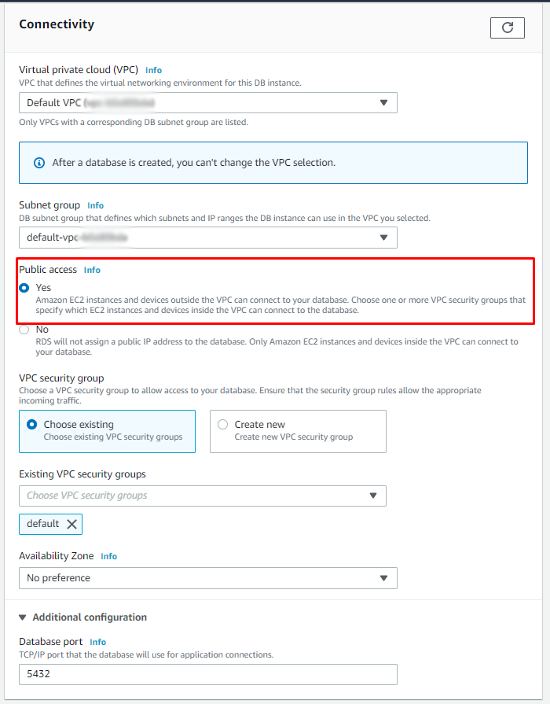
	
10. В блоке Additional configuration можете оставить все по умолчанию, а можете и убрать все галочки связанные с Backup и Performance Insights. Для учебной базы они не нужны. 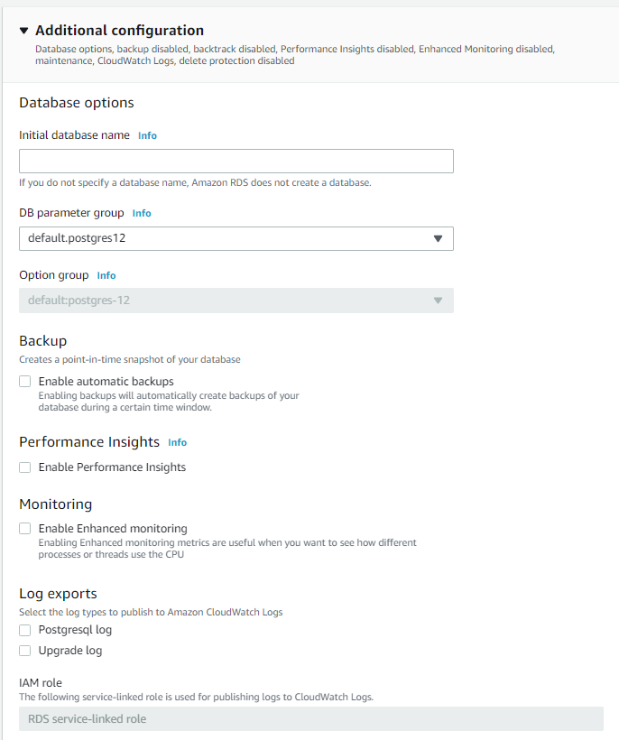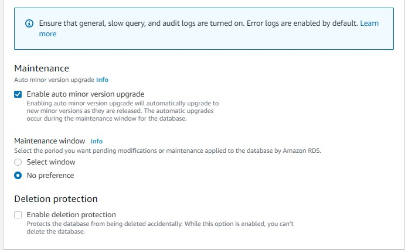
11. На этом с созданием базы все, далее жмем оранжевую кнопку “Create database” 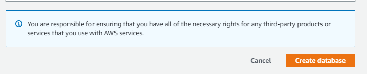
12. Ждем несколько минут, пока база создается. Статус должен смениться на Available 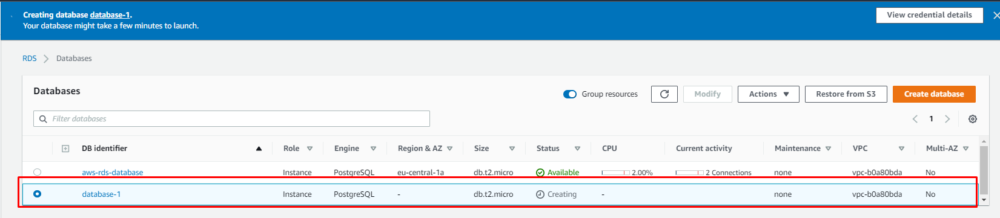

## Доступы

1. Переходим в панель управления сервисом Amazon RDS. Выбираем раздел Databases 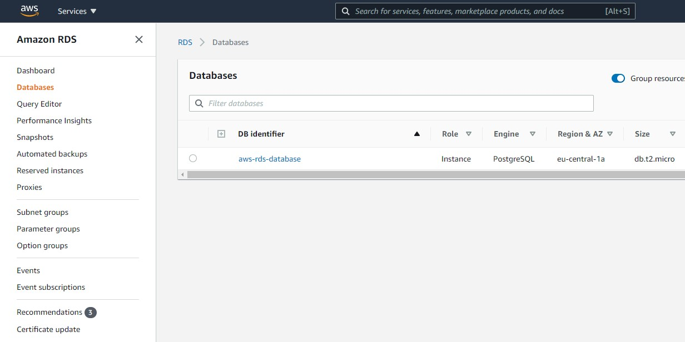
2. Кликаем на названием базы (DB identifier)
3. Затем кликаем на нашу VPC security groups  
4. Кликаем на Security Group ID 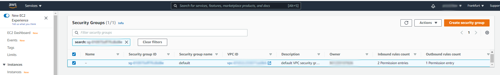
5. Кликаем на кнопку ’Edit inbound rules’ 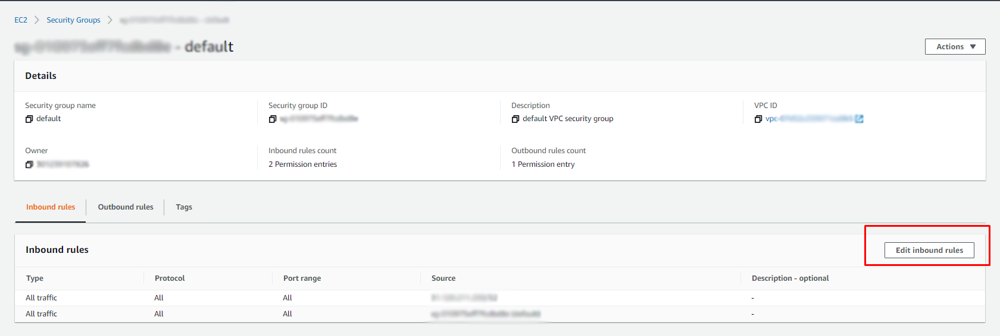
6. Добавляем новое правило, кликнув на кнопку Add rule
7. И тут мы можем пойти по простому варианту - разрешить вообще всем доступ (по логину и паролю разумеется). Или чуть заморочится и сделать более безопасный вариант, вручную указав нужные нам ip.
	* Доступ для всех. Во вкладке Type выбираем All traffic, а во вкладке Source выбираем Anyware.
	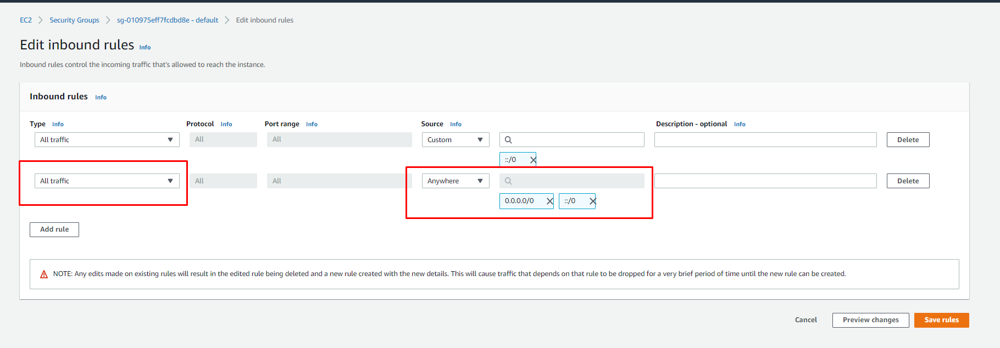
	* Доступ только с определенных IP. Лично я добавил ip своего домашнего компьютера.
Он определяется в системе автоматически, если во вкладке source выбрать My IP   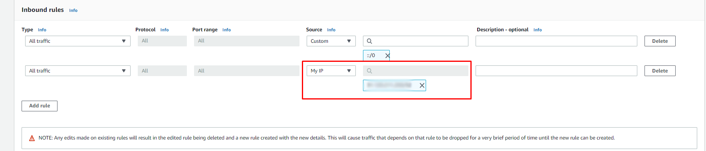
Также я добавлял ip [Data Studio](https://support.google.com/datastudio/answer/7288010?hl=en) и  [Tableau Online](https://help.tableau.com/current/pro/desktop/en-us/publish_tableau_online_ip_authorization.htm). Чтобы эти облачные сервисы тоже могли подключаться к БД. 
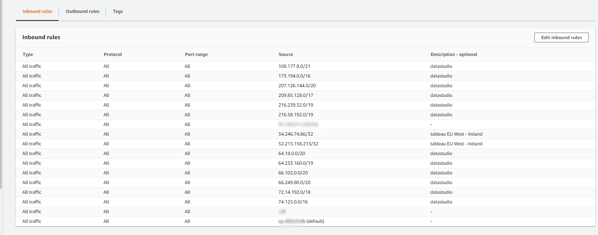

## Подключение через Dbeaver

Все также как и при подключении к базе на локальном компьютере.
Только имя хоста, логин и пароль меняются на амазоновские.

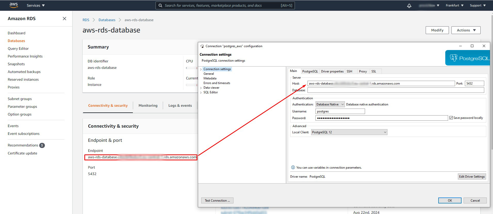

Если не понимаете о чем речь, советую пересмотреть [занятия из модуля 2.3](https://github.com/Data-Learn/data-engineering/blob/master/DE-101%20Modules/Module02/DE%20-%20101%20Module02.md#23-%D0%BF%D0%BE%D0%B4%D0%BA%D0%BB%D1%8E%D1%87%D0%B5%D0%BD%D0%B8%D0%B5-%D0%BA-%D0%B1%D0%B0%D0%B7%D0%B0%D0%BC-%D0%B4%D0%B0%D0%BD%D0%BD%D1%8B%D1%85-%D0%B8-sql)

## Важная информация 

Крайне рекомендую ознакомиться с описанием тарифа [Free Tier для RDS](https://aws.amazon.com/ru/rds/free/), с которым мы только что зарегистрировались и ознакомиться с лимитами, которые Amazon предоставляет бесплатно. В случае превышения этих лимитов, Amazon просто снимет с Вас оплату, поэтому для предотвращения неожиданных счетов, необходимо за этим следить. С этим вам могут помочь сервисы [Billing и Cost management](https://docs.aws.amazon.com/awsaccountbilling/latest/aboutv2/billing-what-is.html)

